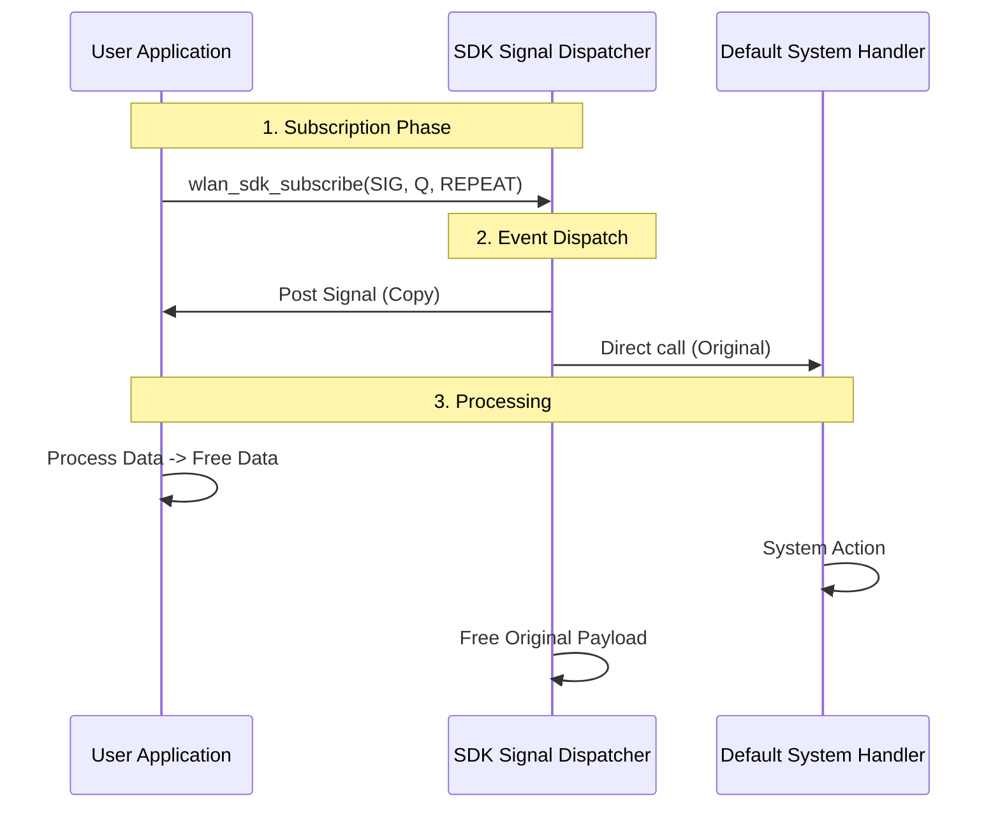
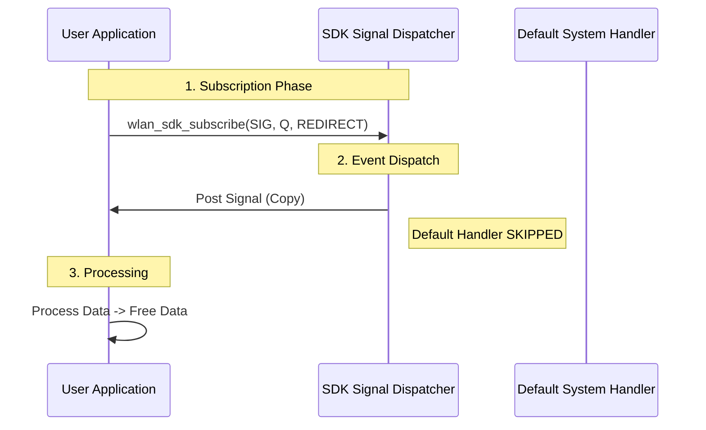
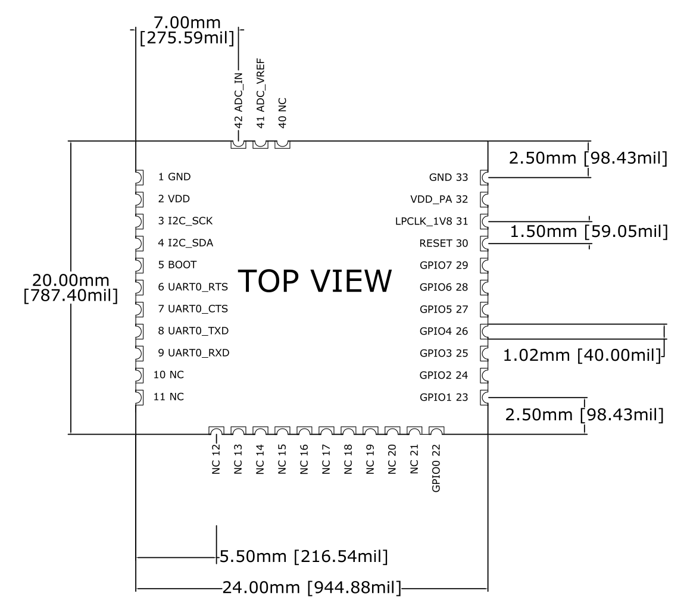

# WLAN API Reference Guide

# 1. Overview

The WF88-M SDK provides a comprehensive software development environment, including RTOS, networking stack, and drivers, for the ACH118x series Wi-Fi modules. It abstracts the complexities of the underlying Wi-Fi stack (802.11 b/g/n) protocols, allowing developers to focus on building application logic.

Key Features:

*   RTOS Foundation: Built on FreeRTOS, enabling standard real-time operating system features such as multi-tasking, semaphores, queues, and software timers.
*   Connectivity: Simplified APIs for Station (STA), Access Point (AP), and Mesh networking modes, along with a full networking stack (LwIP).
*   Peripheral Access: Drivers for UART, SPI, GPIO hardware interfaces.
*   Application Services: Integrated support for MQTT, and Security protocols (SSL/TLS).

Development Environment:

*   Compiler: IAR Embedded Workbench for ARM (v7.2 or higher) is required for compilation.
*   Tools: The "Amped RF Term(http://download.ampedrftech.com/)" utility is provided for firmware flashing and serial debugging.
*   Resources: The user application has access to approximately 45KB of Flash memory for code storage. In Mesh Point (MP) mode, after successfully joining a mesh network, the system provides approximately 114KB of available RAM for application runtime tasks.

# 2. Module APIs


## 2.1 Signal Framework

In the WF88-M SDK, many operations (such as Wi-Fi scanning, Wi-Fi joining, mesh joining, and MQTT messaging) are completed asynchronously. If applications rely on polling, they add latency and complexity. For this reason, the SDK exposes a unified Signal Framework so your application can react to key events at the right time. This framework is the basis for later sections such as Connect, MQTT, and Mesh.

This section describes the Signal Framework and its Publish-Subscribe model for delivering system events (e.g., Wi-Fi status changes, MQTT messages, UART data) to your application.

The Signal Framework utilizes FreeRTOS Queues to dispatch events. The application creates a queue and subscribes to specific event IDs. When an event occurs, the SDK posts a [sdk_signal_t](#2121-struct-sdk_signal_t) message to the registered queue, which the application task can then process in an event loop.

### 2.1.1 Subscription Modes & Workflows

The SDK supports two distinct subscription modes, determining how signals are routed to the application and the system's default handlers.

#### 2.1.1.1 REPEAT Mode
*   Description: The Dispatcher delivers an independent payload copy to the subscriber's queue, then calls the default system handler in the same Dispatcher task with the original event.
*   Use Case: Non-intrusive monitoring (e.g., logging Wi-Fi status) where the system must still perform its standard operations.
*   Memory Management: **App MUST free `msg.data`** (see [struct sdk_signal_t](#2121-struct-sdk_signal_t)). The application owns only its payload copy. The Dispatcher retains ownership of the original payload and releases it after the default handler returns.
*   Flow: `Event -> Dispatcher -> User Queue (Copy)` and `Dispatcher -> Default Handler (Original)`.



#### 2.1.1.2 REDIRECT Mode
*   Description: The signal is delivered **ONLY** to the subscriber's queue. The default system handler is skipped.
*   Use Case: Taking full control of a function (e.g., custom MQTT handling), effectively disabling the default system behavior for that event.
*   Memory Management: **App MUST free `msg.data`** (see [struct sdk_signal_t](#2121-struct-sdk_signal_t)). The Dispatcher posts an independently allocated payload copy to each subscriber. The original event payload remains Dispatcher-owned and is released after default handling is skipped.
*   Flow: `Event -> User Queue` (System Skipped)



### 2.1.2 Data Structures

#### 2.1.2.1 struct sdk_signal_t

Represents the message object sent to the application queue.

| Field | Type | Description |
| :--- | :--- | :--- |
| `id` | `uint16_t` | Unique identifier for the event (e.g., `SIG_SDK_WLAN_CONNECTED`). |
| `source` | `uint8_t` | Internal use. |
| `data` | `void*` | Pointer to the event payload (specific structure depends on the [Signal ID](#2122-signal-ids-event-list)). |
| `data_len` | `uint16_t` | Length of the payload data in bytes. |

#### 2.1.2.2 Signal IDs (Event List)

This section details the available system signals, their trigger conditions, and associated payload data structures.

The following table summarizes the available signals:

| Signal ID | Description |
| :--- | :--- |
| [SIG_SDK_SYS_INIT_DONE](#21221-sig_sdk_sys_init_done) | System initialization is complete. |
| [SIG_SDK_JOIN_SUCCESS](#21222-sig_sdk_join_success) | Asynchronous AP connection request succeeded (Associated). |
| [SIG_SDK_JOIN_FAILED](#21223-sig_sdk_join_failed) | Asynchronous AP connection request failed (Timeout/Auth). |
| [SIG_SDK_WLAN_CONNECTED](#21224-sig_sdk_wlan_connected) | Wi-Fi link established (Handshake complete) or Mesh joined. |
| [SIG_SDK_WLAN_DISCONNECTED](#21225-sig_sdk_wlan_disconnected) | Wi-Fi link lost or terminated. |
| [SIG_SDK_WLAN_IPV4_CHANGED](#21226-sig_sdk_wlan_ipv4_changed) | IPv4 address assigned, updated, or lost. |
| [SIG_SDK_WLAN_IPV6_CHANGED](#21227-sig_sdk_wlan_ipv6_changed) | IPv6 address assigned, updated, or lost. |
| [SIG_SDK_MQTT_CONNECT_OK](#21228-sig_sdk_mqtt_connect_ok) | MQTT Broker connected. |
| [SIG_SDK_MQTT_DISCONNECT](#21229-sig_sdk_mqtt_disconnect) | MQTT Broker disconnected. |
| [SIG_SDK_MQTT_DATA_DOWN](#212210-sig_sdk_mqtt_data_down) | MQTT publish fragment received. |
| [SIG_SDK_TCP_CONNECT_OK](#21051-tcp-connect-signals) | TCP connection established. |
| [SIG_SDK_TCP_DISCONNECT](#21051-tcp-connect-signals) | TCP connection failed or disconnected. |
| [SIG_SDK_TCP_DATA_DOWN](#2107-sig_sdk_tcp_data_down-tcp-recv) | TCP payload received. |
| [SIG_SDK_UDP_DATA_DOWN](#21016-sig_sdk_udp_data_down-udp-recv) | UDP datagram received. |
| [SIG_SDK_UART_DATA_RX](#212211-sig_sdk_uart_data_rx) | UART data received. |

For a typical STA connection flow, applications should subscribe to `SIG_SDK_JOIN_SUCCESS`, `SIG_SDK_JOIN_FAILED`, `SIG_SDK_WLAN_CONNECTED`, `SIG_SDK_WLAN_DISCONNECTED`, and `SIG_SDK_WLAN_IPV4_CHANGED` to track join results, link status, and IPv4 readiness. Subscribe to `SIG_SDK_WLAN_IPV6_CHANGED` when the application requires IPv6 connectivity.

For Mesh Point (MP) mode, subscribe to `SIG_SDK_WLAN_CONNECTED`, `SIG_SDK_WLAN_DISCONNECTED`, and `SIG_SDK_WLAN_IPV6_CHANGED` when the application requires IPv6 connectivity.

For MQTT flows, subscribe to `SIG_SDK_MQTT_CONNECT_OK`, `SIG_SDK_MQTT_DISCONNECT`, and `SIG_SDK_MQTT_DATA_DOWN` to track broker connectivity and incoming messages.

For TCP flows, subscribe to `SIG_SDK_TCP_CONNECT_OK`, `SIG_SDK_TCP_DISCONNECT`, and `SIG_SDK_TCP_DATA_DOWN`. For UDP receive flows, subscribe to `SIG_SDK_UDP_DATA_DOWN`.

##### 2.1.2.2.1 SIG_SDK_SYS_INIT_DONE
*   Description: Notifies the application that the SDK initialization is fully complete and application-layer logic processing can now begin.
*   Trigger: Triggered exactly once when the system startup sequence is finished.
*   Payload: `NULL`

##### 2.1.2.2.2 SIG_SDK_JOIN_SUCCESS
*   Description: (STA Mode Only) Indicates that the asynchronous [wlan_sta_join()](#233-wlan_sta_join) request has successfully completed and the device has associated with the specified Access Point.
*   Trigger: Triggered after calling [wlan_sta_join()](#233-wlan_sta_join) when the authentication and association handshake with the AP is successful.
*   Payload: Optional NUL-terminated `const char *` result text, for example `JoinOK [ssid]`. If no text is available, `data` is `NULL`.
*   Note: This signal confirms the initial connection. For subsequent link maintenance, monitor `SIG_SDK_WLAN_DISCONNECTED`.

##### 2.1.2.2.3 SIG_SDK_JOIN_FAILED
*   Description: (STA Mode Only) Indicates that the asynchronous [wlan_sta_join()](#233-wlan_sta_join) request has failed to establish a connection.
*   Trigger: Triggered after calling [wlan_sta_join()](#233-wlan_sta_join) if the connection attempt fails for any reason, such as authentication failure (incorrect credentials), Access Point not found, or internal timeout.
*   Payload: Optional NUL-terminated `const char *` result text, for example `JoinFailed [ssid]`. If no text is available, `data` is `NULL`.
*   Note: The SDK does **NOT** retry automatically. The application layer must explicitly call [wlan_sta_join()](#233-wlan_sta_join) again to retry.

##### 2.1.2.2.4 SIG_SDK_WLAN_CONNECTED
*   Description: Indicates that the Wi-Fi connection has been established.
*   Trigger:
    *   STA Mode: Triggered after successfully establishing a connection and completing the handshake with an Access Point.
    *   Mesh Point (MP) Mode: Triggered only after the device has successfully joined the mesh network and established a connection to the Root Node. Note: This signal will not be triggered if the device connects to a mesh network that does not currently have a root node.
*   Payload: `NULL`

##### 2.1.2.2.5 SIG_SDK_WLAN_DISCONNECTED
*   Description: Indicates that the Wi-Fi connection has been lost or terminated.
*   Trigger:
    *   STA Mode: Triggered when the association with the Access Point is terminated (e.g., due to beacon loss, de-authentication by AP, or manual disconnection).
    *   Mesh Point (MP) Mode: Triggered when the device loses its connection to the mesh network or its path to the Root Node is severed.
*   Payload: Optional NUL-terminated `const char *` reason text, for example `Deauth`, `Unjoin`, or `[ssid] BSS lost!`. If no text is available, `data` is `NULL`.

##### 2.1.2.2.6 SIG_SDK_WLAN_IPV4_CHANGED
*   Description: Notifies the application that the device IPv4 network parameters have been acquired, updated, or become unavailable.
*   Trigger: Triggered when the device obtains an IPv4 address, its IPv4 network parameters change, or the IPv4 address becomes unavailable.
*   Payload: `sdk_wlan_ipv4_changed_t *`
*   Usage:
    * `valid = 1`: IPv4 networking is available. Applications may use the reported address, netmask, gateway, and DNS server addresses for IPv4 network communication.
    * `valid = 0`: IPv4 networking is unavailable. Applications should stop or defer operations that require IPv4 connectivity.
*   Default AT Output: When the signal is not redirected, the SDK prints a compact IPv4 status line with the current address, gateway, and DNS values. `SDK_SUB_MODE_REDIRECT` suppresses this default output.

```c
#define SDK_IPV4_ADDR_STR_LEN      16
#define SDK_IPV6_ADDR_STR_LEN      46
#define SDK_DNS_SERVER_COUNT        2
#define SDK_DNS_ADDR_STR_LEN        SDK_IPV6_ADDR_STR_LEN

typedef struct {
    uint8_t valid;
    uint8_t if_id;
    char ip[SDK_IPV4_ADDR_STR_LEN];
    char netmask[SDK_IPV4_ADDR_STR_LEN];
    char gateway[SDK_IPV4_ADDR_STR_LEN];
    char dns[SDK_DNS_SERVER_COUNT][SDK_DNS_ADDR_STR_LEN];
} sdk_wlan_ipv4_changed_t;
```

| Field | Description |
| :--- | :--- |
| `valid` | Indicates whether the IPv4 network parameters are currently valid. |
| `if_id` | Reserved interface identifier. Current products report `0`; applications may ignore it. |
| `ip` | Device IPv4 address. |
| `netmask` | IPv4 subnet mask. |
| `gateway` | IPv4 default gateway address. |
| `dns[0]` | Primary DNS server address. An empty string means it is not configured. |
| `dns[1]` | Secondary DNS server address. An empty string means it is not configured. |

##### 2.1.2.2.7 SIG_SDK_WLAN_IPV6_CHANGED
*   Description: Notifies the application that an IPv6 address or its related network parameters have been acquired, updated, or become unavailable.
*   Trigger: Triggered when an IPv6 address becomes available, its network parameters change, or the address becomes unavailable.
*   Payload: `sdk_wlan_ipv6_changed_t *`
*   Usage:
    * `valid = 1`: The reported IPv6 address is available for network communication.
    * `valid = 0`: The IPv6 address identified by `addr_index` is unavailable. Applications should stop or defer operations that use it.
*   Default AT Output: When the signal is not redirected, the SDK prints a compact IPv6 status line with the current address, gateway, and DNS values. `SDK_SUB_MODE_REDIRECT` suppresses this default output.

```c
#define SDK_IPV6_ADDR_STR_LEN          46
#define SDK_IPV6_PREFIX_LEN_UNKNOWN    0U
#define SDK_DNS_SERVER_COUNT            2
#define SDK_DNS_ADDR_STR_LEN            SDK_IPV6_ADDR_STR_LEN

typedef struct {
    uint8_t valid;
    uint8_t if_id;
    uint8_t addr_index;
    uint8_t state;
    uint8_t prefix_len;
    char ip[SDK_IPV6_ADDR_STR_LEN];
    char gateway[SDK_IPV6_ADDR_STR_LEN];
    char dns[SDK_DNS_SERVER_COUNT][SDK_DNS_ADDR_STR_LEN];
} sdk_wlan_ipv6_changed_t;
```

| Field | Description |
| :--- | :--- |
| `valid` | Indicates whether the IPv6 address is currently available. |
| `if_id` | Reserved interface identifier. Current products report `0`; applications may ignore it. |
| `addr_index` | IPv6 address entry identifier. Use it to associate later updates or unavailable notifications with the same address. |
| `state` | Address status information. Applications should use `valid` to determine whether the address can be used. |
| `prefix_len` | IPv6 network prefix length, for example `64`. A value of `0` means it is unknown. |
| `ip` | Device IPv6 address. |
| `gateway` | IPv6 default gateway address. An empty string means it is not configured. |
| `dns[0]` | Primary DNS server address. An empty string means it is not configured. |
| `dns[1]` | Secondary DNS server address. An empty string means it is not configured. |

##### 2.1.2.2.8 SIG_SDK_MQTT_CONNECT_OK
*   Description: The MQTT client has successfully established a connection with the Broker.
*   Trigger: Received `CONNACK` with success code from the Broker.
*   Payload: `NULL`

##### 2.1.2.2.9 SIG_SDK_MQTT_DISCONNECT
*   Description: The MQTT client connection has been terminated.
*   Trigger: TCP connection loss, keep-alive timeout, or disconnection initiated by the Broker.
*   Payload: `NULL`

##### 2.1.2.2.10 SIG_SDK_MQTT_DATA_DOWN
*   Description: An MQTT publish fragment has been received on a subscribed MQTT topic.
*   Trigger: Broker publishes a message to the device.
*   Payload: `sdk_mqtt_data_down_msg_t *`
*   Notes:
    *   One MQTT publish may generate multiple `SIG_SDK_MQTT_DATA_DOWN` signals.
    *   The payload is a structured fragment descriptor, not a bare MQTT payload buffer.
    *   If the application needs the full MQTT payload, it must reassemble all fragments that belong to the same publish.

###### 2.1.2.2.10.1 Struct sdk_mqtt_data_down_msg_t Definition

| Member | Type | Description |
|---|---|---|
| `topic_len` | `uint16_t` | Original topic length for this publish, in bytes. |
| `chunk_len` | `uint16_t` | Payload length carried by this signal fragment, in bytes. |
| `total_len` | `uint32_t` | Total payload length of the full MQTT publish, in bytes. |
| `flags` | `uint8_t` | Fragment status flags. Bit 0 (`MQTT_DATA_FLAG_LAST`) indicates this is the last fragment of the current publish. |
| `topic` | `char[SDK_MQTT_TOPIC_MAX_LEN]` | Topic string for the current publish. The trailing `'\0'` is provided for compatibility and logging convenience. |
| `data` | `uint8_t[0]` | Flexible array member containing this fragment's payload bytes only. |

```c
#define SDK_MQTT_TOPIC_MAX_LEN 128

typedef struct {
    uint16_t topic_len;
    uint16_t chunk_len;
    uint32_t total_len;
    uint8_t flags;
    char topic[SDK_MQTT_TOPIC_MAX_LEN];
    uint8_t data[0];
} sdk_mqtt_data_down_msg_t;
```

##### 2.1.2.2.11 SIG_SDK_UART_DATA_RX
*   Description: Data has been received via a UART interface.
*   Trigger: UART receive interrupt or DMA transfer completion.
*   Payload: `app_uart_rx_event_t *` (Refer to the definition below).

###### 2.1.2.2.11.1 Struct app_uart_rx_event_t Definition

| Member | Type | Description |
|---|---|---|
| `len` | `uint16_t` | The number of bytes received in this event. |
| `data` | `uint8_t[0]` | Flexible array member pointing to the received data buffer. |

```c
typedef struct {
    uint16_t    len;
    uint8_t     data[0];
} app_uart_rx_event_t;
```

### 2.1.3 APIs

#### 2.1.3.1 wlan_sdk_subscribe()
Registers a FreeRTOS queue to receive specific system signals.

**Prototype:**
```c
BaseType_t wlan_sdk_subscribe(uint16_t signal_id,
                              QueueHandle_t xTargetQueue,
                              sdk_sub_mode_t mode);
```

| Returns | Description |
| :--- | :--- |
| `pdPASS` (non-zero) | Subscription registered successfully. |
| `pdFAIL` (0) | The subscription could not be registered, for example because system resources are unavailable. |

| Parameter | Description |
| :--- | :--- |
| `signal_id` | The [Signal ID](#2122-signal-ids-event-list) of the event to subscribe to. |
| `xTargetQueue` | Handle of the FreeRTOS queue that receives `sdk_signal_t` messages. |
| `mode` | Subscription mode: `SDK_SUB_MODE_REPEAT` or `SDK_SUB_MODE_REDIRECT`. See below. |

Check the return value against `pdPASS`; this API does not use the SDK `result_type` return codes.

**Subscription Modes:**

*   `SDK_SUB_MODE_REPEAT`:  The application receives the signal, and the SDK's internal default handler continues to process it. **App MUST free `msg.data`**. see [REPEAT Mode](#2111-repeat-mode).
*   `SDK_SUB_MODE_REDIRECT`:  The application receives the signal, but the SDK's default internal handler is skipped. **App MUST free `msg.data`**. See [REDIRECT Mode](#2112-redirect-mode).

#### 2.1.3.2 wlan_sdk_unsubscribe()

Removes one signal subscription associated with an application queue.

**Prototype:**

```c
BaseType_t wlan_sdk_unsubscribe(uint16_t signal_id,
                                QueueHandle_t xTargetQueue);
```

| Returns | Description |
| :--- | :--- |
| `pdPASS` (non-zero) | A matching subscription was removed. |
| `pdFAIL` (0) | No matching subscription was found. |

| Parameter | Description |
| :--- | :--- |
| `signal_id` | The [Signal ID](#2122-signal-ids-event-list) to stop receiving. |
| `xTargetQueue` | The same application queue passed to `wlan_sdk_subscribe()`. |

Usage Rules:

*   Call this API before deleting the subscribed application queue.
*   This API removes one matching subscription only. It does not clear messages already queued; free any remaining `sdk_signal_t.data` payloads before deleting the queue.

## 2.2 Common Return Codes

Include the return code definitions:

```c
#include "wlan_def.h"
```

This return code enumeration is defined in `wlan_def.h`. It is commonly used by basic WLAN management APIs, which typically return the numeric code as `u8_t`, and by MQTT Client APIs, which return `enum result_type`.

Other SDK modules use dedicated result conventions. For example, the Signal Framework uses `pdPASS` and `pdFAIL`, Connection Worker APIs use `AMP_CONN_*`, and OTA APIs use `wlan_ota_result_t`.

The following table describes the `enum result_type` values:

| Value | Name | Description |
|---|---|---|
| 0 | `NO_ERR` | Success. |
| 1 | `PARA_ERR` | Parameter Error. One or more input parameters are invalid. |
| 2 | `VALUE_ERR` | Value Error. The configuration value is out of range or unsupported. |
| 3 | `STATUS_ERR` | Status Error. The device is in an incorrect state for this operation (e.g., trying to send data when not connected). |
| 4 | `CONNECT_ERR` | Connection Error. Failed to establish a connection. |
| 5 | `SEND_ERR` | Send Error. Failed to transmit data packet. |
| 6 | `TIMEOUT` | Timeout. The operation was started, but the expected result did not arrive before the specified timeout. |

```c
enum result_type{
    NO_ERR = 0,
    PARA_ERR,
    VALUE_ERR,
    STATUS_ERR,
    CONNECT_ERR,
    SEND_ERR,
    TIMEOUT,
};
```

`result_type` is an enum tag, not a typedef name. Declare a variable as `enum result_type result;`, or use `u8_t result;` when receiving the numeric result returned by a basic WLAN management API. Do not declare `result_type result;`.

## 2.3 Connect APIs

The Connect APIs provide the necessary functions to manage Wi-Fi connectivity and data link establishment. This involves multiple phases, from discovering available networks to joining an Access Point. 

Key functionalities include:

*   Network Discovery: Use [wlan_sta_scan()](#231-wlan_sta_scan) to find available Access Points in the area.
*   AP Association: Connect to a specific AP using [wlan_sta_join()](#233-wlan_sta_join), monitor the connection status with [wlan_sta_status()](#234-wlan_sta_status), or disconnect with [wlan_sta_unjoin()](#235-wlan_sta_unjoin).

The following table summarizes the available connection APIs:

| Function | Description |
| :--- | :--- |
| [wlan_sta_scan()](#231-wlan_sta_scan) | Scans for available Access Points. |
| [wlan_scan_result_clearall()](#232-wlan_scan_result_clearall) | Frees the memory allocated for scan results. |
| [wlan_sta_join()](#233-wlan_sta_join) | Connects the station to a specified Access Point. |
| [wlan_sta_status()](#234-wlan_sta_status) | Retrieves the current Wi-Fi connection status. |
| [wlan_sta_unjoin()](#235-wlan_sta_unjoin) | Disconnects the station from the current Access Point. |

### 2.3.1 wlan_sta_scan()

Initiates a **synchronous** scan for available Access Points (APs) in the vicinity.

Functional Description:
*   Discovery: Triggers the Wi-Fi hardware to listen for beacons and probe responses across all supported channels.
*   Synchronous Execution: The function blocks the caller while the scan is in progress. The 2.4 GHz scan can wait for up to 10 seconds and the 5 GHz scan for up to 15 seconds. The registered callback function is executed within the context of this call **before** the function returns. Do not call this API from a real-time task or other context that cannot tolerate this delay.
*   Callback Context: The callback receives a pointer to a linked list of `scan_data_t` structures, each representing an identified AP.
*   Memory Management: The `scan_data_t` list must be released by the application using [wlan_scan_result_clearall()](#232-wlan_scan_result_clearall).

**Prototype:**

```c
u8_t wlan_sta_scan(scan_callback_t *scan_done_cb)
```

**Precondition:** **DeviceMode** must be set to `STA` or `AP_STA` (refer to [wlan_set_operation_mode](#2410-wlan_set_operation_mode)).

| Returns | Parameters |
| :--- | :--- |
| [result_type](#22-common-return-codes):<br>`NO_ERR` (0): Scan completed successfully.<br>`STATUS_ERR`: Operation not permitted in current mode (e.g., pure AP mode).<br>`PARA_ERR`: Invalid callback pointer. | **scan_done_cb**: Pointer to a user-defined callback function. Refer to [scan_callback_t](#2311-struct-scan_data_t-definition) for details. |

**Example Usage:**
```c
void my_scan_cb(const scan_data_t *pScandata) {
    const scan_data_t *curr = pScandata;
    while(curr) {
        wlan_printf("Found AP: %s (RSSI: %d)\n", curr->ssid, curr->signal);
        curr = curr->next;
    }
    // Free pScandata
    wlan_scan_result_clearall();
}

// scan_callback_t is already a function pointer type. Pass its address.
scan_callback_t scan_cb = my_scan_cb;
u8_t result = wlan_sta_scan(&scan_cb);
```

#### 2.3.1.1 Struct scan_data_t Definition

| Member | Type | Description |
|---|---|---|
| `signal` | int | Received Signal Strength Indication (RSSI) in dBm. |
| `freq` | int | Channel frequency in MHz. |
| `bssid` | uint8_t[6] | BSSID (MAC Address) of the Access Point. |
| `ssid` | char[32] | SSID (Network Name), null-terminated string. |
| `next` | void* | Pointer to the next `scan_data_t` entry in the linked list. |

```c
typedef struct scan_data_s{
    int signal;
    int freq;
    uint8_t bssid[6];
    char ssid[32];
    void *next;
} scan_data_t;
```

### 2.3.2 wlan_scan_result_clearall()

Frees the memory allocated for the Wi-Fi scan results.

Functional Description:

*   After a scan is completed and results are processed in the `scan_callback_t` callback, the application must call this function to release the dynamic memory allocated for the scan result list.
*   Call once after finishing processing the scan list; it releases all scan results.

Prototype: 
```c
void wlan_scan_result_clearall(void)
```

| Returns | Parameters |
| :--- | :--- |
| void | void |

### 2.3.3 wlan_sta_join()

This function initiates an **asynchronous** request to join a specified Access Point (AP).

Functional Description:

*   Asynchronous Request: The function submits a join command and returns immediately. Its current synchronous return value is always `NO_ERR` (0); this only means the API has attempted to submit the command, **not** that the Wi-Fi stack accepted it or that a connection was established.
*   Status Monitoring (Required):
    *   Because the operation is asynchronous, the final outcome of the join request is communicated via the **Signal Framework**:
        *   Success: The [SIG_SDK_JOIN_SUCCESS](#21222-sig_sdk_join_success) signal is triggered when the association is successful.
        *   Failure: The [SIG_SDK_JOIN_FAILED](#21223-sig_sdk_join_failed) signal is triggered if the connection attempt fails.
    *   Alternatively, the application can continue to use [wlan_sta_status()](#234-wlan_sta_status) (polling) to verify the connection.
*   Connection Maintenance (No Auto-Reconnect):
    *   The SDK does **NOT** perform automatic reconnection for this API.
    *   If the initial request fails, or if the Wi-Fi link is lost later (detected via polling or the `SIG_SDK_WLAN_DISCONNECTED` signal), the application layer **must explicitly call `wlan_sta_join()` again** to re-establish connectivity.
*   Retry Strategy: If the join attempt fails or the connection drops, wait for a backoff period (for example, 2 seconds) before calling this API again.

Prototype: 
```c
u8_t wlan_sta_join(wlan_ap_t *pAP)
```

**Precondition:** **DeviceMode** must be set to `STA` or `AP_STA`.

| **Returns** | **Description** |
| :--- | :--- |
| `NO_ERR` (0) | The API has attempted to submit the join command. This return value does **not** indicate that the command was accepted or that the device connected. Use `SIG_SDK_JOIN_SUCCESS`, `SIG_SDK_JOIN_FAILED`, or `wlan_sta_status()` to determine the actual result. |

#### 2.3.3.1 Struct wlan_ap_t Definition

| Member | Type | Description |
|---|---|---|
| `ssid` | char[32] | The SSID (Network Name) of the target Access Point. |
| `password` | char[64] | The password/passphrase for WPA/WPA2 authentication. |

```c
typedef struct wlan_ap_s{
    char ssid[32];
    char password[64];
} wlan_ap_t;
```

### 2.3.4 wlan_sta_status()

Retrieves the current Wi-Fi connection status.

Functional Description:

*   Status Check: Returns the internal state indicating whether the device is currently associated (joined) with an Access Point (AP).
*   Polling Usage: Commonly used in a loop (with delay) after calling `wlan_sta_join()` to confirm when the connection is fully established and stable.

Prototype: 
```c
bool wlan_sta_status(void)
```

| Returns | Parameters |
| :--- | :--- |
| `true`: Connected (Joined).<br>`false`: Not connected. | `void` |

### 2.3.5 wlan_sta_unjoin()

Disconnects the station from the currently associated Access Point (AP).

Functional Description:

*   Disassociation: Terminates the active Wi-Fi link with the AP and transitions the stack to an idle state.
*   Synchronous Execution: This function blocks until the disassociation request is processed by the WLAN stack.
*   Status Update: After this function returns, [wlan_sta_status](#234-wlan_sta_status) will return `false`.

Prototype: 
```c
void wlan_sta_unjoin(void)
```

**Precondition:** Device must be currently joined to an AP (refer to [wlan_sta_join](#233-wlan_sta_join)); otherwise, the function has no effect.

| Returns | Parameters |
| :--- | :--- |
| void | void |

## 2.4 Configuration APIs

This section details the APIs used to configure the fundamental parameters of the Wi-Fi module. These APIs allow the application to manage device identity, network settings, and operating modes.

The Configuration APIs can be broadly categorized into the following groups:

*   Device Identification: APIs to get or set the device name (`wlan_get_device_name()` / `wlan_set_device_name()`) and MAC address (`wlan_get_mac_address()` / `wlan_set_mac_address()`).
*   Network Configuration: APIs to manage IP settings, including enabling/disabling DHCP (`wlan_get_dhcp_mode()` / `wlan_set_dhcp_mode()`) and configuring static IP addresses (`wlan_get_ip_info()` / `wlan_set_ip_info()`).
*   Operating Modes: APIs to switch between Station (STA), Access Point (AP), or concurrent (AP_STA) modes (`wlan_get/set_operation_mode`).
*   Advanced Configuration: The versatile [wlan_config_info()](#2411-wlan_config_info) API provides access to a wide range of internal system variables (var_id) for fine-tuning the stack behavior.

**Important Note:**
Configuration changes are saved to non-volatile memory. Restart the module with [wlan_restart()](#251-wlan_restart) after changing any configuration variable for the new value to take effect.

The following table summarizes the available configuration APIs:

| Function | Description |
| :--- | :--- |
| [wlan_get_device_name()](#241-wlan_get_device_name) | Retrieves the module's identification string. |
| [wlan_set_device_name()](#242-wlan_set_device_name) | Sets the module's identification string. |
| [wlan_get_mac_address()](#243-wlan_get_mac_address) | Retrieves the 6-byte hardware MAC address. |
| [wlan_set_mac_address()](#244-wlan_set_mac_address) | Sets a new MAC address (Requires 12-character HEX string). |
| [wlan_get_dhcp_mode()](#245-wlan_get_dhcp_mode) | Checks if DHCP is enabled or if the module uses static IP settings. |
| [wlan_set_dhcp_mode()](#246-wlan_set_dhcp_mode) | Enables or disables DHCP mode. |
| [wlan_get_ip_info()](#247-wlan_get_ip_info) | Retrieves the configured static IP, Netmask, and Gateway values in integer format. |
| [wlan_set_ip_info()](#248-wlan_set_ip_info) | Configures manual static IP settings when DHCP is disabled. |
| [wlan_get_operation_mode()](#249-wlan_get_operation_mode) | Retrieves the current Wi-Fi mode. |
| [wlan_set_operation_mode()](#2410-wlan_set_operation_mode) | Configures the Wi-Fi operating mode. |
| [wlan_config_info()](#2411-wlan_config_info) | Accesses or modifies internal system variables using specific IDs. |
| [wlan_get_config_byID()](#2412-wlan_get_config_byid) | Retrieves the current value of a system configuration variable by its ID. |

### 2.4.1 wlan_get_device_name()

Retrieves the module's identification string (Device Name).

Functional Description:
*   Configuration Access: Reads the device name string currently stored in the system configuration variables.
*   Identity: This name is often used as the identification string within the system configuration.

Prototype: 
```c
char* wlan_get_device_name(void)
```

| Returns | Parameters |
| :--- | :--- |
| **char***: Pointer to the null-terminated string containing the device name. The pointer is owned by the SDK; do not free it. | `void` |

### 2.4.2 wlan_set_device_name()

Sets the identification string (Device Name) for the module.

Functional Description:
*   Persistent Storage: Updates the "DeviceName" variable in the non-volatile system configuration.
*   Length Limitation: The name string is limited to a maximum of **20 characters** (case sensitive).
*   Effect: Changes take effect only after a system reboot.

Prototype: 
```c
u8_t wlan_set_device_name(char* pName)
```

**Note:** A system restart ([wlan_restart](#251-wlan_restart)) is required for the new name to take effect.

| Returns | Parameters |
| :--- | :--- |
| `NO_ERR` (0): Success.<br>`PARA_ERR`: `pName` is NULL.<br>`VALUE_ERR`: String too long or storage error. | **pName**: Pointer to a null-terminated string containing the new device name. |

**Example Usage:**
```c
if (wlan_set_device_name("MyACHModule") == NO_ERR) {
    wlan_printf("Name set successfully. Rebooting...\n");
    wlan_restart();
}
```

### 2.4.3 wlan_get_mac_address()

Retrieves the current MAC address of the Wi-Fi interface.

Functional Description:

*   Data Retrieval: Copies the 6-byte hardware MAC address from the system into the provided buffer.
*   Format: binary array of 6 bytes.

Prototype: 
```c
void wlan_get_mac_address(u8_t* pMac)
```

| Returns | Parameters |
| :--- | :--- |
| `void` | **pMac**: Pointer to a **6-byte** unsigned char array (`u8_t mac[6]`) where the address will be stored. |

**Example Usage:**
```c
unsigned char mac[6];
wlan_get_mac_address(mac);
wlan_printf("MAC Address: %02X:%02X:%02X:%02X:%02X:%02X\n", 
            mac[0], mac[1], mac[2], mac[3], mac[4], mac[5]);
```

### 2.4.4 wlan_set_mac_address()

Sets a new MAC address for the Wi-Fi interface using a **hexadecimal string**.

Functional Description:
*   Persistent Storage: Configures the hardware MAC address in the system's non-volatile memory.
*   Format Requirement: This API expects a **12-character hexadecimal string** (e.g., `"00043E112233"`). **CRITICAL: Do NOT pass a 6-byte binary array.** Because the underlying API treats the input as a string, passing a non-null-terminated binary array will lead to buffer over-reads and a HardFault system crash. The format MUST be 12 hex characters without separators (no colons).
*   Effect: A system restart is required for the new MAC address to be applied to the hardware.

Prototype: 
```c
void wlan_set_mac_address(u8_t* pMac)
```

**Note:** This function triggers an automatic system restart; code after the call will not execute.

| Returns | Parameters |
| :--- | :--- |
| `void` | **pMac**: Pointer to a **12-character string** representing the MAC address in hex (e.g., `"00043E212345"`). |

**Example Usage:**

```c
// Set MAC address to 00:04:3E:11:22:33
// Note: The system reboots immediately; code after this call will not execute.
wlan_set_mac_address("00043E112233");
wlan_printf("MAC address updated. Rebooting system automatic...\n");
```

### 2.4.5 wlan_get_dhcp_mode()

Retrieves the current DHCP configuration mode.

Functional Description:

*   Returns whether the module is configured to obtain an IP address automatically via DHCP or use a static IP configuration.
*   If this returns `false`, The module relies on manual IP configurations assigned via [wlan_set_ip_info()](#248-wlan_set_ip_info).

Prototype: 
```c
bool wlan_get_dhcp_mode(void)
```

| Returns | Parameters |
| :--- | :--- |
| `true`: DHCP is enabled (Automatic IP).<br>`false`: DHCP is disabled (Static IP). | `void` |

**Example Usage:**
```c
if (wlan_get_dhcp_mode()) {
    wlan_printf("DHCP is enabled.\n");
} else {
    wlan_printf("Using static IP configuration.\n");
}
```

### 2.4.6 wlan_set_dhcp_mode()

Enables or disables DHCP for automatic IP address retrieval.

Functional Description:
*   Mode Switch: Configures the system to either use a DHCP server to obtain IP settings or rely on manually configured static IP values.
*   Persistent Storage: The setting is saved to the non-volatile system configuration.
*   Effect: A system restart is required for the change to take effect.

Prototype: 
```c
u8_t wlan_set_dhcp_mode(bool mode)
```

**Note:** A system restart ([wlan_restart](#251-wlan_restart)) is mandatory for the mode switch to be applied.

| Returns | Parameters |
| :--- | :--- |
| `NO_ERR` (0): Success.<br>`VALUE_ERR`: Storage error. | **mode**: `true` to enable DHCP; `false` to disable (use Static IP). |

**Example Usage:**

```c
// Disable DHCP to use static IP
if (wlan_set_dhcp_mode(false) == NO_ERR) {
    wlan_printf("DHCP disabled. Restarting to apply static IP...\n");
    wlan_restart();
}
```

### 2.4.7 wlan_get_ip_info()

Retrieves the configured static IP values (IP address, Netmask, and Gateway) in integer format.

Functional Description:
*   Data Access: Copies the configured static IP values into the provided structure.
*   DHCP Operation: This API does not report the runtime address assigned by DHCP. To obtain the current DHCP address, netmask, gateway, and DNS servers, handle [SIG_SDK_WLAN_IPV4_CHANGED](#21226-sig_sdk_wlan_ipv4_changed).
*   Format: The information is returned as 32-bit integers within the  [ip_info_int_t](#2471-struct-ip_info_int_t-definition) structure, in network byte order (compatible with LwIP `ip_addr_t`).

Prototype: 
```c
void wlan_get_ip_info(ip_info_int_t* pIP_int)
```

| Returns | Parameters |
| :--- | :--- |
| `void` | **pIP_int**: Pointer to an [ip_info_int_t](#2471-struct-ip_info_int_t-definition) structure where the data will be stored. |

**Example Usage:**
```c
#include "lwip/ip_addr.h"

ip_info_int_t ip_info;
wlan_get_ip_info(&ip_info);

// Display the configured static IP values.
// Use an LwIP utility function to convert IP to a dotted-decimal string.
// Note: ip4addr_ntoa is not thread-safe (uses a static buffer). 
wlan_printf("IP: %s\n", ip4addr_ntoa((const ip4_addr_t*)&ip_info.ip));
wlan_printf("Netmask: %s\n", ip4addr_ntoa((const ip4_addr_t*)&ip_info.netmask));
wlan_printf("Gateway: %s\n", ip4addr_ntoa((const ip4_addr_t*)&ip_info.gateway));
```


#### 2.4.7.1 Struct ip_info_int_t Definition

| Member | Type | Description |
|---|---|---|
| `ip` | `struct ip_address` | The IP address of the module. |
| `netmask` | `struct ip_address` | The subnet mask of the local network. |
| `gateway` | `struct ip_address` | The default gateway address. |

Note: The `ip`/`netmask`/`gateway` fields are compatible with LwIP `ip_addr_t` layout.

**Sub-struct `ip_address`:**
| Member | Type | Description |
|---|---|---|
| `addr` | `uint32_t` | 32-bit unsigned integer representing the IPv4 address. |

```c
struct ip_address{
    uint32_t addr;
};

typedef struct ip_info_int_s{
    struct ip_address ip;
    struct ip_address netmask;
    struct ip_address gateway;
} ip_info_int_t;
```

### 2.4.8 wlan_set_ip_info()

Configures static IP settings (IP address, Netmask, and Gateway) for the module.

Functional Description:
*   Static Configuration: Sets the manual IP parameters. These settings are used only when DHCP is disabled.
*   Format: Parameters are passed via the `ip_info_str_t` structure as dotted-decimal strings (e.g., "192.168.1.10").
*   Persistent Storage: Settings are saved to non-volatile memory.
*   Effect: A system restart is required for the new IP settings to be applied.

**Precondition:** `DHCPMode` must be set to `false` (refer to [wlan_set_dhcp_mode()](#246-wlan_set_dhcp_mode)); otherwise, these settings will be ignored. A system restart ([wlan_restart()](#251-wlan_restart)) is required after calling this function.

Prototype: 
```c
u8_t wlan_set_ip_info(ip_info_str_t ip_str)
```

| Returns | Parameters |
| :--- | :--- |
| `NO_ERR` (0): Success.<br>`VALUE_ERR`: Storage error or invalid format. | **ip_str**: An [ip_info_str_t](#2481-struct-ip_info_str_t-definition) structure containing the IP, Netmask, and Gateway strings. |

**Example Usage:**
```c
ip_info_str_t my_ip;

// 1. Disable DHCP first
wlan_set_dhcp_mode(false);

// 2. Configure static IP details
strncpy(my_ip.ip, "192.168.1.50", 16);
strncpy(my_ip.netmask, "255.255.255.0", 16);
strncpy(my_ip.gateway, "192.168.1.1", 16);

// 3. Apply settings
if (wlan_set_ip_info(my_ip) == NO_ERR) {
    wlan_printf("Static IP configured. Restarting...\n");
    wlan_restart();
}
```


#### 2.4.8.1 Struct ip_info_str_t Definition

| Member | Type | Description |
|---|---|---|
| `ip` | `char[16]` | IP address as a string (e.g., "192.168.1.10"). |
| `netmask` | `char[16]` | Subnet mask as a string (e.g., "255.255.255.0"). |
| `gateway` | `char[16]` | Gateway address as a string (e.g., "192.168.1.1"). |

```c
typedef struct ip_info_str_s{
    char ip[16];
    char netmask[16];
    char gateway[16];
} ip_info_str_t;
```

### 2.4.9 wlan_get_operation_mode()

Retrieves the currently active Wi-Fi operating mode.

Functional Description:
*   Mode Retrieval: Returns the mode the Wi-Fi stack is currently running in.
*   Modes: Possible values include `STA`, `AP`, `AP_STA`, and for Mesh operations, `MP` (Mesh Point) or `AP_MP` (Access Point + Mesh Point).

Prototype: 
```c
operate_mode_t wlan_get_operation_mode(void)
```

| Returns | Parameters |
| :--- | :--- |
| **operate_mode_t**: The current mode (refer to [operate_mode_t](#24101-enum-operate_mode_t-definition)). | `void` |

**Example Usage:**
```c
operate_mode_t mode = wlan_get_operation_mode();
if (mode == STA) {
    wlan_printf("Module is running in Station mode.\n");
}
```

### 2.4.10 wlan_set_operation_mode()

Sets the Wi-Fi operating mode for the module.

Functional Description:
*   Mode Configuration: Switches the module between Station (`STA`), Access Point (`AP`), Concurrent (`AP_STA`), or Mesh (`MP`/`AP_MP`) modes.
*   Persistent Storage: The mode is saved to the system configuration.
*   Effect: This function triggers an **automatic system restart** upon successfully saving the new mode configuration. The function may not return because the system reboots immediately.

**Note:** The system reboots immediately after a successful call to re-initialize the Wi-Fi stack. Code execution stops at this point.

Prototype: 
```c
u8_t wlan_set_operation_mode(operate_mode_t mode)
```

| Returns | Parameters |
| :--- | :--- |
| `NO_ERR` (0): Success (system will reboot; the function not return).<br>`VALUE_ERR`: Invalid mode or storage error. | **mode**: Target [operate_mode_t](#24101-enum-operate_mode_t-definition) value. |

**Example Usage:**
```c
// Set to Access Point mode. 
// Note: The module reboots automatically; wlan_printf will not execute.
if (wlan_set_operation_mode(AP) == NO_ERR) {
    wlan_printf("This line will not be reached.\n");
}
```


#### 2.4.10.1 Enum operate_mode_t Definition

| Value | Name | Description |
|---|---|---|
| 0 | `STA` | Station Mode. Device connects to an Access Point. |
| 1 | `AP` | Access Point Mode. Device acts as an AP for others. |
| 2 | `AP_STA` | Concurrent Mode. Device acts as both STA and AP. |
| 3 | `MP` | Mesh Point Mode. Device participates in a mesh network. |
| 4 | `AP_MP` | Concurrent Mode. Device acts as both an AP and a Mesh Point. |

```c
typedef enum operate_mode_e{
    STA=0,
    AP,
    AP_STA,
    MP,
    AP_MP
} operate_mode_t;
```

### 2.4.11 wlan_config_info()

A versatile API to access or modify the internal system configuration variables.

Functional Description:
*   Dual Mode: This function acts as both a "Getter" and a "Setter" depending on the parameters.
    *   Get/Print: If `pconfig_info` is `NULL`, it prints the current value of the specified variable to the debug UART. If [var_id](#24111-configuration-variables-var_id) is 0, it prints *all* variables.
    *   Set: If `pconfig_info` is a valid string, it updates the specified variable with that value.
*   System Variables: It operates on the internal configuration table (see list below), covering everything from network settings to hardware parameters.
*   Persistence: Changes are saved to non-volatile memory.
*   Restart Required: All configuration changes require [wlan_restart()](#251-wlan_restart) before the new values take effect.

Note: When `pconfig_info` is `NULL`, output is printed to the debug UART; no value is returned.

**Precondition:** After changing one or more variables, call [wlan_restart()](#251-wlan_restart) to apply the saved configuration.

Prototype: 
```c
void wlan_config_info(u16_t var_id, char* pconfig_info)
```

| Returns | Parameters |
| :--- | :--- |
| `void` | **[var_id](#24111-configuration-variables-var_id)**: The configuration variable ID as `u16_t` (see table below).<br>**pconfig_info**: <br> - **NULL**: Print the current value of `[var_id](#24111-configuration-variables-var_id)` (or all if ID=0).<br> - **String**: Pointer to a null-terminated string containing the new value to set. |

**Example Usage:**

```c
// 1. Set the Mesh ID
wlan_config_info(AMP_VARID_MESH_ID, "MyNewMeshNetwork");

// 2. Print the current Mesh ID to UART to verify
wlan_config_info(AMP_VARID_MESH_ID, NULL);

// 3. Print ALL configuration variables
wlan_config_info(0, NULL);
```

#### 2.4.11.1 Configuration Variables (var_id)

| var_id (Macro) | Details |
| :--- | :--- |
| `AMP_VARID_BUILD_VERSION` | **Name**: BuildVersion<br>**Def**: `151202A`<br>**Desc**: Date code version of the software (read only) |
| `AMP_VARID_DEVICE_NAME` | **Name**: DeviceName<br>**Def**: `Amped WIFI`<br>**Desc**: Up to 20 characters are allowed (case sensitive) |
| `AMP_VARID_STA_MAC_ADDR` | **Name**: STA_MAC_ADDR<br>**Def**: `00043e26002d`<br>**Desc**: MAC address of the station interface (Read Only). |
| `AMP_VARID_DHCP_MODE` | **Name**: DHCPMode<br>**Def**: `true`<br>**Desc**: true=enable DHCP false=disable DHCP DHCP on/off. |
| `AMP_VARID_IP_ADDRESS` | **Name**: IPAddress<br>**Def**: `192.168.0.2`<br>**Desc**: A static IP address, when DHCP off or failed, it will be used |
| `AMP_VARID_NET_MASK` | **Name**: NetMask<br>**Def**: `255.255.255.0`<br>**Desc**: Subnet mask of the local network (e.g., "255.255.255.0"). |
| `AMP_VARID_GATE_WAY` | **Name**: GateWay<br>**Def**: `192.168.0.1`<br>**Desc**: Gateway of the network |
| `AMP_VARID_SSID` | **Name**: SSID<br>**Def**: `Amped RF`<br>**Desc**: Wi-Fi SSID used by AP mode. This is `var08`. |
| `AMP_VARID_PASS_PHRASE` | **Name**: PassPhrase<br>**Def**: `12345678`<br>**Desc**: Wi-Fi passphrase used by AP mode. This is `var09`. |
| `AMP_VARID_AUTH_TYPE` | **Name**: AuthType<br>**Def**: `1`<br>**Desc**: 0=NONE 1= WPA2-PSK Wi-Fi encryption methods |
| `AMP_VARID_HOST_IP_ADDR` | **Name**: HostIPAddr<br>**Def**: `192.168.0.10`<br>**Desc**: Remote device’s IP address |
| `AMP_VARID_IP_PROTOCOL` | **Name**: IPProtocol<br>**Def**: `1`<br>**Desc**: 0=TCP Server 1=UDP 2=TCP client Protocol type |
| `AMP_VARID_HOST_PORT` | **Name**: HostPort<br>**Def**: `2015`<br>**Desc**: Remote device’s listen port number. |
| `AMP_VARID_LOCAL_PORT` | **Name**: LocalPort<br>**Def**: `2015`<br>**Desc**: Local listen port number. |
| `AMP_VARID_UART_BAUDRATE` | **Name**: UartBaudrate<br>**Def**: `115200`<br>**Desc**: 2400, 4800, 9600, 19200, 38400, 57600, 115200, 230400, 460800, 921600 |
| `AMP_VARID_UART_PARITY` | **Name**: UartParity<br>**Def**: `none`<br>**Desc**: odd, even, none UART parity. Typical: none |
| `AMP_VARID_UART_DATA_BITS` | **Name**: UartDataBits<br>**Def**: `8`<br>**Desc**: 8, 9 UART data bits per character. Typical:8 |
| `AMP_VARID_UART_STOP_BITS` | **Name**: UartStopBits<br>**Def**: `1`<br>**Desc**: Number of UART stop bits: `0.5`, `1`, `1.5`, or `2`. Typical: `1`. |
| `AMP_VARID_UART_FLOW_CONTROL` | **Name**: UartFlowControl<br>**Def**: `false`<br>**Desc**: True= enable UART hardware RTS/CTS flow control False= disable RST/CTS flow control |
| `AMP_VARID_HARDWARE` | **Name**: Hardware<br>**Def**: `WF88-M`<br>**Desc**: Module hardware type. (read only) |
| `AMP_VARID_CPU_MHZ` | **Name**: CpuMHz<br>**Def**: `42`<br>**Desc**: Module’s CPU speed: 42Mhz is supported |
| `AMP_VARID_CHANNEL` | **Name**: Channel<br>**Def**: `1`<br>**Desc**: 2.4GHz: 1-13 5GHz: 36-165 Set the Wi-Fi channel for AP mode (no effect in STA mode). |
| `AMP_VARID_DEVICE_MODE` | **Name**: DeviceMode<br>**Def**: `MP`<br>**Desc**: STA, AP, AP_STA, MP, or AP_MP Wi-Fi module operation mode |
| `AMP_VARID_OUT_MTU_SIZE` | **Name**: OutMtuSize<br>**Def**: `1400`<br>**Desc**: 1 - 1420 Packet size of UART received. Typical:1400 |
| `AMP_VARID_MAX_STA_COUNT` | **Name**: MaxSTACount<br>**Def**: `5`<br>**Desc**: 1-12 Maxim station number in AP mode. Typical:5 |
| `AMP_VARID_MP_MODE` | **Name**: MPMode<br>**Def**: `0`<br>**Desc**: 0=Disable; 1=Enable Multiple connections on/off |
| `AMP_VARID_KEEP_ALIVE` | **Name**: KeepAlive<br>**Def**: `60`<br>**Desc**: Keep-alive interval in seconds. |
| `AMP_VARID_STATION_INACTIVE` | **Name**: StationInactive<br>**Def**: `120`<br>**Desc**: Inactivity timeout from `15` to `255` seconds. When the timeout expires without station traffic, the AP checks whether the station remains reachable. |
| `AMP_VARID_WSM_FIRMWARE` | **Name**: WsmFirmware<br>**Def**: `wsm_V3.2.3.bin`<br>**Desc**: Filename of the Wi-Fi firmware binary stored in flash. |
| `AMP_VARID_WSM_BOOTLOADER` | **Name**: WsmBootloader<br>**Def**: `bootloader.bin`<br>**Desc**: Filename of the Wi-Fi bootloader binary. |
| `AMP_VARID_WSM_SDD` | **Name**: WsmSdd<br>**Def**: `sdd_6010.bin`<br>**Desc**: Filename of the Wi-Fi SDD (Configuration) binary. |
| `AMP_VARID_MQTT_SERVER_IP` | **Name**: MQTTServerIP<br>**Def**: `192.168.1.76`<br>**Desc**: IP address or Domain Name of the MQTT broker. |
| `AMP_VARID_MQTT_SERVER_PORT` | **Name**: MQTTServerPort<br>**Def**: `1883`<br>**Desc**: Port number of the MQTT broker (e.g., 1883, 8883). |
| `AMP_VARID_MQTT_SERVER_USR_NAME` | **Name**: MQTTServerUsrName<br>**Def**: `admin`<br>**Desc**: Username for MQTT broker authentication. |
| `AMP_VARID_MQTT_SERVER_PASSWD` | **Name**: MQTTServerPasswd<br>**Def**: `password`<br>**Desc**: Password for MQTT broker authentication. |
| `AMP_VARID_MQTT_SUBSCRIBE_TOPIC` | **Name**: MQTTSubscribeTopic<br>**Def**: `testtopic`<br>**Desc**: The default MQTT topic that the module automatically subscribes to after connecting to the broker. Additional runtime subscriptions can still be added with `wlan_mqtt_subscribe()`. Maximum topic length: **19 characters**. |
| `AMP_VARID_MQTT_PUBLISH_TOPIC` | **Name**: MQTTPublishTopic<br>**Def**: `testtoptic`<br>**Desc**: The default topic used for outgoing MQTT messages. Maximum topic length: **19 characters**. |
| `AMP_VARID_MQTT_QOS` | **Name**: MQTTQoS<br>**Def**: `0`<br>**Desc**: MQTT Quality of Service level (0: At most once, 1: At least once, 2: Exactly once). |
| `AMP_VARID_MQTT_AUTH_TYPE` | **Name**: MQTTAuthType<br>**Def**: `1`<br>**Desc**: MQTT Authentication Mode: 0=User/Pass, 1=Cert, 2=Mutual, 4=None. |
| `AMP_VARID_ADDR_TYPE` | **Name**: AddrType<br>**Def**: `0`<br>**Desc**: Selects the IP address type preference: 0 for IPv4, 1 for IPv6. |
| `AMP_VARID_LINK_TYPE` | **Name**: LINKTYPE<br>**Def**: `0`<br>**Desc**: Selects the default link protocol: 0 for TCP, 1 for MQTT. |
| `AMP_VARID_MQTT_CA_CRT` | **Name**: MQTTCaCrt<br>**Def**: `CA.crt`<br>**Desc**: Filename of the MQTT CA certificate. |
| `AMP_VARID_MQTT_CLIENT_CRT` | **Name**: MQTTClientCrt<br>**Def**: `client.crt`<br>**Desc**: Filename of the MQTT Client certificate. |
| `AMP_VARID_MQTT_CLIENT_KEY` | **Name**: MQTTClientKey<br>**Def**: `client.key`<br>**Desc**: Filename of the MQTT Client private key. |
| `AMP_VARID_DNS1V4` | **Name**: DNS1V4<br>**Def**: `8.8.8.8`<br>**Desc**: Primary IPv4 DNS server address. |
| `AMP_VARID_DNS2V4` | **Name**: DNS2V4<br>**Def**: `1.1.1.1`<br>**Desc**: Secondary IPv4 DNS server address. |
| `AMP_VARID_MESH_ID` | **Name**: MESH_ID<br>**Def**: `mymesh12345`<br>**Desc**: Range 1~32 char |
| `AMP_VARID_MESH_PASS_PHRASE` | **Name**: MESH_PassPhrase<br>**Def**: `12345678`<br>**Desc**: Range 1~64char |
| `AMP_VARID_MESH_AUTH_TYPE` | **Name**: MESH_AuthType<br>**Def**: `2`<br>**Desc**: Authentication method. `0`: Open, `2`: SAE (Secure Authentication of Equals). |
| `AMP_VARID_APP_AUTO_START` | **Name**: APP_AutoStart<br>**Def**: `false`<br>**Desc**: Boot-time gate for `app_demo`. Set `true` to register `at+ab test` and create the AppDemo task on the next reset or power-on; `false` leaves the base Wi-Fi and standard AT functions running but does not start the demo. |
| `AMP_VARID_AUTO_SSID` | **Name**: AutoSSID<br>**Def**: `Amped RF`<br>**Desc**: Wi-Fi SSID used by `app_demo` STA auto-connect. This is `var65`. |
| `AMP_VARID_PASS_PHRASE_ALT` | **Name**: PassPhrase<br>**Def**: `12345678`<br>**Desc**: Wi-Fi passphrase used by `app_demo` STA auto-connect. This is `var66`; use the var ID in AT commands because `PassPhrase` is also the displayed name of `AMP_VARID_PASS_PHRASE`. |
| `AMP_VARID_MQTT_GPIO_EN` | **Name**: MQTTGpioEn<br>**Def**: `false`<br>**Desc**: Enables MQTT GPIO remote control. This option is available only when MQTT Client support is included. |
| `AMP_VARID_GPIO_MODES` | **Name**: GPIOModeSet<br>**Def**: `IN,IN,IN,IN,IN,IN,IN,IN`<br>**Desc**: Comma-separated modes for eight MQTT GPIO channels. Use `OUT` for an output; other values are treated as input. |
| `AMP_VARID_MQTT_CLIENT_ID` | **Name**: MQTTClientID<br>**Def**: `amped_mqtt_client`<br>**Desc**: MQTT Client ID. A non-empty value overrides the automatically generated Client ID. This option is available only when MQTT Client support is included. |
| `AMP_VARID_LOG_OUTPUT` | **Name**: LogOutput<br>**Def**: `0`<br>**Desc**: Background-log output level after restart: `0` suppresses background logs, `1` enables them in command mode, and `2` also enables them in Bypass mode. Mandatory AT responses are not suppressed. |
| `AMP_VARID_MQTT_PARAM_CFG_EN` | **Name**: MQTTParamCfgEn<br>**Def**: `false`<br>**Desc**: Enables the MQTT parameter-configuration channel. When enabled, accepted MQTT parameter messages can be passed to the configuration command path. Keep this disabled unless MQTT topic access is appropriately controlled. |

> `app_demo` STA auto-connect uses `AMP_VARID_AUTO_SSID` (`var65`) and `AMP_VARID_PASS_PHRASE_ALT` (`var66`). AP mode uses `AMP_VARID_SSID` (`var08`) and `AMP_VARID_PASS_PHRASE` (`var09`). Use var IDs in AT commands because both passphrase fields are displayed as `PassPhrase`.

### 2.4.12 wlan_get_config_byID()

Retrieves the current value of a system configuration variable by its ID.

Functional Description:
*   Synchronous Retrieval: Returns the requested configuration value into the provided buffer.
*   String Format: Regardless of the internal data type (integer, boolean, or string), all values are returned as null-terminated strings.
*   Buffer Safety: The caller must provide a buffer and specify its length (`len`, including space for the null terminator). If the formatted value does not fit, the result is truncated and remains null-terminated.
*   Invalid ID: `id` must identify a documented configuration variable; `0` and out-of-range values are invalid. If it is invalid, the buffer is cleared and no value is returned.

Prototype: 
```c
void wlan_get_config_byID(char* buf, u16_t len, u16_t id)
```

| Returns | Parameters |
| :--- | :--- |
| `void` | **buf**: Destination buffer where the configuration string will be stored.<br>**len**: Maximum size of the buffer in bytes.<br>**id**: The configuration variable ID as `u16_t` (refer to [var_id](#24111-configuration-variables-var_id)). |

**Example Usage:**
To get the Mesh Point mode status:

```c
char mode_buf[8];
// Retrieve Mesh Point mode (AMP_VARID_MP_MODE)
wlan_get_config_byID(mode_buf, sizeof(mode_buf), AMP_VARID_MP_MODE);

if (strcmp(mode_buf, "1") == 0) {
    printf("Mesh Point mode is ENABLED\n");
}
```

> Tip: If unsure about the parameter format for a specific [var_id](#24111-configuration-variables-var_id), you can call [wlan_config_info](#2411-wlan_config_info)(0, NULL). This will output the current values and formats of all variables to the UART console for confirmation.

## 2.5 System APIs

The following table summarizes the available system APIs:

| Function | Description |
| :--- | :--- |
| [wlan_restart()](#251-wlan_restart) | Performs a full hardware-level system reset of the module. |
| [wlan_printf()](#252-wlan_printf) | Prints formatted strings to the system's primary debug UART interface. |

### 2.5.1 wlan_restart()

Performs a full system reset (equivalent to power-on reset) of the module.

Functional Description:

*   Hardware Reset: Triggers a chip-wide reset by writing to the system configuration reset registers. This action follows the same sequence as a physical power-on reset. This call does not return; the system resets immediately.
*   Configuration Reload: During the subsequent boot sequence, the module re-reads all non-volatile memory (NV) variables. This is the standard method to apply changes made via [wlan_config_info()](#2411-wlan_config_info).

Prototype: 
```c
void wlan_restart(void)
```

**Precondition:** None.

| Returns | Parameters |
| :--- | :--- |
| void | void |

**Example Usage:**
```c
wlan_printf("Applying new settings and rebooting...\n");
wlan_restart();
```

### 2.5.2 wlan_printf()

Prints formatted strings to the system's primary debug UART interface.

Functional Description:

*   Operates similarly to the standard C `printf()` function, allowing for formatted output (strings, integers, hex, etc.).
*   Output is sent to the system console (typically UART0 or the designated debug port).

Prototype: 
```c
void wlan_printf(char *fmt, ...)
```

| Returns | Parameters |
| :--- | :--- |
| `void` | **fmt**: Pointer to a null-terminated format string.<br>**...**: Optional arguments corresponding to the format specifiers. |

**Example Usage:**
```c
int sensor_val = 25;
wlan_printf("System initialized. Current temperature: %d.\n", sensor_val);
```

## 2.6 Driver APIs

The Driver APIs provide low-level control over the module's UART and GPIO interfaces.

The following table summarizes the available driver APIs:

| Function | Description |
| :--- | :--- |
| [wlan_uart_send()](#261-wlan_uart_send) | Sends a single byte of data over the specified UART port. |
| [wlan_gpio_config()](#262-wlan_gpio_config) | Configures a GPIO pin's direction. |
| [wlan_gpio_set()](#263-wlan_gpio_set) | Sets the output level of a GPIO pin. |
| [wlan_gpio_get()](#264-wlan_gpio_get) | Reads the current level of a GPIO pin. |

**Module Pinout Reference:**



### 2.6.1 wlan_uart_send()

Sends a single byte of data through the specified UART port.

Functional Description:
*   Single Byte Transmission: Transmits exactly one 8-bit data byte. For sending buffers or strings, this function must be called in a loop.
*   Port Selection: Only UART0 is supported in this SDK.
*   Baud Rate: Default baud rate is 115200 (baud rate configuration is unsupported in this SDK).

Prototype: 
```c
void wlan_uart_send(uart_port_t PortNum, u8_t data)
```

| Returns | Parameters |
| :--- | :--- |
| void | **PortNum**: Target UART port index (refer to [uart_port_t](#2611-enum-uart_port_t-definition)).<br>**data**: The 8-bit byte to transmit. |


#### 2.6.1.1 Enum uart_port_t Definition

Used to specify the hardware UART interface.

| Value | Name | Description |
|---|---|---|
| 0 | `UART_PORT0` | UART interface 0 (typically the primary AT command / Debug port). Only UART0 is supported. |

```c
typedef enum uart_port_e
{
    UART_PORT0 //Only UART0 is supported.
} uart_port_t;
```

**Example Usage:**
```c
// Send character 'A' to UART0
wlan_uart_send(UART_PORT0, 'A');

// Send a string
char *msg = "Hello";
while(*msg) {
    wlan_uart_send(UART_PORT0, *msg++);
}
```

### 2.6.2 wlan_gpio_config()

Configures the operational direction (Input or Output) for a specific GPIO pin.

Functional Description:
*   Direction Control: Sets whether a physical pin acts as a digital input (reading external signals) or a digital output (driving external circuits).
*   Initialization: This function should be called before performing any read or write operations on the pin.
*   Multiplexing Note: Some GPIO pins are multiplexed with other functions (e.g., SPI1). Activating SPI1 will override the GPIO configuration for those specific pins.

**Module Pin Mapping:**

The following table maps the SDK's logical GPIO IDs to the physical pins on the Wi-Fi module.

| wlan_gpio_t(enum) | Module Pin (Physical) | Default Label | Alternate Function (SPI1) |
| :--- | :--- | :--- | :--- |
| **WLAN_GPIO_0** | Pin 22 | GPIO0 | - |
| **WLAN_GPIO_1** | Pin 23 | GPIO1 | **SPI1_SSN (CS)** |
| **WLAN_GPIO_2** | Pin 24 | GPIO2 | **SPI1_SCK** |
| **WLAN_GPIO_3** | Pin 25 | GPIO3 | **SPI1_MISO (SDI)** |
| **WLAN_GPIO_4** | Pin 26 | GPIO4 | **SPI1_MOSI (SDO)** |
| **WLAN_GPIO_5** | Pin 27 | GPIO5 | - |
| **WLAN_GPIO_6** | Pin 28 | GPIO6 | - |
| **WLAN_GPIO_7** | Pin 29 | GPIO7 | - |

Prototype: 
```c
void wlan_gpio_config(wlan_gpio_t gpio, gpio_direction_t dir)
```

| Returns | Parameters |
| :--- | :--- |
| `void` | **gpio**: The target GPIO pin index (refer to [wlan_gpio_t](#2621-enum-wlan_gpio_t-definition)).<br>**dir**: The desired direction: `GPIO_INPUT` (0) or `GPIO_OUTPUT` (1). |

**Example Usage:**
```c
// Configure GPIO 2 as an output pin
wlan_gpio_config(WLAN_GPIO_2, GPIO_OUTPUT);
```

#### 2.6.2.1 Enum wlan_gpio_t Definition

Available GPIO pins on the module.

| Value | Name |
|---|---|
| 0-7 | `WLAN_GPIO_0` to `WLAN_GPIO_7` |

```c
typedef enum gpio_e
{
    WLAN_GPIO_0,
    WLAN_GPIO_1,
    // ...
    WLAN_GPIO_7,
} wlan_gpio_t;
```

#### 2.6.2.2 Enum gpio_direction_t Definition

| Value | Name | Description |
|---|---|---|
| 0 | `GPIO_INPUT` | Configure pin as Input. |
| 1 | `GPIO_OUTPUT` | Configure pin as Output. |

```c
typedef enum gpio_direction_e
{
    GPIO_INPUT,
    GPIO_OUTPUT
} gpio_direction_t;
```

### 2.6.3 wlan_gpio_set()

Sets the output level of a configured GPIO pin.

Functional Description:
*   Level Control: Drives the physical pin to a logic High (VCC) or logic Low (GND) state.
*   Latch: The output state remains latched until explicitly changed or the system is reset.

Prototype: 
```c
void wlan_gpio_set(wlan_gpio_t gpio, u8_t value)
```

**Precondition:** The pin must be configured as `GPIO_OUTPUT` using [wlan_gpio_config()](#262-wlan_gpio_config) before calling this function.

| Returns | Parameters |
| :--- | :--- |
| `void` | **gpio**: The target GPIO pin index (refer to [wlan_gpio_t](#2621-enum-wlan_gpio_t-definition)).<br>**value**: The desired output level:<br>`0`: Logic Low (GND).<br>`1` (or non-zero): Logic High (VCC). |

**Example Usage:**
```c
// Toggle GPIO 2
wlan_gpio_set(WLAN_GPIO_2, 1); // Set High
vTaskDelay(pdMS_TO_TICKS(500));
wlan_gpio_set(WLAN_GPIO_2, 0); // Set Low
```

### 2.6.4 wlan_gpio_get()

Reads the current logic level of a specified GPIO pin.

Functional Description:
*   Input Sampling: Samples the voltage level on the physical pin and returns the corresponding digital value.
*   Polling: Can be used to poll the status of external signals (e.g., buttons, sensors).

Prototype: 
```c
u8_t wlan_gpio_get(wlan_gpio_t gpio)
```

**Precondition:** The pin should generally be configured as `GPIO_INPUT` using [wlan_gpio_config()](#262-wlan_gpio_config).

| Returns | Parameters |
| :--- | :--- |
| `0`: Logic Low (GND).<br>`1`: Logic High (VCC). | **gpio**: The target GPIO pin index (refer to [wlan_gpio_t](#2621-enum-wlan_gpio_t-definition)). |

**Example Usage:**
```c
// Check if Button on GPIO 0 is pressed (Assuming Active Low)
if (wlan_gpio_get(WLAN_GPIO_0) == 0) {
    wlan_printf("Button Pressed!\n");
}
```

## 2.7 Timer APIs

The Timer APIs provide a simplified interface to the underlying FreeRTOS software timer service. These functions allow applications to schedule periodic or one-shot events without blocking the main execution threads.

Key characteristics include:
*   Software-Based: Timers are managed by the FreeRTOS kernel and share the context of the Timer Service Task.
*   Efficiency: Suitable for low-frequency housekeeping tasks, timeouts, and state machine updates.
*   Capacity: The SDK supports a fixed pool of **5 user timers** (Indices 0–4).

The following table summarizes the available timer APIs:

| Function | Description |
| :--- | :--- |
| [wlan_timer_config()](#271-wlan_timer_config) | Allocates and configures a new software timer instance. |
| [wlan_timer_start()](#272-wlan_timer_start) | Starts or restarts a configured timer. |
| [wlan_timer_stop()](#273-wlan_timer_stop) | Stops a running timer. |
| [wlan_timer_destroy()](#274-wlan_timer_destroy) | Deletes a software timer instance. |

### 2.7.1 wlan_timer_config()

Creates and configures a new software timer instance. The SDK uses an internal array to manage up to 5 concurrent timers.

Functional Description:
*   Timer Creation: Allocates a FreeRTOS software timer and assigns it a unique index.
*   Capacity: Supports a maximum of **5 timers** (Indices 0 to 4).
*   Capacity Limit: If more than 5 timers are attempted to be configured, the function will fail and return **255** (0xFF).
*   Execution Context: The callback function executes within the FreeRTOS Timer Service Task (Daemon Task). Avoid long-running or blocking operations in the callback.
*   Reload Behavior: Can be configured as a periodic (auto-reload) or one-shot timer.
*   Identifier Usage: Similar to standard FreeRTOS timers, the `pvTimerID` can be used to associate a custom ID or pointer with the timer, which can then be retrieved inside the callback function.

Prototype: 
```c
unsigned char wlan_timer_config(const char * const pTimerName, 
                                unsigned long TimerPeriodInTicks, 
                                unsigned long uxAutoReload, 
                                void * const pvTimerID, 
                                timer_callback pxCallbackFunction)
```

| Returns | Parameters |
| :--- | :--- |
| **unsigned char**: The assigned **Timer Index (0-4)**. Returns **255** (0xFF) if the capacity limit is reached. | **pTimerName**: A text name for the timer (useful for debugging).<br>**TimerPeriodInTicks**: The timer period in ticks. Use `pdMS_TO_TICKS(ms)` for millisecond conversion.<br>**uxAutoReload**: `1` for periodic mode (auto-reload); `0` for one-shot mode.<br>**pvTimerID**: User identifier or context pointer. This value can be retrieved within the callback using `pvTimerGetTimerID(xTimer)`.<br>**pxCallbackFunction**: The function to be executed when the timer expires. Refer to [timer_callback](#2711-callback-timer_callback-definition). |


#### 2.7.1.1 Callback timer_callback Definition

`timer_callback` is the callback function executed when the timer expires.

| Name | Signature | Description |
|---|---|---|
| `timer_callback` | `void (*func)(TimerHandle_t xTimer)` | A pointer to the callback function. It receives the `xTimer` handle as its only argument. |

```c
typedef void (* timer_callback)(TimerHandle_t xTimer);
```

**TimerHandle_t xTimer:**

Handle of the software timer that expired and caused this callback to be executed.

The handle can be used to identify the timer instance, retrieve the user-defined timer ID (`pvTimerID`) via `pvTimerGetTimerID(xTimer)`, or perform timer-specific operations.

### 2.7.2 wlan_timer_start()

Activates a previously configured software timer.

Functional Description:
*   Activation: Sends a command to the FreeRTOS timer daemon task to start the timer associated with the given index.
*   Behavior:
    *   If the timer is stopped, it starts running.
    *   If the timer is already running, this function re-starts the timer (resetting its expiry time relative to the current time).
*   Invalid Index: Passing an invalid or unconfigured index may cause undefined behavior.

Prototype: 
```c
void wlan_timer_start(unsigned char index)
```

**Precondition:** The timer must be configured first using [wlan_timer_config](#271-wlan_timer_config) to obtain a valid index.

| Returns | Parameters |
| :--- | :--- |
| `void` | **index**: The Timer Index (0-4) returned by `wlan_timer_config`. |

### 2.7.3 wlan_timer_stop()

Stops a running software timer.

Functional Description:
*   Deactivation: Transitions the timer associated with the given index to the dormant state.
*   Effect: The timer will no longer expire, and its associated callback function will not be executed until the timer is started again.
*   Idle Safety: If the timer is already stopped (dormant), calling this function has no effect.

Prototype: 
```c
void wlan_timer_stop(unsigned char index)
```

**Precondition:** The timer must be configured first using [wlan_timer_config](#271-wlan_timer_config) to obtain a valid index.

| Returns | Parameters |
| :--- | :--- |
| `void` | **index**: The Timer Index (0-4) returned by `wlan_timer_config`. |


### 2.7.4 wlan_timer_destroy()

Deletes a software timer instance and releases its allocated resources.

Functional Description:
*   Resource Cleanup: Permanently deletes the underlying FreeRTOS timer and clears the internal handle in the SDK's timer pool.
*   Index Management: Once destroyed, the index (0-4) becomes available for a new `wlan_timer_config()` call.
*   Recommendation: It is recommended to stop the timer before destroying it.

Prototype: 
```c
void wlan_timer_destroy(unsigned char index)
```

**Precondition:** The timer must have been previously configured via [wlan_timer_config](#271-wlan_timer_config).

| Returns | Parameters |
| :--- | :--- |
| `void` | **index**: The Timer Index (0-4) to be destroyed. |

### 2.7.5 Example: Timer Usage

The following code demonstrates how to configure, start, and use a software timer.

**Note:** The `timer_setup_example` function is intended to be called as a subroutine (e.g., from `main` or an existing Task), not as a standalone Task. Therefore, it returns naturally.

```c
#include "ach118x.h"
#include "FreeRTOS.h"
#include "timers.h"
#include "wlan_driver.h" // For timer APIs
#include <stdio.h>

// Global handle to store the timer index so it can be used later (e.g. to stop it)
static unsigned char g_my_timer_idx;

// Timer callback function
void my_timer_callback(TimerHandle_t xTimer)
{
    //Get user identifier or context pointer
    int timer_id = (int)(long)pvTimerGetTimerID(xTimer);
    wlan_printf("Timer callback function executed. Timer ID: %d\n", timer_id);
}

// Initialization function (Call this from your Main Task)
void timer_setup_example(void)
{
    unsigned long timer_period_ms = 1000;
    unsigned long auto_reload = 1; // 1 for periodic, 0 for one-shot
    int timer_id = 1;

    // Convert ms to ticks
    unsigned long period_ticks = pdMS_TO_TICKS(timer_period_ms);

    // 1. Configure the timer
    // Returns index 0-4 on success
    g_my_timer_idx = wlan_timer_config("MyTimer", 
                                       period_ticks, 
                                       auto_reload, 
                                       (void *)(long)timer_id, 
                                       my_timer_callback);

    wlan_printf("Timer Configured. Index: %d\n", g_my_timer_idx);

    if (g_my_timer_idx == 0xFF) {
        wlan_printf("Timer configuration failed. No available timers.\n");
        return;
    }

    // 2. Start the timer
    // The timer runs in the FreeRTOS Timer Daemon Task, so it continues
    // running even after this function returns.
    wlan_timer_start(g_my_timer_idx);
    wlan_printf("Timer Started.\n");
}

void stop_my_timer(void)
{
    // Example of stopping the timer using the stored index
    wlan_timer_stop(g_my_timer_idx);
}
```

## 2.8 MQTT APIs

The MQTT APIs provide a client implementation of the MQTT protocol. They enable the module to communicate with IoT cloud platforms or local brokers using a lightweight publish/subscribe messaging model.

Key features include:
*   APIs to connect, disconnect, manage session.
*   Support for SSL/TLS encryption (one-way and mutual authentication) via certificate configuration (see [wlan_mqtt_set_ca_cert()](#2814-wlan_mqtt_set_ca_cert) / [wlan_mqtt_set_client_cert()](#2815-wlan_mqtt_set_client_cert) / [wlan_mqtt_set_client_key()](#2816-wlan_mqtt_set_client_key)).
*   Flexible publish and subscribe capabilities with Quality of Service (QoS) levels 0, 1, and 2.
*   Connection and messaging operations are non-blocking. Use `SIG_SDK_MQTT_*` signals to track connection state and incoming data.
*   Only APIs without the Unsupported tag are available in this SDK release.

For MQTT downlink reception, note that `SIG_SDK_MQTT_DATA_DOWN` delivers one **publish fragment** at a time rather than a full MQTT payload buffer. Each fragment carries its own topic and fragment metadata. If the application needs the complete MQTT payload, it must reassemble all fragments that belong to the same publish.

The following table summarizes the available MQTT APIs:

| Function | Description |
| :--- | :--- |
| [wlan_mqtt_set_server_ip()](#281-wlan_mqtt_set_server_ip) | Configures the Broker IP or Domain Name. |
| [wlan_mqtt_set_server_port()](#282-wlan_mqtt_set_server_port) | Sets the Broker Port. |
| [wlan_mqtt_set_client_id()](#283-wlan_mqtt_set_client_id) | Configures the Client ID. |
| [wlan_mqtt_get_client_id()](#284-wlan_mqtt_get_client_id) | Retrieves the Client ID. |
| [wlan_mqtt_set_keep_alive()](#285-wlan_mqtt_set_keep_alive) | Configures the MQTT Keep Alive interval. |
| [wlan_mqtt_set_username()](#286-wlan_mqtt_set_username) | Sets the username. |
| [wlan_mqtt_set_password()](#287-wlan_mqtt_set_password) | Sets the password. |
| [wlan_mqtt_set_last_will()](#288-wlan_mqtt_set_last_will) | Configures the MQTT Last Will for the next connection. |
| [wlan_mqtt_clear_last_will()](#289-wlan_mqtt_clear_last_will) | Clears the configured MQTT Last Will. |
| [wlan_mqtt_set_pub_topic()](#2810-wlan_mqtt_set_pub_topic) | Sets the default publish topic. |
| [wlan_mqtt_set_sub_topic()](#2811-wlan_mqtt_set_sub_topic) | Sets the default auto-subscribe topic. |
| [wlan_mqtt_set_qos()](#2812-wlan_mqtt_set_qos) | Configures the QoS level. |
| [wlan_mqtt_set_auth_type()](#2813-wlan_mqtt_set_auth_type) | Selects the authentication mode. |
| [wlan_mqtt_set_ca_cert()](#2814-wlan_mqtt_set_ca_cert) | Sets the CA certificate filename. |
| [wlan_mqtt_set_client_cert()](#2815-wlan_mqtt_set_client_cert) | Sets the Client certificate filename. |
| [wlan_mqtt_set_client_key()](#2816-wlan_mqtt_set_client_key) | Sets the Client private key filename. |
| [wlan_mqtt_connect()](#2817-wlan_mqtt_connect) | Initiates the connection to the broker. |
| [wlan_mqtt_disconnect()](#2818-wlan_mqtt_disconnect) | Terminates the MQTT session. |
| [wlan_mqtt_get_status()](#2819-wlan_mqtt_get_status) | Retrieves connection status. |
| [wlan_mqtt_publish()](#2821-wlan_mqtt_publish) | Sends a message payload. |
| [wlan_mqtt_subscribe()](#2822-wlan_mqtt_subscribe) | Subscribes to a topic. |
| [wlan_mqtt_unsubscribe()](#2823-wlan_mqtt_unsubscribe) | Unsubscribes from a topic. |

### 2.8.1 wlan_mqtt_set_server_ip()

Configures the address of the target MQTT broker.

Functional Description:
*   Sets the destination broker using either an IPv4 address (e.g., "192.168.1.100") or a fully qualified domain name (e.g., "iot.eclipse.org"), Despite the name, domain names are supported.
*   Persistent Storage: The configuration is saved to the system's non-volatile memory and will persist across reboots.

Prototype: 
```c
enum result_type wlan_mqtt_set_server_ip(const char *ip_or_domain)
```

| Returns | Parameters |
| :--- | :--- |
| [result_type](#22-common-return-codes):<br>`NO_ERR`: Success.<br>`PARA_ERR`: Invalid parameter (e.g., string length > 64).<br>`VALUE_ERR`: Storage failure. | **ip_or_domain**: Pointer to a null-terminated string containing the IP or domain name. **Max length: 64 characters.** |

**Example Usage:**

```c
// Configure the MQTT broker address
if (wlan_mqtt_set_server_ip("broker.example.com") == NO_ERR) {
    wlan_printf("MQTT Server IP updated successfully.\n");
}
```

### 2.8.2 wlan_mqtt_set_server_port()

Configures the broker port for MQTT authentication and connection.

Functional Description:

*   Sets the broker port used by the MQTT client.
*   Persistent Storage: The value is saved to non-volatile memory and persists across system restarts.

Prototype: 
```c
enum result_type wlan_mqtt_set_server_port(int port)
```

| Returns | Parameters |
| :--- | :--- |
| [result_type](#22-common-return-codes):<br>`NO_ERR`: Success.<br>`PARA_ERR`: Invalid parameter.<br>`VALUE_ERR`: Storage failure. | **port**: int: Port number (Range: 1-65535, Default: 1883) |

**Example Usage:**
```c
if (wlan_mqtt_set_server_port(1883) == NO_ERR) {
    wlan_printf("wlan_mqtt_set_server_port updated successfully.\n");
}
```

### 2.8.3 wlan_mqtt_set_client_id()

Configures the unique Client Identifier (Client ID) for the MQTT session.

Functional Description:
*   Sets the string used to uniquely identify this client to the broker. 
*   It is critical that each device has a unique Client ID (e.g., based on MAC address). If two clients connect with the same ID, the broker will disconnect the earlier one.
*   Persistent Storage: Saved to non-volatile memory.

Prototype: 
```c
enum result_type wlan_mqtt_set_client_id(const char *client_id)
```

| Returns | Parameters |
| :--- | :--- |
| [result_type](#22-common-return-codes):<br>`NO_ERR`: Success.<br>`PARA_ERR`: Invalid parameter (e.g., length > 64). | **client_id**: Pointer to a null-terminated string. **Max length: 60 characters.**<br>**Recommendation**: Alphanumeric combinations of no more than 23 characters are suggested. |

**Example Usage:**
```c
// Use MAC address as Client ID
wlan_mqtt_set_client_id("ACH118x-A1B2C3");
```

### 2.8.4 wlan_mqtt_get_client_id()

Retrieves the currently configured MQTT Client Identifier.

Functional Description:
*   Returns a pointer to the null-terminated string containing the Client ID.
*   The returned pointer is managed by the SDK; do not modify or free it.

Prototype: 
```c
char* wlan_mqtt_get_client_id(void)
```

| Returns | Parameters |
| :--- | :--- |
| **char***: Pointer to the Client ID string. | `void` |

**Example Usage:**
```c
char *client_id = wlan_mqtt_get_client_id();
wlan_printf("Current Client ID: %s\n", client_id);
```

### 2.8.5 wlan_mqtt_set_keep_alive()

Configures the MQTT Keep Alive interval.

Functional Description:
*   Defines the maximum time interval (in seconds) that can elapse between two messages sent by the client. 
*   If no data is sent within this period, the client will automatically send a PINGREQ packet to maintain the connection.
*   The configured value is stored in non-volatile memory.
*   The new value takes effect the next time `wlan_mqtt_connect()` starts a connection.
*   The default value is 60 seconds.

Prototype: 
```c
enum result_type wlan_mqtt_set_keep_alive(u16_t seconds)
```

| Returns | Parameters |
| :--- | :--- |
| [result_type](#22-common-return-codes):<br>`NO_ERR`: Success.<br>`VALUE_ERR`: Storage failure. | **seconds**: MQTT Keep Alive interval in seconds (0-65535). `0` disables MQTT keep alive. |

**Example Usage:**
```c
// Set Keep Alive to 120 seconds
wlan_mqtt_set_keep_alive(120);
```

### 2.8.6 wlan_mqtt_set_username()

Configures the username for MQTT authentication and connection.

Functional Description:
*   Sets the username used by the MQTT client.
*   Persistent Storage: The value is saved to non-volatile memory and persists across system restarts.

Prototype: 
```c
enum result_type wlan_mqtt_set_username(const char* username)
```

| Returns | Parameters |
| :--- | :--- |
| [result_type](#22-common-return-codes):<br>`NO_ERR`: Success.<br>`PARA_ERR`: Invalid parameter.<br>`VALUE_ERR`: Storage failure. | **username**: const char*: Pointer to null-terminated string (Max length: 64 characters) |

**Example Usage:**
```c
if (wlan_mqtt_set_username("my_user") == NO_ERR) {
    wlan_printf("wlan_mqtt_set_username updated successfully.\n");
}
```

### 2.8.7 wlan_mqtt_set_password()

Configures the password for MQTT authentication and connection.

Functional Description:
*   Sets the password used by the MQTT client.
*   Persistent Storage: The value is saved to non-volatile memory and persists across system restarts.

Prototype: 
```c
enum result_type wlan_mqtt_set_password(const char* password)
```

| Returns | Parameters |
| :--- | :--- |
| [result_type](#22-common-return-codes):<br>`NO_ERR`: Success.<br>`PARA_ERR`: Invalid parameter.<br>`VALUE_ERR`: Storage failure. | **password**: const char*: Pointer to null-terminated string (Max length: 64 characters) |

**Example Usage:**
```c
if (wlan_mqtt_set_password("my_secret_pass") == NO_ERR) {
    wlan_printf("wlan_mqtt_set_password updated successfully.\n");
}
```

### 2.8.8 wlan_mqtt_set_last_will()

Configures the MQTT Last Will that will be attached to the next MQTT connection.

Functional Description:
*   The configured Last Will is applied when the next `wlan_mqtt_connect()` call builds the MQTT CONNECT packet.
*   If the MQTT session disappears unexpectedly before `wlan_mqtt_disconnect()` is called, the broker can publish this Last Will to other subscribers.
*   The payload is passed as raw bytes, so it can be either text or binary data.

Prototype:
```c
enum result_type wlan_mqtt_set_last_will(const char *topic,
                                         const void *payload,
                                         uint16_t payload_len,
                                         uint8_t qos,
                                         bool retain)
```

| Returns | Parameters |
| :--- | :--- |
| [result_type](#22-common-return-codes):<br>`NO_ERR`: Success.<br>`PARA_ERR`: Invalid topic, invalid payload pointer, invalid payload length, or unsupported QoS value.<br>`VALUE_ERR`: Failed to store the Last Will into the MQTT backend. | **topic**: Last Will topic string. Maximum length: **19 characters**.<br>**payload**: Pointer to the Last Will payload bytes.<br>**payload_len**: Payload length in bytes. Valid range: **1-128**.<br>**qos**: Last Will QoS. Supported values: **0** and **1**.<br>**retain**: Set to `true` to publish the Last Will as a retained message. |

**Example Usage:**
```c
static const char offline_msg[] = "{\"status\":\"offline\"}";

wlan_mqtt_set_last_will("device/status",
                        offline_msg,
                        sizeof(offline_msg) - 1U,
                        1,
                        false);
```

### 2.8.9 wlan_mqtt_clear_last_will()

Clears the MQTT Last Will configuration.

Functional Description:
*   This removes the Last Will that would otherwise be attached to the next `wlan_mqtt_connect()` call.
*   Clearing the Last Will does not change an MQTT session that is already connected. It only affects future connections.

Prototype:
```c
enum result_type wlan_mqtt_clear_last_will(void)
```

| Returns | Parameters |
| :--- | :--- |
| [result_type](#22-common-return-codes):<br>`NO_ERR`: Success. | `void` |

**Example Usage:**
```c
wlan_mqtt_clear_last_will();
```

### 2.8.10 wlan_mqtt_set_pub_topic()

Configures the default topic used for outgoing (published) MQTT messages.

Functional Description:
*   Topic Setup: Sets the primary MQTT topic name that the module will use when sending data.
*   Length Limitation: The topic must be a null-terminated string with a maximum length of **19 characters**.
*   Persistent Storage: The configuration is saved to non-volatile memory and remains active across system restarts.

Prototype: 
```c
enum result_type wlan_mqtt_set_pub_topic(const char *topic)
```

| Returns | Parameters |
| :--- | :--- |
| [result_type](#22-common-return-codes):<br>`NO_ERR`: Success.<br>`PARA_ERR`: Invalid parameter (for example, the topic exceeds 19 characters).<br>`VALUE_ERR`: Storage failure. | **topic**: Pointer to a null-terminated string containing the default publish topic. Maximum length: **19 characters**. |

**Example Usage:**
```c
// Set the default publish topic
if (wlan_mqtt_set_pub_topic("home/sensor/status") == NO_ERR) {
    wlan_printf("Default publish topic configured.\n");
}
```

### 2.8.11 wlan_mqtt_set_sub_topic()

Configures the default MQTT topic that the module will automatically subscribe to when the MQTT connection is established.

Functional Description:

*   Topic Setup: Sets the default topic string used for the automatic subscribe step after MQTT connection succeeds.
*   Overwrite Behavior: Multiple calls to this API overwrite the previously configured default auto-subscribe topic.
*   Runtime Subscriptions: This API does not prevent additional runtime subscriptions. Use `wlan_mqtt_subscribe()` after the MQTT connection is established if the application needs to subscribe to other topics.
*   Persistent Storage: The topic name is saved to non-volatile memory.

Prototype: 
```c
enum result_type wlan_mqtt_set_sub_topic(const char *topic)
```

| Returns | Parameters |
| :--- | :--- |
| [result_type](#22-common-return-codes):<br>`NO_ERR`: Success.<br>`PARA_ERR`: Invalid parameter (for example, the topic exceeds 19 characters).<br>`VALUE_ERR`: Storage failure. | **topic**: Pointer to a null-terminated string containing the subscription topic. Maximum length: **19 characters**. |

**Example Usage:**
```c
// Configure the default topic to auto-subscribe after MQTT connects
if (wlan_mqtt_set_sub_topic("home/sensor/cmd") == NO_ERR) {
    wlan_printf("Default auto-subscribe topic configured.\n");
}
```

### 2.8.12 wlan_mqtt_set_qos()

Configures the Quality of Service (QoS) level for MQTT messages.

Functional Description:
*   Default QoS Configuration: Sets the stored MQTT QoS value used by the module's default topic behavior.
*   Scope:
    *   It applies to the default auto-subscribe topic configured by `wlan_mqtt_set_sub_topic()`.
    *   It also applies to the original AT subscribe path that uses the stored default QoS.
    *   It does **not** override the explicit `qos` parameter of `wlan_mqtt_publish()`.
    *   It does **not** override the explicit `qos` parameter of `wlan_mqtt_subscribe()`.
*   QoS Levels:
    *   `0`: At most once (Fire and forget).
    *   `1`: At least once (Acknowledged).
    *   `2`: Exactly once (Assured delivery).
*   Persistent Storage: Saved to non-volatile memory.

Prototype: 
```c
enum result_type wlan_mqtt_set_qos(int qos)
```

| Returns | Parameters |
| :--- | :--- |
| [result_type](#22-common-return-codes):<br>`NO_ERR`: Success.<br>`PARA_ERR`: Invalid QoS value (must be 0, 1, or 2). | **qos**: The desired MQTT QoS level (0, 1, or 2). |

**Example Usage:**
```c
// Set QoS level to 1 (At least once)
wlan_mqtt_set_qos(1);
```

### 2.8.13 wlan_mqtt_set_auth_type()

Configures the authentication mode for the MQTT connection.

Functional Description:
*   Defines whether the connection requires a username/password or SSL/TLS certificates.
*   Supported Types:
    *   `0`: User and Password authentication (non-TLS).
    *   `1`: SSL/TLS Server Authentication (One-way).
    *   `2`: SSL/TLS Mutual Authentication (Two-way).
    *   `4`: No Authentication / Anonymous.
*   Persistent Storage: Saved to non-volatile memory.

Prototype: 
```c
enum result_type wlan_mqtt_set_auth_type(int type)
```

| Returns | Parameters |
| :--- | :--- |
| [result_type](#22-common-return-codes):<br>`NO_ERR`: Success.<br>`PARA_ERR`: Invalid authentication type. | **type**: The authentication mode index (0, 1, 2, or 4). |

**Example Usage:**
```c
// Enable Username and Password authentication
wlan_mqtt_set_auth_type(0);
```

### 2.8.14 wlan_mqtt_set_ca_cert()

Sets the filename for the CA Certificate used in SSL/TLS encrypted MQTT connections.

Functional Description:
*   Filename Configuration: Stores the name of the file that contains the CA Certificate data.
*   Filesystem Requirement: This API only sets the filename reference. The actual certificate/key file **must be pre-uploaded** to the module's internal filesystem before establishing a connection.
*   File Format: Certificate files should be in PEM format (e.g., `.crt`).
*   Persistent Storage: The filename is saved to the system configuration and persists across reboots.

Prototype: 
```c
enum result_type wlan_mqtt_set_ca_cert(const char *filename)
```

| Returns | Parameters |
| :--- | :--- |
| [result_type](#22-common-return-codes):<br>`NO_ERR`: Success.<br>`PARA_ERR`: Invalid parameter (e.g., filename length > 64).<br>`VALUE_ERR`: Storage failure. | **filename**: Pointer to a null-terminated string containing the file name. **Max length: 64 characters.** |

**Example Usage:**
```c
// Configure the CA Certificate filename
// Ensure "ca.crt" has been uploaded to the module filesystem.
if (wlan_mqtt_set_ca_cert("ca.crt") == NO_ERR) {
    wlan_printf("CA Certificate filename configured successfully.\n");
}
```

### 2.8.15 wlan_mqtt_set_client_cert()

Sets the filename for the Client Certificate used in SSL/TLS encrypted MQTT connections.

Functional Description:
*   Filename Configuration: Stores the name of the file that contains the Client Certificate data.
*   Filesystem Requirement: This API only sets the filename reference. The actual certificate/key file **must be pre-uploaded** to the module's internal filesystem before establishing a connection.
*   File Format: Certificate files should be in PEM format (e.g., `.crt`).
*   Usage Note: Required when [wlan_mqtt_set_auth_type(2)](#2813-wlan_mqtt_set_auth_type) (mutual TLS) is used.
*   Persistent Storage: The filename is saved to the system configuration and persists across reboots.

Prototype: 
```c
enum result_type wlan_mqtt_set_client_cert(const char *filename)
```

| Returns | Parameters |
| :--- | :--- |
| [result_type](#22-common-return-codes):<br>`NO_ERR`: Success.<br>`PARA_ERR`: Invalid parameter (e.g., filename length > 64).<br>`VALUE_ERR`: Storage failure. | **filename**: Pointer to a null-terminated string containing the file name. **Max length: 64 characters.** |

**Example Usage:**
```c
// Configure the Client Certificate filename
// Ensure "client.crt" has been uploaded to the module filesystem.
if (wlan_mqtt_set_client_cert("client.crt") == NO_ERR) {
    wlan_printf("Client Certificate filename configured successfully.\n");
}
```

### 2.8.16 wlan_mqtt_set_client_key()

Sets the filename for the Client Private Key used in SSL/TLS encrypted MQTT connections.

Functional Description:
*   Filename Configuration: Stores the name of the file that contains the Client Private Key data.
*   Filesystem Requirement: This API only sets the filename reference. The actual certificate/key file **must be pre-uploaded** to the module's internal filesystem before establishing a connection.
*   File Format: Private key files should be in PEM format (e.g., `.key`).
*   Usage Note: Required when [wlan_mqtt_set_auth_type(2)](#2813-wlan_mqtt_set_auth_type) (mutual TLS) is used.
*   Persistent Storage: The filename is saved to the system configuration and persists across reboots.

Prototype: 
```c
enum result_type wlan_mqtt_set_client_key(const char *filename)
```

| Returns | Parameters |
| :--- | :--- |
| [result_type](#22-common-return-codes):<br>`NO_ERR`: Success.<br>`PARA_ERR`: Invalid parameter (e.g., filename length > 64).<br>`VALUE_ERR`: Storage failure. | **filename**: Pointer to a null-terminated string containing the file name. **Max length: 64 characters.** |

**Example Usage:**
```c
// Configure the Client Private Key filename
// Ensure "client.key" has been uploaded to the module filesystem.
if (wlan_mqtt_set_client_key("client.key") == NO_ERR) {
    wlan_printf("Client Private Key filename configured successfully.\n");
}
```

### 2.8.17 wlan_mqtt_connect()

Initiates a connection request to the configured MQTT broker.

Functional Description:
*   Asynchronous Initiation: When a broker address is configured, this function triggers the MQTT connection state machine. It returns immediately after the request is queued and does not wait for the actual network handshake to complete.
*   Configuration Check: If the configured MQTT broker address is missing or empty, the function returns `VALUE_ERR` without queuing a connection request.
*   Automatic Handshake: Upon a successful call, the module attempts to establish a TCP connection and perform the MQTT CONNECT exchange using the previously configured server, port, and credentials.
*   Status Monitoring: After calling this function, the application can monitor the connection state using [wlan_mqtt_get_status()](#2819-wlan_mqtt_get_status) (polling) or the [Signal Framework](#2820-monitoring-mqtt-connection) (asynchronous notifications).
*   No Auto-Reconnect: If the MQTT connection is lost after being established, the SDK will **not** attempt to reconnect automatically. The application layer must detect the disconnection (via polling or signals) and explicitly call `wlan_mqtt_connect()` again to re-establish the session.
*   UART Bypass Mode: Once the MQTT connection is successfully established, the module's **UART0** interface automatically enters **Bypass Mode**. 
    *   Behavior: Any raw data received on UART0 from the host is directly encapsulated into MQTT packets and published to the broker (using the default publish topic).
    *   Exiting Bypass Mode: To return UART0 to **Command Mode** (allowing AT commands), the host must send the specific escape sequence: `^#^$^%`.

**Precondition:** 

1. The device must have a valid network connection (refer to [wlan_sta_join](#233-wlan_sta_join)).
   > [!WARNING]
   > Ensure the module\'s protocol stack is configured for MQTT mode (not TCP). This is controlled by `LINKTYPE(0:TCP/1:MQTT)` (`AMP_VARID_LINK_TYPE`, see [var_id](#24111-configuration-variables-var_id)), which can be adjusted using [wlan_config_info()](#2411-wlan_config_info). If the system remains in TCP mode (default), the connection attempt will be rejected with the error: *"Current Work Mode is NOT MQTT mode"*.
2. Broker parameters (IP, Port) and Client credentials (Username, Password) must be configured using the respective `wlan_mqtt_set_*` functions.

Prototype: 
```c
enum result_type wlan_mqtt_connect(void)
```

| Returns | Parameters |
| :--- | :--- |
| `NO_ERR` (0): Connection request successfully initiated.<br>`VALUE_ERR` (3): MQTT broker address is missing or empty. | `void` |

### 2.8.18 wlan_mqtt_disconnect()

Terminates the active MQTT session and closes the network connection to the broker.

Functional Description:
*   Session Termination: Sends an MQTT DISCONNECT packet to the broker (if the link is still active) and closes the underlying TCP socket.
*   Asynchronous Operation: Like the connect API, this is an asynchronous request. The module will transition to a disconnected state in the background. Use `SIG_SDK_MQTT_DISCONNECT` or [wlan_mqtt_get_status()](#2819-wlan_mqtt_get_status) to confirm the disconnection.
*   Safe to Call: Calling this function when already disconnected has no effect.

**Precondition:** An MQTT connection have been initiated via [wlan_mqtt_connect](#2817-wlan_mqtt_connect).

Prototype: 
```c
enum result_type wlan_mqtt_disconnect(void)
```

| Returns | Parameters |
| :--- | :--- |
| `NO_ERR` (0): Disconnect request accepted. | `void` |

**Example Usage:**
```c
// Gracefully close the MQTT connection
wlan_mqtt_disconnect();
wlan_printf("MQTT disconnection initiated.\n");
```

### 2.8.19 wlan_mqtt_get_status()

Retrieves the current connection status of the MQTT client.

Functional Description:
*   Connectivity Check: Directly queries the MQTT stack to verify if the client is currently connected to the broker.
*   Usage: Recommended for business logic to verify link health before publishing or subscribing.

Prototype: 
```c
u8_t wlan_mqtt_get_status(void)
```

| Returns | Parameters |
| :--- | :--- |
| `1`: Connected.<br>`0`: Disconnected. | `void` |

### 2.8.20 Monitoring MQTT Connection

In addition to polling with [wlan_mqtt_get_status()](#2819-wlan_mqtt_get_status), the application can use the **Signal Framework** to receive asynchronous notifications about the MQTT connection state.

*   SIG_SDK_MQTT_CONNECT_OK: Triggered when the client successfully connects to the Broker.
*   SIG_SDK_MQTT_DISCONNECT: Triggered when the connection to the Broker is lost or terminated.

For details on how to subscribe to and handle these events, refer to the [Signal Framework](#21-signal-framework) section.

### 2.8.21 wlan_mqtt_publish()

Publishes a message payload to a specific MQTT topic.

Functional Description:
*   Data Transmission: Packages the provided message and sends it to the broker under the specified topic name.
*   Topic Routing: The `topic` string determines which subscribers will receive the message.
*   Payload: Supports arbitrary binary or text data via the `payload` pointer and `len` parameter.
*   Per-message Control: Each publish can choose its own `qos` and `retain` values.

**Important Constraints:**
*   Topic Length: The topic must be a null-terminated string with a maximum length of **19 characters**.
*   Payload Size: With the current firmware, the maximum payload is **5094 bytes** when the topic length is **19 characters**. A shorter topic leaves slightly more room for payload. Do not assume a fixed `1024`-byte limit.
*   QoS Support: The current SDK accepts only QoS **0** and **1** for this API.

Prototype: 
```c
enum result_type wlan_mqtt_publish(const char *topic,
                                   const void *payload,
                                   uint16_t len,
                                   uint8_t qos,
                                   bool retain)
```

**Precondition:** An MQTT connection must be established via [wlan_mqtt_connect](#2817-wlan_mqtt_connect).

| Returns | Parameters |
| :--- | :--- |
| [result_type](#22-common-return-codes):<br>`NO_ERR`: Success.<br>`SEND_ERR`: Failed to transmit the packet.<br>`PARA_ERR`: Invalid topic, invalid payload pointer, unsupported payload length, or unsupported QoS value. | **topic**: Pointer to a null-terminated string. Maximum length: **19 characters**.<br>**payload**: Pointer to the data payload.<br>**len**: Length of the message payload in bytes.<br>**qos**: Per-message MQTT QoS. Current SDK supports **0** and **1**.<br>**retain**: Set to `true` to publish a retained message. |

**Example Usage:**
```c
char *payload = "Temp: 24C";
if (wlan_mqtt_publish("sensors/data", payload, strlen(payload), 1, false) == NO_ERR) {
    wlan_printf("Data published successfully.\n");
}
```

### 2.8.22 wlan_mqtt_subscribe()

Subscribes to a specific MQTT topic with a given QoS level.

Functional Description:
*   Subscription: Sends a SUBSCRIBE packet to the broker for the specified topic.
*   Message Reception: Once subscribed, messages published to this topic by other clients will be received by the module.
*   Topic Length: The topic must be a null-terminated string with a maximum length of **19 characters**.
*   QoS: The `qos` parameter specifies the subscription QoS level (0, 1, or 2). This is independent of `wlan_mqtt_set_qos()`, which only applies to the default auto-subscribe topic.
*   Timeout: `timeout_ms == 0` means the API returns after the request is queued locally. `timeout_ms > 0` means the API waits for the broker result.

Prototype: 
```c
enum result_type wlan_mqtt_subscribe(const char *topic,
                                     uint8_t qos,
                                     u32_t timeout_ms)
```

**Precondition:** An MQTT connection must be established via [wlan_mqtt_connect](#2817-wlan_mqtt_connect).

| Returns | Parameters |
| :--- | :--- |
| [result_type](#22-common-return-codes):<br>`NO_ERR`: Success.<br>`SEND_ERR`: Local request failed or broker rejected the subscription.<br>`TIMEOUT`: Timed out while waiting for the broker result.<br>`PARA_ERR`: Invalid topic, NULL pointer, or qos > 2. | **topic**: Pointer to a null-terminated string. Maximum length: **19 characters**.<br>**qos**: Subscription QoS level. `0` (At most once), `1` (At least once), or `2` (Exactly once).<br>**timeout_ms**: Wait timeout in milliseconds. Use `0` for non-blocking request submission. |

**Example Usage:**

```c
// Subscribe to "home/cmd" with QoS 1 and wait up to 3 seconds for SUBACK
if (wlan_mqtt_subscribe("home/cmd", 1, 3000) == NO_ERR) {
    wlan_printf("Subscribed to home/cmd with QoS 1.\n");
}
```


### 2.8.23 wlan_mqtt_unsubscribe()

Unsubscribes from a specific MQTT topic.

Functional Description:

*   Unsubscription: Sends an UNSUBSCRIBE packet to the broker.
*   Effect: The module will stop receiving messages for this topic.
*   Timeout: `timeout_ms == 0` means the API returns after the request is queued locally. `timeout_ms > 0` means the API waits for the broker result.

Prototype: 
```c
enum result_type wlan_mqtt_unsubscribe(const char *topic, u32_t timeout_ms)
```

**Precondition:** An MQTT connection must be established.

| Returns | Parameters |
| :--- | :--- |
| [result_type](#22-common-return-codes):<br>`NO_ERR`: Success.<br>`SEND_ERR`: Local request failed or broker rejected the unsubscribe.<br>`TIMEOUT`: Timed out while waiting for the broker result.<br>`PARA_ERR`: Invalid topic. | **topic**: Pointer to the topic string to unsubscribe from. Maximum length: **19 characters**.<br>**timeout_ms**: Wait timeout in milliseconds. Use `0` for non-blocking request submission. |

**Example Usage:**
```c
wlan_mqtt_unsubscribe("home/cmd", 3000);
```


### 2.8.24 MQTT Connection Sequence

The following steps describe how to establish an MQTT connection (assuming the device is already connected to an AP or Mesh network):

1. **Switch Protocol Mode**: Enable the MQTT stack by setting the `LINKTYPE` variable (AMP_VARID_LINK_TYPE) to `1` using the [wlan_config_info()](#2411-wlan_config_info) API.
2. Configure MQTT Server information:
   - `wlan_mqtt_set_server_ip` to set Server IP or Domain.
   - `wlan_mqtt_set_server_port` to set Server Port.
3. Configure MQTT Client information (for example, Username, Password, Client ID, QoS, default publish topic, and default auto-subscribe topic).
4. If the application uses the Signal Framework, subscribe to `SIG_SDK_MQTT_CONNECT_OK`, `SIG_SDK_MQTT_DISCONNECT`, and `SIG_SDK_MQTT_DATA_DOWN` before connecting.
5. Enable the MQTT connection by calling [wlan_mqtt_connect](#2817-wlan_mqtt_connect).
6. Verify the connection result via `SIG_SDK_MQTT_CONNECT_OK` / `SIG_SDK_MQTT_DISCONNECT` or [wlan_mqtt_get_status()](#2819-wlan_mqtt_get_status).
7. After the broker connection succeeds:
   - the topic configured by `wlan_mqtt_set_sub_topic()` is subscribed automatically
   - additional runtime subscriptions can be added with [wlan_mqtt_subscribe()](#2822-wlan_mqtt_subscribe)
   - UART enters `BypassMode` only after the broker connection succeeds
8. When MQTT downlink data arrives through `SIG_SDK_MQTT_DATA_DOWN`, process it as **publish fragments**. Reassemble fragments in the application if full-message semantics are required.

For a complete runnable example, refer to `Application/src/app_demo.c`.


## 2.9 Mesh Networking Overview and Configuration

This section provides a guide to configuring and using the Mesh networking capabilities (based on IEEE 802.11s) provided by the SDK. Unlike standard Station (STA) or Access Point (AP) modes, Mesh networking allows devices to form a self-organizing, multi-hop network.

### 2.9.1 Overview

To establish a Mesh network, devices must be configured to operate in **Mesh Point (MP)** mode. All configuration is performed by modifying system variables using the [wlan_config_info()](#2411-wlan_config_info) API. Because these settings modify the underlying Wi-Fi stack behavior, **a system restart is mandatory** for the changes to take effect.

Once the system has restarted, the application can use the [wlan_mesh_get_status()](#293-wlan_mesh_get_status) API to programmatically monitor the association state and verify the link to the Mesh network gateway.

### 2.9.2 Key Configuration Variables

The table below details the specific system variables required to configure a Mesh node. To apply these settings, pass the corresponding `var_id` macros to the [`wlan_config_info()`](#2411-wlan_config_info) function.

For a Mesh network to form, the `MESH_ID`, `Channel`, and `AuthType` **must be identical** across all participating nodes.

| var_id | Name | Value / Description |
| :--- | :--- | :--- |
| `AMP_VARID_DEVICE_MODE` | `DeviceMode` | Must be set to **`MP`** (Mesh Point) or `AP_MP` (Concurrent AP + Mesh). |
| `AMP_VARID_CHANNEL` | `Channel` | All Mesh nodes **must** be on the same radio channel (e.g., `1`, `6`, `161`). |
| `AMP_VARID_MESH_ID` | `MESH_ID` | A string identifier for the Mesh network (similar to SSID). Max 32 chars. |
| `AMP_VARID_MESH_AUTH_TYPE` | `MESH_AuthType` | Authentication method. `0`: Open, `2`: SAE (Secure Authentication of Equals). |
| `AMP_VARID_MESH_PASS_PHRASE` | `MESH_PassPhrase`| The password string for the Mesh network (required if AuthType is SAE). |
| `AMP_VARID_MP_MODE` | `MPMode` | Set to `1` to enable multi-point forwarding features. |
| `AMP_VARID_IP_ADDRESS` | `IPAddress` | Static IP address for the node (e.g., `192.168.10.x`). |


### 2.9.3 wlan_mesh_get_status()

Checks the association status of the device within the Mesh network.

Functional Description:

*   Gateway Verification: Confirms if the device is in a valid Mesh mode (`MP` or `AP_MP`) and has successfully established a link to a Mesh gateway.
*   Path Discovery: Returns success only if at least one Mesh gate is visible in the routing table.

Prototype: 
```c
u8_t wlan_mesh_get_status(void)
```

**Precondition:** Device must be operating in Mesh mode (refer to [Mesh Overview](#29-mesh-networking-overview-and-configuration)).

| Returns | Parameters |
| :--- | :--- |
| `1`: Connected to mesh gateway.<br>`0`: Not connected or mode mismatch. | `void` |

### 2.9.4 Monitoring Mesh Connection

In addition to polling with [wlan_mesh_get_status()](#293-wlan_mesh_get_status), the application can use the **Signal Framework** to receive asynchronous notifications about the Mesh connection state.

*   SIG_SDK_WLAN_CONNECTED: Triggered when the device successfully joins the Mesh network and finds a path to the **Root Node**.
*   SIG_SDK_WLAN_DISCONNECTED: Triggered when the link to the Mesh network or the Root Node is lost.

For details on how to subscribe to and handle these events, refer to the [Signal Framework](#21-signal-framework) section.

### 2.9.5 Configuration Workflow

To successfully start a Mesh node, the application should follow this strict sequence:

1.  **Set Mode**: Configure `DeviceMode` to `MP`.
2.  **Set Channel**: Ensure the `Channel` is set to the designated Mesh frequency.
3.  **Configure Identity**: Set the `MESH_ID` to the target network name.
4.  **Configure Security**: Set `MESH_AuthType` and `MESH_PassPhrase` to match the network credentials.
5.  **Configure Network**: Assign a unique static `IPAddress` and common `GateWay` to the device.
6.  **Apply Changes**: Call [wlan_restart()](#251-wlan_restart) to reboot the module and initialize the Mesh stack with the new settings.

> **Note:** Mesh networking does not typically use DHCP for self-addressing in this SDK version. Static IP assignment is recommended to ensure reachability.

### 2.9.6 Example: Mesh Connection (Code)

```c
#include "wlan_config.h"
#include "wlan_sys.h"

void mesh_setup_example(void)
{
    /* Configure Mesh mode and static IPv4 settings. */
    wlan_config_info(AMP_VARID_DEVICE_MODE, "MP");
    wlan_config_info(AMP_VARID_DHCP_MODE, "false");
    wlan_config_info(AMP_VARID_IP_ADDRESS, "192.168.0.90");
    wlan_config_info(AMP_VARID_NET_MASK, "255.255.255.0");
    wlan_config_info(AMP_VARID_GATE_WAY, "192.168.0.1");

    /* Configure the Mesh radio and credentials. */
    wlan_config_info(AMP_VARID_CHANNEL, "161");
    wlan_config_info(AMP_VARID_MESH_ID, "mymesh123456789");
    wlan_config_info(AMP_VARID_MESH_AUTH_TYPE, "2");
    wlan_config_info(AMP_VARID_MESH_PASS_PHRASE, "12345678");

    /* Configuration changes take effect after the restart. */
    wlan_restart();
}
```

## 2.10 AMP Connection APIs

The AMP Connection APIs provide a shared connection worker for application-layer TCP and UDP communication. Applications create one `amp_conn_worker_t` instance with `amp_conn_worker_init()`, then use this worker handle for TCP and UDP operations such as sending data over an existing TCP connection, sending UDP datagrams through a specific UDP bind object, or sending UDP data to a previously configured peer.

The connection worker owns the runtime resources for TCP connections and UDP bind objects. TCP APIs operate on `conn_id`, while UDP APIs operate on `bind_id`. These IDs are returned by the corresponding connection or bind APIs and must be treated as runtime handles. Before calling send APIs such as `amp_tcp_send()`, `amp_udp_send()`, or `amp_udp_send_peer()`, the application must ensure that the worker has been initialized and that the required `conn_id` or `bind_id` is valid.

For typical usage, initialize the worker once during application startup, keep the returned worker handle for later TCP/UDP calls, and deinitialize it with `amp_conn_worker_deinit()` when the application no longer needs connection services.

### 2.10.1 Common Return Codes

AMP Connection APIs use `AMP_CONN_OK` to indicate success and negative `AMP_CONN_ERR_*` values to indicate failure. APIs that create runtime objects may return a positive handle on success, such as `conn_id` for TCP connections or `bind_id` for UDP bind objects. Send, close, and configuration APIs typically return `AMP_CONN_OK` on success.

| Value | Name | Description |
| :--- | :--- | :--- |
| `0` | `AMP_CONN_OK` | Operation completed successfully. |
| `-1` | `AMP_CONN_ERR_INVALID_ARG` | One or more input parameters are invalid. |
| `-2` | `AMP_CONN_ERR_NOMEM` | Memory allocation failed. |
| `-3` | `AMP_CONN_ERR_BUSY` | The worker or connection resource is busy. |
| `-4` | `AMP_CONN_ERR_TIMEOUT` | The operation timed out. |
| `-5` | `AMP_CONN_ERR_CONNECT_FAIL` | Connection establishment failed. |
| `-6` | `AMP_CONN_ERR_NOT_FOUND` | The specified connection or bind object was not found. |
| `-7` | `AMP_CONN_ERR_ALREADY_EXISTS` | The requested object already exists. |
| `-8` | `AMP_CONN_ERR_CONN_LIMIT` | The TCP connection or UDP bind pool limit has been reached. |
| `-9` | `AMP_CONN_ERR_IO` | A socket or network I/O operation failed. |
| `-10` | `AMP_CONN_ERR_PEER_CLOSED` | The remote peer closed the connection. |

### 2.10.2 amp_conn_worker_init()

Creates and starts a shared AMP connection worker.

Functional Description:

*   Shared Worker: Initializes one `amp_conn_worker_t` instance that is used by both TCP and UDP APIs.
*   Runtime Resource Owner: The worker owns the internal receive buffer, TCP connection pool, and UDP bind pool.
*   Default Configuration: If `opt` is `NULL`, the SDK uses the following defaults:
    *   Worker receive buffer: `1024` bytes.
    *   TCP connection pool: up to `2` TCP connection entries.
    *   UDP bind pool: up to `1` UDP bind entry.
*   Receive Buffer Behavior: The worker receive buffer size is the default per-receive staging buffer used by worker-side socket processing. It is not a protocol-level hard limit for TCP or UDP payload size, but it does affect how much payload can be delivered in a single worker receive operation.
*   Custom Configuration: If `opt` is not `NULL`, each member of `amp_conn_worker_opt_t` controls one part of the worker runtime configuration. Be careful when setting pool sizes to `0`, because this disables the corresponding protocol manager.

Prototype:
```c
int amp_conn_worker_init(amp_conn_worker_t **worker, const amp_conn_worker_opt_t *opt)
```

**Precondition:** `worker` must be a valid output pointer. An application should normally initialize one shared worker and reuse the returned handle for later TCP/UDP calls.

| Returns | Parameters |
| :--- | :--- |
| `AMP_CONN_OK` (0): Worker created successfully.<br>Negative `AMP_CONN_ERR_*`: Initialization failed. Refer to [Common Return Codes](#2101-common-return-codes). | **worker**: Output pointer that receives the initialized worker handle.<br>**opt**: Optional worker configuration. Pass `NULL` to use the default configuration. |

#### 2.10.2.1 Struct amp_conn_worker_opt_t Definition

| Member | Type | Description |
| :--- | :--- | :--- |
| `rx_buf_size` | `int` | Internal receive buffer size used by worker-side socket receive processing. `0`: use the default `1024` bytes. `>0`: use the caller-provided size. `<0`: invalid. |
| `tcp_conn_pool_size` | `int` | TCP connection pool capacity. `0`: disable the TCP manager. `>0`: maximum number of TCP connection entries managed by this worker. `<0`: invalid. |
| `udp_bind_pool_size` | `int` | UDP bind pool capacity. `0`: disable the UDP manager. `>0`: maximum number of UDP bind entries managed by this worker. `<0`: invalid. |

```c
typedef struct {
    int rx_buf_size;
    int tcp_conn_pool_size;
    int udp_bind_pool_size;
} amp_conn_worker_opt_t;
```

**Example Usage:**

Use the default worker configuration:

```c
amp_conn_worker_t *worker = NULL;

if (amp_conn_worker_init(&worker, NULL) != AMP_CONN_OK) {
    printf("Failed to initialize AMP connection worker\n");
    return;
}
```

Use a custom worker configuration:

```c
amp_conn_worker_t *worker = NULL;
amp_conn_worker_opt_t opt;

memset(&opt, 0, sizeof(opt));
opt.rx_buf_size = 2048;
opt.tcp_conn_pool_size = 2;
opt.udp_bind_pool_size = 1;

if (amp_conn_worker_init(&worker, &opt) != AMP_CONN_OK) {
    printf("Failed to initialize AMP connection worker\n");
    return;
}
```

> Note: When using a custom `opt`, set `tcp_conn_pool_size` and `udp_bind_pool_size` explicitly if TCP or UDP is required. A value of `0` disables the corresponding protocol manager.

### 2.10.3 amp_conn_worker_deinit()

Stops a shared AMP connection worker and releases its runtime resources.

Functional Description:

*   Stops the worker loop associated with the specified `amp_conn_worker_t` handle.
*   Releases active TCP and UDP runtime objects owned by the worker.
*   After this function succeeds, the worker handle must not be used for later TCP/UDP API calls.

Prototype:
```c
int amp_conn_worker_deinit(amp_conn_worker_t *worker)
```

**Precondition:** `worker` must be a valid handle returned by a successful [amp_conn_worker_init()](#2102-amp_conn_worker_init) call. Do not call this API with `NULL` or with a worker handle that has already been deinitialized.

| Returns | Parameters |
| :--- | :--- |
| `AMP_CONN_OK` (0): Worker stopped and resources released successfully.<br>Negative `AMP_CONN_ERR_*`: Deinitialization failed. Refer to [Common Return Codes](#2101-common-return-codes). | **worker**: Worker handle to stop and release. |

### 2.10.4 amp_conn_worker_get()

Gets the current initialized shared AMP connection worker handle.

Functional Description:

*   Worker Lookup: Returns the currently initialized `amp_conn_worker_t` handle.
*   Initialization State: Returns `NULL` if the worker has not been initialized or has already been deinitialized.
*   Shared Access: Allows modules that do not store the worker pointer directly to retrieve the active worker before calling TCP/UDP APIs.

Prototype:
```c
amp_conn_worker_t *amp_conn_worker_get(void)
```

**Precondition:** None. If the application requires a non-`NULL` handle, [amp_conn_worker_init()](#2102-amp_conn_worker_init) must have completed successfully first.

| Returns | Parameters |
| :--- | :--- |
| Initialized `amp_conn_worker_t` handle, or `NULL` if no worker is currently initialized. | `void` |

### 2.10.5 amp_tcp_connect()

Starts an asynchronous TCP client connection request.

Functional Description:

*   Starts a TCP connection request to the target host.
*   `ip` is the target host name or IP string. IPv4 and IPv6 are supported, and the SDK identifies the address type automatically.
*   `timeout_ms` is the connection timeout in milliseconds. If `timeout_ms <= 0`, the default timeout is `5000 ms`.
*   This is an asynchronous API. A return value `> 0` means the connect request was submitted and a TCP `conn_id` was allocated; it does not mean the TCP connection is already established.
*   Use the Signal Framework to receive `SIG_SDK_TCP_CONNECT_OK` and `SIG_SDK_TCP_DISCONNECT` for the final connection result.

Prototype:
```c
int amp_tcp_connect(amp_conn_worker_t *worker, const char *ip, uint16_t port, int timeout_ms)
```

**Precondition:** The worker must be initialized, and the TCP manager must be enabled. If the application needs to track connection results, subscribe to `SIG_SDK_TCP_CONNECT_OK` and `SIG_SDK_TCP_DISCONNECT` using the [Signal Framework](#21-signal-framework).

| Returns | Parameters |
| :--- | :--- |
| `>0`: TCP `conn_id`; the asynchronous connect request was submitted successfully.<br>`AMP_CONN_ERR_INVALID_ARG`: Invalid parameter.<br>`AMP_CONN_ERR_NOMEM`: Memory allocation failed.<br>`AMP_CONN_ERR_CONN_LIMIT`: TCP connection pool is full.<br>`AMP_CONN_ERR_IO`: Socket, DNS resolve, event creation, or other I/O failure. | **worker**: Valid worker handle returned by [amp_conn_worker_init()](#2102-amp_conn_worker_init).<br>**ip**: Target host name or IP string. IPv4/IPv6 is detected automatically.<br>**port**: Target TCP port. Must be greater than `0`.<br>**timeout_ms**: Connect timeout in milliseconds. Use `<= 0` to apply the default `5000 ms` timeout. |

#### 2.10.5.1 TCP Connect Signals

The final result of `amp_tcp_connect()` is delivered through the Signal Framework.

| Signal ID | Description | Payload |
| :--- | :--- | :--- |
| `SIG_SDK_TCP_CONNECT_OK` | The TCP connection has been established successfully. | `amp_tcp_signal_msg_t *` |
| `SIG_SDK_TCP_DISCONNECT` | The TCP connection failed, timed out, was closed by the peer, was closed locally, or encountered an I/O error. | `amp_tcp_signal_msg_t *` |
| `SIG_SDK_TCP_DATA_DOWN` | TCP payload data has been received on an established connection. | `amp_tcp_data_down_msg_t *` |

When `SIG_SDK_TCP_CONNECT_OK` is received, `msg.conn_id` matches the `conn_id` returned by `amp_tcp_connect()`, `msg.reason` is `AMP_TCP_SIGNAL_REASON_NONE`, and `msg.last_err` is `AMP_CONN_OK`.

#### 2.10.5.2 Struct amp_tcp_signal_msg_t Definition

| Member | Type | Description |
| :--- | :--- | :--- |
| `conn_id` | `int` | Logical TCP connection ID. |
| `last_err` | `int` | Last AMP connection error associated with this connection. Refer to [Common Return Codes](#2101-common-return-codes). |
| `ip` | `char[AMP_CONN_ADDR_STR_LEN]` | Peer address string. |
| `port` | `uint16_t` | Peer port. |
| `role` | `amp_conn_role_e` | TCP endpoint role, using `amp_conn_role_e`. Refer to [TCP Roles](#21053-tcp-roles). |
| `reason` | `unsigned char` | Connect or disconnect reason, using `amp_tcp_signal_reason_t`. Refer to [TCP Signal Reasons](#21054-tcp-signal-reasons). |

```c
typedef struct {
    int conn_id;
    int last_err;
    char ip[AMP_CONN_ADDR_STR_LEN];
    uint16_t port;
    amp_conn_role_e role;
    unsigned char reason;
} amp_tcp_signal_msg_t;
```

#### 2.10.5.3 TCP Roles

The following values are defined by `amp_conn_role_e` and are reported through the `role` field of `amp_tcp_signal_msg_t` and `amp_conn_info_t`.

| Role | Description |
| :--- | :--- |
| `AMP_CONN_ROLE_ACTIVE` | Client-initiated TCP connection. This role is used for connections created by `amp_tcp_connect()`. |
| `AMP_CONN_ROLE_PASSIVE` | Server-accepted TCP connection. This role is used for connections accepted by the TCP server listener. |

#### 2.10.5.4 TCP Signal Reasons

The following values are defined by `amp_tcp_signal_reason_t` and are reported through the `reason` field of `amp_tcp_signal_msg_t`.

| Reason | Description |
| :--- | :--- |
| `AMP_TCP_SIGNAL_REASON_NONE` | No error. Used for successful connection. |
| `AMP_TCP_SIGNAL_REASON_CONNECT_TIMEOUT` | TCP connection attempt timed out. |
| `AMP_TCP_SIGNAL_REASON_CONNECT_IO` | TCP connect I/O operation failed. |
| `AMP_TCP_SIGNAL_REASON_PEER_CLOSED` | Remote peer closed the connection. |
| `AMP_TCP_SIGNAL_REASON_LOCAL_CLOSE` | Local side closed the connection. |
| `AMP_TCP_SIGNAL_REASON_IO_ERROR` | Send or receive I/O error occurred. |

**Example Usage:**

```c
int conn_id;

conn_id = amp_tcp_connect(worker, "192.168.1.100", 8080, 5000);
if (conn_id <= 0) {
    /* Submit failed. conn_id is AMP_CONN_ERR_*. */
    return;
}

/*
 * Wait for SIG_SDK_TCP_CONNECT_OK before treating the connection as usable.
 * SIG_SDK_TCP_DISCONNECT reports connect failure, timeout, or later disconnect.
 */
```

> Note: When [amp_conn_worker_deinit()](#2103-amp_conn_worker_deinit) is called, any TCP connection that is still in the `CONNECTING` or `CONNECTED` state triggers `SIG_SDK_TCP_DISCONNECT`.

### 2.10.6 amp_tcp_send()

Sends data through an existing TCP connection.

Functional Description:

*   Sends application payload bytes through an existing TCP connection.
*   The send operation uses the connection identified by `conn_id`.
*   If the connection is not connected, `amp_tcp_send()` fails immediately. If the underlying send operation fails with a fatal socket error, the connection is closed and `SIG_SDK_TCP_DISCONNECT` is generated with reason `AMP_TCP_SIGNAL_REASON_IO_ERROR`.

Prototype:
```c
int amp_tcp_send(amp_conn_worker_t *worker, int conn_id, const char *data, int len)
```

**Precondition:** The worker must be initialized, the TCP manager must be enabled, and the TCP connection identified by `conn_id` must have been confirmed by `SIG_SDK_TCP_CONNECT_OK`.

| Returns | Parameters |
| :--- | :--- |
| `AMP_CONN_OK` (0): Data sent successfully.<br>`AMP_CONN_ERR_INVALID_ARG`: Invalid parameter.<br>`AMP_CONN_ERR_NOT_FOUND`: `conn_id` was not found or the connection object is unavailable.<br>`AMP_CONN_ERR_IO`: Socket send or other I/O failure.<br>`AMP_CONN_ERR_PEER_CLOSED`: Remote peer has closed the connection.<br>Other negative `AMP_CONN_ERR_*`: Refer to [Common Return Codes](#2101-common-return-codes). | **worker**: Valid worker handle returned by [amp_conn_worker_init()](#2102-amp_conn_worker_init).<br>**conn_id**: Established TCP connection ID.<br>**data**: Payload buffer pointer. Must not be `NULL`.<br>**len**: Payload length in bytes. Must be greater than `0`. |

### 2.10.7 SIG_SDK_TCP_DATA_DOWN (tcp recv)

Reports TCP payload received from an established connection.

Functional Description:

*   Reports TCP payload received from an established connection through the Signal Framework.
*   This signal is generated when the SDK receives TCP data for a managed connection.
*   The received payload is delivered asynchronously to subscribed application queues.
*   `data_len` reports the valid payload bytes carried by this one signal instance. A large TCP stream may be split into multiple `SIG_SDK_TCP_DATA_DOWN` events depending on the current worker `rx_buf_size` and socket receive behavior. Do not assume a single signal contains the full application message.

| Signal ID | Payload |
| :--- | :--- |
| `SIG_SDK_TCP_DATA_DOWN` | [`amp_tcp_data_down_msg_t *`](#21071-struct-amp_tcp_data_down_msg_t-definition) |

Signal payload ownership and release rules follow the [Signal Framework](#21-signal-framework).

#### 2.10.7.1 Struct amp_tcp_data_down_msg_t Definition

| Member | Type | Description |
| :--- | :--- | :--- |
| `conn_id` | `int` | TCP connection ID that received the payload. |
| `data_len` | `unsigned short` | Valid payload length in `data[]`. |
| `data` | `unsigned char[0]` | Flexible payload tail. This buffer is not guaranteed to be null-terminated. |

```c
typedef struct {
    int conn_id;
    unsigned short data_len;
    unsigned char data[0];
} amp_tcp_data_down_msg_t;
```

### 2.10.8 amp_tcp_close()

Closes a TCP connection and releases its connection resource.

Functional Description:

*   Closes the TCP connection identified by `conn_id`.
*   After a successful close, the `conn_id` becomes invalid and must not be used by later TCP APIs.
*   Closing a valid active connection generates `SIG_SDK_TCP_DISCONNECT` with reason `AMP_TCP_SIGNAL_REASON_LOCAL_CLOSE`. Refer to  [TCP Signal Reasons](#21054-tcp-signal-reasons).
*   If `conn_id` has already been closed or does not exist, `amp_tcp_close()` returns `AMP_CONN_ERR_NOT_FOUND` and no additional disconnect event is generated.

Prototype:
```c
int amp_tcp_close(amp_conn_worker_t *worker, int conn_id)
```

**Precondition:** The worker must be initialized, the TCP manager must be enabled, and `conn_id` must be greater than `0`. The `conn_id` should be returned by [amp_tcp_connect()](#2105-amp_tcp_connect) or by a TCP server accepted connection.

| Returns | Parameters |
| :--- | :--- |
| `AMP_CONN_OK` (0): Connection closed successfully.<br>Negative `AMP_CONN_ERR_*`: Close failed. Refer to [Common Return Codes](#2101-common-return-codes). | **worker**: Valid worker handle returned by [amp_conn_worker_init()](#2102-amp_conn_worker_init).<br>**conn_id**: TCP connection ID to close. Must be greater than `0`. |

### 2.10.9 amp_tcp_server_start()

Starts a TCP server listener so the device can accept remote TCP client connections.

Functional Description:

*   Starts TCP server listening on the specified local address and port.
*   Remote TCP client connections are accepted by the SDK and reported through the Signal Framework.
*   When a remote TCP client connects successfully, `SIG_SDK_TCP_CONNECT_OK` is generated with payload `amp_tcp_signal_msg_t`.
*   Server-accepted connections use `AMP_CONN_ROLE_PASSIVE`. Refer to [TCP Roles](#21053-tcp-roles).

Prototype:
```c
int amp_tcp_server_start(amp_conn_worker_t *worker,
                         const char *bind_ip,
                         uint16_t port,
                         uint8_t backlog)
```

**Precondition:** The worker must be initialized, and the TCP manager must be enabled. If the application needs to track accepted client connections, subscribe to `SIG_SDK_TCP_CONNECT_OK` using the [Signal Framework](#21-signal-framework).

| Returns | Parameters |
| :--- | :--- |
| `AMP_CONN_OK` (0): TCP server listener started successfully.<br>Negative `AMP_CONN_ERR_*`: Start failed. Refer to [Common Return Codes](#2101-common-return-codes). | **worker**: Valid worker handle returned by [amp_conn_worker_init()](#2102-amp_conn_worker_init).<br>**bind_ip**: Local bind address. `NULL` or empty string means bind to any local address. IPv4 and IPv6 addresses are supported, and the SDK identifies the address type automatically.<br>**port**: Local listen port. Must be greater than `0`.<br>**backlog**: Listen backlog. Use `0` to apply the default value `5`. |

### 2.10.10 amp_tcp_server_stop()

Stops the TCP server listener.

Functional Description:

*   Stops accepting new remote TCP client connections.
*   This API only stops the TCP listener. It does not close existing accepted TCP connections.
*   Existing accepted connections remain active after the listener is stopped.
*   `SIG_SDK_TCP_DISCONNECT` is not generated for existing accepted connections when the listener is stopped.
*   To close existing accepted connections, call [amp_tcp_close()](#2108-amp_tcp_close) for each `conn_id`.

Prototype:
```c
int amp_tcp_server_stop(amp_conn_worker_t *worker)
```

**Precondition:** The worker must be initialized, and the TCP manager must be enabled. This API should normally be called after [amp_tcp_server_start()](#2109-amp_tcp_server_start) has started the TCP server listener successfully.

| Returns | Parameters |
| :--- | :--- |
| `AMP_CONN_OK` (0): TCP server listener stopped successfully.<br>Negative `AMP_CONN_ERR_*`: Stop failed. Refer to [Common Return Codes](#2101-common-return-codes). | **worker**: Valid worker handle returned by [amp_conn_worker_init()](#2102-amp_conn_worker_init). |

### 2.10.11 amp_tcp_get_conn_info()

Queries the current state and peer information of a specified TCP connection.

Functional Description:

*   Queries a TCP connection snapshot by `conn_id`.
*   When the query succeeds, the `info` output parameter is filled with the current connection state and peer information.
*   If the connection has been closed, released, or the `conn_id` does not exist, `amp_tcp_get_conn_info()` returns `AMP_CONN_ERR_NOT_FOUND`.

Prototype:
```c
int amp_tcp_get_conn_info(amp_conn_worker_t *worker,
                          int conn_id,
                          amp_conn_info_t *info)
```

**Precondition:** The worker must be initialized, the TCP manager must be enabled, `conn_id` must be greater than `0`, and `info` must not be `NULL`.

| Returns | Parameters |
| :--- | :--- |
| `AMP_CONN_OK` (0): Query succeeded and `info` has been filled.<br>Negative `AMP_CONN_ERR_*`: Query failed. Refer to [Common Return Codes](#2101-common-return-codes). | **worker**: Valid worker handle returned by [amp_conn_worker_init()](#2102-amp_conn_worker_init).<br>**conn_id**: TCP connection ID to query. Must be greater than `0`.<br>**info**: Output pointer that receives the TCP connection information. Must not be `NULL`. |

#### 2.10.11.1 Struct amp_conn_info_t Definition

| Member | Type | Description |
| :--- | :--- | :--- |
| `conn_id` | `int` | TCP connection ID. |
| `state` | `amp_conn_state_e` | Current TCP connection state. Refer to [TCP Connection States](#210112-tcp-connection-states). |
| `last_err` | `int` | Last AMP-layer connection error. This is not system `errno`. Refer to [Common Return Codes](#2101-common-return-codes). |
| `role` | `amp_conn_role_e` | TCP connection role. Refer to [TCP Roles](#21053-tcp-roles). |
| `ip` | `char[AMP_CONN_ADDR_STR_LEN]` | Peer IP or host address. |
| `port` | `uint16_t` | Peer port. |

```c
typedef struct {
    int conn_id;
    amp_conn_state_e state;
    int last_err;
    amp_conn_role_e role;
    char ip[AMP_CONN_ADDR_STR_LEN];
    uint16_t port;
} amp_conn_info_t;
```

#### 2.10.11.2 TCP Connection States

| State | Description |
| :--- | :--- |
| `AMP_CONN_STATE_CONNECTING` | TCP client connection is being established. |
| `AMP_CONN_STATE_CONNECTED` | TCP connection has been established and can send and receive data. |

### 2.10.12 amp_tcp_list_conn_info()

Gets the information list of all current valid TCP connections.

Functional Description:

*   Lists current valid TCP connections managed by the worker.
*   The returned list includes TCP client connections that are still connecting and TCP connections that have already been established.
*   Closed or released connections are not returned.
*   Use this API when the application needs to enumerate active TCP connections, such as before closing all connections or when showing connection state.
*   For event-driven applications, keep local state from `SIG_SDK_TCP_CONNECT_OK` and `SIG_SDK_TCP_DISCONNECT`, and use `amp_tcp_list_conn_info()` as a recovery or diagnostic query.

Prototype:
```c
int amp_tcp_list_conn_info(amp_conn_worker_t *worker,
                           amp_conn_info_t *infos,
                           int *inout_count)
```

**Precondition:** The worker must be initialized, the TCP manager must be enabled, `infos` must point to a caller-provided [`amp_conn_info_t`](#210111-struct-amp_conn_info_t-definition) array, and `inout_count` must not be `NULL`.

| Returns | Parameters |
| :--- | :--- |
| `AMP_CONN_OK` (0): Query succeeded and `*inout_count` has been updated with the actual number of entries written.<br>Negative `AMP_CONN_ERR_*`: Query failed. Refer to [Common Return Codes](#2101-common-return-codes). | **worker**: Valid worker handle returned by [amp_conn_worker_init()](#2102-amp_conn_worker_init).<br>**infos**: Caller-provided [`amp_conn_info_t`](#210111-struct-amp_conn_info_t-definition) array that receives TCP connection information.<br>**inout_count**: Input: capacity of the `infos` array. Output on success: actual number of entries written. |

If the `infos` capacity is smaller than the number of active TCP connections, only the first capacity entries are returned.

### 2.10.13 amp_dns_resolve()

Resolves a domain name or host name into one or more numeric IP addresses.

Functional Description:

*   Resolves `host` and writes the numeric IP results into a caller-provided `amp_dns_ip_item_t` array.
*   The `family` parameter filters the address family of returned results.
*   Duplicate results are filtered. The same `ip` and `family` pair is returned only once.

Prototype:
```c
int amp_dns_resolve(const char *host,
                    int family,
                    amp_dns_ip_item_t *items,
                    int *inout_count)
```

**Precondition:** `host` must not be `NULL`, `items` must point to a caller-provided [`amp_dns_ip_item_t`](#210132-struct-amp_dns_ip_item_t-definition) array, and `inout_count` must not be `NULL`.

| Returns | Parameters |
| :--- | :--- |
| `AMP_CONN_OK` (0): Resolve call completed successfully and `*inout_count` has been updated with the actual number of results written.<br>Negative `AMP_CONN_ERR_*`: Resolve failed. Refer to [Common Return Codes](#2101-common-return-codes). | **host**: Domain name or host string to resolve. Must not be `NULL`.<br>**family**: Address family filter. Refer to [Address Family Values](#210131-address-family-values).<br>**items**: Caller-provided [`amp_dns_ip_item_t`](#210132-struct-amp_dns_ip_item_t-definition) array that receives numeric IP results.<br>**inout_count**: Input: capacity of the `items` array. Output on success: actual number of results written. |

If the resolve call succeeds but the number of valid results exceeds the `items` capacity, only the first `*inout_count` results are returned. In rare cases, `AMP_CONN_OK` may be returned with `*inout_count` set to `0`, for example when addresses returned by the lower layer cannot be converted to numeric IP strings.

#### 2.10.13.1 Address Family Values

| Value | Description |
| :--- | :--- |
| `AMP_ADDR_FAMILY_UNSPEC` | Do not restrict the address family. IPv4 or IPv6 results may be returned. |
| `AMP_ADDR_FAMILY_IPV4` | Return IPv4 results only. |
| `AMP_ADDR_FAMILY_IPV6` | Return IPv6 results only. |

#### 2.10.13.2 Struct amp_dns_ip_item_t Definition

| Member | Type | Description |
| :--- | :--- | :--- |
| `ip` | `char[AMP_CONN_ADDR_STR_LEN]` | Resolved numeric IP address string. |
| `family` | `int` | Address family of this IP address. The value is `AMP_ADDR_FAMILY_IPV4` or `AMP_ADDR_FAMILY_IPV6`. |

```c
typedef struct {
    char ip[AMP_CONN_ADDR_STR_LEN];
    int family;
} amp_dns_ip_item_t;
```

### 2.10.14 amp_udp_bind()

Creates and binds a UDP socket.

Functional Description:

*   Creates a UDP bind object and binds the underlying UDP socket to a local address and port.
*   On success, this API returns a positive UDP `bind_id`.
*   Later UDP APIs use this `bind_id` to send, receive, configure a peer, or close the UDP bind object.

Prototype:
```c
int amp_udp_bind(amp_conn_worker_t *worker,
                 const char *bind_ip,
                 uint16_t port)
```

**Precondition:** The worker must be initialized, and the UDP manager must be enabled.

| Returns | Parameters |
| :--- | :--- |
| `>0`: UDP `bind_id`; bind succeeded.<br>Negative `AMP_CONN_ERR_*`: Bind failed. Refer to [Common Return Codes](#2101-common-return-codes). | **worker**: Valid worker handle returned by [amp_conn_worker_init()](#2102-amp_conn_worker_init).<br>**bind_ip**: Local bind address. `NULL` or empty string means bind to any local address.<br>**port**: Local UDP port. Must be greater than `0`. |

By default, [amp_conn_worker_init()](#2102-amp_conn_worker_init) with `opt == NULL` creates a UDP bind pool with `1` entry. To create multiple UDP bind objects at the same time, configure `amp_conn_worker_opt_t.udp_bind_pool_size`. Refer to [Struct amp_conn_worker_opt_t Definition](#21021-struct-amp_conn_worker_opt_t-definition).

UDP receive data is reported by [`SIG_SDK_UDP_DATA_DOWN`](#21016-sig_sdk_udp_data_down-udp-recv) through the Signal Framework.

### 2.10.15 amp_udp_send()

Sends one UDP datagram through a specified UDP bind object.

Functional Description:

*   Sends one UDP datagram through the UDP bind object identified by `bind_id`.
*   The destination is specified by `ip` and `port`.
*   `ip` can be a target IP string or domain name string.

Prototype:
```c
int amp_udp_send(amp_conn_worker_t *worker,
                 int bind_id,
                 const char *ip,
                 uint16_t port,
                 const void *data,
                 int len)
```

**Precondition:** The worker must be initialized, the UDP manager must be enabled, and `bind_id` must identify a valid UDP bind object returned by [amp_udp_bind()](#21014-amp_udp_bind).

| Returns | Parameters |
| :--- | :--- |
| `AMP_CONN_OK` (0): Datagram sent successfully.<br>Negative `AMP_CONN_ERR_*`: Send failed. Refer to [Common Return Codes](#2101-common-return-codes). | **worker**: Valid worker handle returned by [amp_conn_worker_init()](#2102-amp_conn_worker_init).<br>**bind_id**: UDP bind ID returned by [amp_udp_bind()](#21014-amp_udp_bind). Must be greater than `0`.<br>**ip**: Target IP or domain name string. Must not be `NULL`.<br>**port**: Target UDP port. Must be greater than `0`.<br>**data**: Payload buffer pointer. Must not be `NULL`.<br>**len**: Payload length in bytes. Must be greater than `0`. |

`amp_udp_send()` resolves the destination address according to the address family of the bind socket. An IPv4 bind sends only to IPv4 targets, and an IPv6 bind sends only to IPv6 targets. If `ip` is a domain name, the resolved address is also filtered by the bind socket address family.

### 2.10.16 SIG_SDK_UDP_DATA_DOWN (udp recv)

Reports that a UDP bind object has received a UDP datagram from a remote sender.

Functional Description:

*   Reports received UDP payload data through the Signal Framework.
*   This signal is generated after the application creates a UDP bind object with [amp_udp_bind()](#21014-amp_udp_bind), and the bind socket receives UDP data.
*   The signal identifies the receiving `bind_id`, remote sender address, remote sender port, and UDP payload.
*   `data_len` reports the valid payload bytes carried by this one signal instance. One `SIG_SDK_UDP_DATA_DOWN` corresponds to one UDP receive operation and does not reassemble multiple events into one datagram.
*   The default worker `rx_buf_size` is `1024` bytes. If an incoming UDP datagram is larger than the active receive buffer, only up to `rx_buf_size` bytes are delivered in this signal and the remaining bytes of that datagram are not delivered in later UDP receive signals.
*   Applications should size `rx_buf_size` according to expected datagram size and must always parse payload using `data_len`.

| Signal ID | Payload |
| :--- | :--- |
| `SIG_SDK_UDP_DATA_DOWN` | [`amp_udp_data_down_msg_t *`](#210161-struct-amp_udp_data_down_msg_t-definition) |

Signal payload ownership and release rules follow the [Signal Framework](#21-signal-framework).

#### 2.10.16.1 Struct amp_udp_data_down_msg_t Definition

| Member | Type | Description |
| :--- | :--- | :--- |
| `bind_id` | `int` | UDP bind ID that received the datagram. |
| `ip` | `char[AMP_CONN_ADDR_STR_LEN]` | Remote sender IP address string. |
| `port` | `uint16_t` | Remote sender UDP port. |
| `data_len` | `unsigned short` | UDP payload length in `data[]`. |
| `data` | `unsigned char[0]` | Flexible payload tail. This buffer is not guaranteed to be null-terminated. |

```c
typedef struct {
    int bind_id;
    char ip[AMP_CONN_ADDR_STR_LEN];
    uint16_t port;
    unsigned short data_len;
    unsigned char data[0];
} amp_udp_data_down_msg_t;
```

`data` is not a C string. Use `data_len` to read payload bytes.

The same `bind_id` can receive datagrams from different source IP/port pairs unless the UDP socket has been connected with [amp_udp_connect()](#21018-amp_udp_connect). After [amp_udp_close()](#21017-amp_udp_close) is called for a `bind_id`, no more `SIG_SDK_UDP_DATA_DOWN` events should be generated for that `bind_id`. UDP close or disconnect events are not generated.

### 2.10.17 amp_udp_close()

Closes a UDP bind object and releases its UDP socket resource.

Functional Description:

*   Closes the UDP bind object identified by `bind_id`.
*   Releases the underlying UDP socket resource associated with this `bind_id`.
*   After a successful close, the `bind_id` becomes invalid and must not be used by later UDP APIs.
*   Closing the UDP bind object stops receiving UDP data for this `bind_id`.
*   `amp_udp_close()` does not generate a UDP close or disconnect event.
*   If the application maintains local `bind_id` state, remove that local state after `amp_udp_close()` returns `AMP_CONN_OK`.
*   [amp_conn_worker_deinit()](#2103-amp_conn_worker_deinit) also releases all UDP bind objects owned by the worker.

Prototype:
```c
int amp_udp_close(amp_conn_worker_t *worker, int bind_id)
```

**Precondition:** The worker must be initialized, the UDP manager must be enabled, and `bind_id` must identify a valid UDP bind object returned by [amp_udp_bind()](#21014-amp_udp_bind).

| Returns | Parameters |
| :--- | :--- |
| `AMP_CONN_OK` (0): UDP bind object closed successfully.<br>Negative `AMP_CONN_ERR_*`: Close failed. Refer to [Common Return Codes](#2101-common-return-codes). | **worker**: Valid worker handle returned by [amp_conn_worker_init()](#2102-amp_conn_worker_init).<br>**bind_id**: UDP bind ID returned by [amp_udp_bind()](#21014-amp_udp_bind). Must be greater than `0`. |

### 2.10.18 amp_udp_connect()

Associates a UDP bind object with a specified remote peer.

Functional Description:

*   Configures the UDP bind object identified by `bind_id` with a fixed remote peer IP and port.
*   After this API succeeds, the `bind_id` is marked as connected.
*   After this API succeeds, use `amp_udp_send_peer()` to send data to the configured peer.
*   `amp_udp_send()` is intended for unconnected UDP bind objects. If the bind object is already connected, `amp_udp_send()` returns `AMP_CONN_ERR_IO`.
*   UDP data received by this `bind_id` is still reported to the application through `SIG_SDK_UDP_DATA_DOWN`.
*   `AMP_CONN_OK` does not mean the remote peer exists or that later UDP datagrams will be delivered.

Prototype:
```c
int amp_udp_connect(amp_conn_worker_t *worker,
                    int bind_id,
                    const char *ip,
                    uint16_t port)
```

**Precondition:** The worker must be initialized, the UDP manager must be enabled, and `bind_id` must identify a valid UDP bind object returned by [amp_udp_bind()](#21014-amp_udp_bind).

| Returns | Parameters |
| :--- | :--- |
| `AMP_CONN_OK` (0): Peer associated successfully.<br>Negative `AMP_CONN_ERR_*`: Connect failed. Refer to [Common Return Codes](#2101-common-return-codes). | **worker**: Valid worker handle returned by [amp_conn_worker_init()](#2102-amp_conn_worker_init).<br>**bind_id**: UDP bind ID returned by [amp_udp_bind()](#21014-amp_udp_bind). Must be greater than `0`.<br>**ip**: Numeric peer IP string. Must not be `NULL` or empty.<br>**port**: Peer UDP port. Must be greater than `0`. |

To send data to the configured peer, use [amp_udp_send_peer()](#21019-amp_udp_send_peer). To close the connected UDP bind object, call [amp_udp_close()](#21017-amp_udp_close). To check whether a bind object is connected, use [amp_udp_list_bind_info()](#21020-amp_udp_list_bind_info).

### 2.10.19 amp_udp_send_peer()

Sends one UDP datagram to the fixed peer configured for a UDP bind object.

Functional Description:

*   Sends one UDP datagram through a UDP bind object that has already been connected to a fixed remote peer by [amp_udp_connect()](#21018-amp_udp_connect).
*   The destination is the current peer configured for this `bind_id`.
*   Unlike [amp_udp_send()](#21015-amp_udp_send), this API does not take destination `ip` and `port` parameters for each send.
*   If the UDP bind object is not in the connected state, this API fails immediately.

Prototype:
```c
int amp_udp_send_peer(amp_conn_worker_t *worker,
                      int bind_id,
                      const void *data,
                      int len)
```

**Precondition:** The worker must be initialized, the UDP manager must be enabled, `bind_id` must identify a valid UDP bind object returned by [amp_udp_bind()](#21014-amp_udp_bind), and [amp_udp_connect()](#21018-amp_udp_connect) must have succeeded for this `bind_id`.

| Returns | Parameters |
| :--- | :--- |
| `AMP_CONN_OK` (0): Datagram sent successfully.<br>Negative `AMP_CONN_ERR_*`: Send failed. Refer to [Common Return Codes](#2101-common-return-codes). | **worker**: Valid worker handle returned by [amp_conn_worker_init()](#2102-amp_conn_worker_init).<br>**bind_id**: UDP bind ID returned by [amp_udp_bind()](#21014-amp_udp_bind). Must be greater than `0`.<br>**data**: Payload buffer pointer. Must not be `NULL`.<br>**len**: Payload length in bytes. Must be greater than `0`. |

This API sends through the already connected UDP socket to the peer configured by [amp_udp_connect()](#21018-amp_udp_connect). It does not perform destination address parsing or per-call peer selection. If the application needs to send to different targets, use [amp_udp_send()](#21015-amp_udp_send) instead.

### 2.10.20 amp_udp_list_bind_info()

Gets the information list of all current valid UDP bind objects.

Functional Description:

*   Lists current active UDP bind objects.
*   Use this API to enumerate active UDP bind objects, check whether a `bind_id` is still valid, or check whether a bind object has been connected with [amp_udp_connect()](#21018-amp_udp_connect).

Prototype:
```c
int amp_udp_list_bind_info(amp_conn_worker_t *worker,
                           amp_udp_bind_info_t *infos,
                           int *inout_count)
```

**Precondition:** The worker must be initialized, the UDP manager must be enabled, `infos` must point to a caller-provided [`amp_udp_bind_info_t`](#210201-struct-amp_udp_bind_info_t-definition) array, and `inout_count` must not be `NULL`.

| Returns | Parameters |
| :--- | :--- |
| `AMP_CONN_OK` (0): Query succeeded and `*inout_count` has been updated with the actual number of entries written.<br>Negative `AMP_CONN_ERR_*`: Query failed. Refer to [Common Return Codes](#2101-common-return-codes). | **worker**: Valid worker handle returned by [amp_conn_worker_init()](#2102-amp_conn_worker_init).<br>**infos**: Caller-provided [`amp_udp_bind_info_t`](#210201-struct-amp_udp_bind_info_t-definition) array that receives UDP bind information.<br>**inout_count**: Input: capacity of the `infos` array. Output on success: actual number of entries written. |

If the `infos` capacity is smaller than the number of active UDP bind objects, only the first capacity entries are returned. A capacity of `0` is allowed; in that case, no entries are written and `*inout_count` is set to `0` on success.

#### 2.10.20.1 Struct amp_udp_bind_info_t Definition

| Member | Type | Description |
| :--- | :--- | :--- |
| `bind_id` | `int` | UDP bind ID. |
| `family` | `int` | Local bind address family. Refer to [Address Family Values](#210131-address-family-values). |
| `peer_family` | `int` | Connected peer address family. Usually `AMP_ADDR_FAMILY_UNSPEC` when not connected. Refer to [Address Family Values](#210131-address-family-values). |
| `port` | `uint16_t` | Local UDP port. |
| `peer_port` | `uint16_t` | Connected peer UDP port, or `0` when not connected. |
| `connected` | `uint8_t` | `1`: peer has been configured by [amp_udp_connect()](#21018-amp_udp_connect). `0`: no peer is configured. |
| `peer_ip` | `char[AMP_CONN_ADDR_STR_LEN]` | Connected peer IP string, or an empty string when not connected. |

```c
typedef struct {
    int bind_id;
    int family;
    int peer_family;
    uint16_t port;
    uint16_t peer_port;
    uint8_t connected;
    char peer_ip[AMP_CONN_ADDR_STR_LEN];
} amp_udp_bind_info_t;
```

## 2.11 OTA Update API

Include the public OTA API header:

```c
#include "wlan_ota.h"
```

This SDK release provides OTA through the `wlan_ota.h` API only. The OTA API downloads and verifies an application firmware update asynchronously. The application receives transfer-status and completion events through an event callback, then explicitly applies the verified update when it is ready to restart the device.

This version supports application firmware OTA only. It does not update Custom files or Config partitions.

The device uses A/B application partitions to protect the currently running firmware. A verified update is written to the other application partition. If download, verification, or activation fails, the existing confirmed firmware remains available for boot.

Only one OTA transaction is supported at a time. An OTA URL may use a hostname or an IPv4/IPv6 literal; the application can select automatic resolution, IPv4 only, or IPv6 only.

The normal OTA lifecycle is:

1. Call `wlan_ota_init()` to obtain the OTA handle.
2. Call `wlan_ota_start()` to begin asynchronous download and verification.
3. Wait for `WLAN_OTA_EVENT_READY` or `WLAN_OTA_EVENT_FAILED`.
4. Optionally call `wlan_ota_get_ready_info()` to inspect the verified update.
5. Call `wlan_ota_apply()` to activate the update. The device restarts immediately.

| Function | Description |
| :--- | :--- |
| [wlan_ota_init()](#2112-wlan_ota_init) | Obtains the system OTA handle. Only one OTA transaction is supported. |
| [wlan_ota_start()](#2113-wlan_ota_start) | Starts asynchronous application firmware download and verification. |
| [wlan_ota_get_ready_info()](#2114-wlan_ota_get_ready_info) | Returns verified update information after `WLAN_OTA_EVENT_READY`. |
| [wlan_ota_is_busy()](#2115-wlan_ota_is_busy) | Returns non-zero while OTA is active. |
| [wlan_ota_apply()](#2116-wlan_ota_apply) | Activates the verified application firmware and immediately restarts the device. |

### 2.11.1 Common Result Codes

OTA control APIs return `wlan_ota_result_t` for their synchronous call result. A successful return from `wlan_ota_start()` means only that the asynchronous OTA transaction was accepted; download and verification success are reported later through the event callback.

| Result | Value | Description |
| :--- | ---: | :--- |
| `WLAN_OTA_OK` | `0` | The API call completed successfully or the OTA transaction was accepted. |
| `WLAN_OTA_ERR_ARG` | `-1` | An argument or request configuration is invalid. |
| `WLAN_OTA_ERR_BUSY` | `-2` | An OTA transaction is already active. |
| `WLAN_OTA_ERR_STATE` | `-3` | The OTA service is not in a state that allows this operation. |
| `WLAN_OTA_ERR_UNSUPPORTED` | `-4` | The requested operation or configuration is not supported. |
| `WLAN_OTA_ERR_NO_MEM` | `-5` | Required memory could not be allocated. |
| `WLAN_OTA_ERR_IO` | `-6` | A storage or I/O operation failed. |

`wlan_ota_failure_t` identifies an asynchronous OTA failure. It is valid only when the event callback receives `WLAN_OTA_EVENT_FAILED`.

| Failure | Value | Description |
| :--- | ---: | :--- |
| `WLAN_OTA_FAILURE_NONE` | `0` | No failure. |
| `WLAN_OTA_FAILURE_NETWORK` | `1` | A network connection, DNS resolution, or transfer error occurred. |
| `WLAN_OTA_FAILURE_HTTP` | `2` | The HTTP response or transfer metadata is invalid. |
| `WLAN_OTA_FAILURE_PACKAGE` | `3` | The OTA package format, component layout, or expected application-image size is invalid. |
| `WLAN_OTA_FAILURE_INTEGRITY` | `4` | Package integrity verification failed. |
| `WLAN_OTA_FAILURE_STORAGE` | `5` | The application image could not be written to storage. |
| `WLAN_OTA_FAILURE_NOT_AVAILABLE` | `6` | No eligible application partition is available for the update. |
| `WLAN_OTA_FAILURE_INTERNAL` | `7` | An internal OTA error occurred. |

### 2.11.2 wlan_ota_init()

Obtains the system OTA handle.

Prototype:

```c
wlan_ota_handle_t *wlan_ota_init(void);
```

**Precondition:** A Wi-Fi connection is not required to call this API. Network availability is required later when calling `wlan_ota_start()`.

| Returns | Parameters |
| :--- | :--- |
| Valid `wlan_ota_handle_t *`: OTA handle obtained successfully.<br>`NULL`: The OTA service could not be created because required system resources are unavailable. | `void` |

Usage Rules:

*   Call this API during application initialization and keep the returned system-owned handle. Repeated calls return the same handle; do not free it or access its internal members.
*   The handle remains valid for the current boot. After a device restart, call this API again to obtain the handle for the new boot.
*   Obtaining a handle does not reserve an OTA transaction. Another application task can start OTA first; coordinate application tasks through `wlan_ota_is_busy()` and the result from `wlan_ota_start()`.

### 2.11.3 wlan_ota_start()

Starts an asynchronous HTTP OTA transaction that downloads and verifies an application firmware update package.

Prototype:

```c
wlan_ota_result_t wlan_ota_start(
    wlan_ota_handle_t *ota,
    const wlan_ota_request_t *request);
```

| Returns | Parameters |
| :--- | :--- |
| `WLAN_OTA_OK`: The transaction was accepted; final success or failure is reported through `request->event_cb`.<br>`WLAN_OTA_ERR_ARG`: `ota`, `request`, `request->url`, or `request->event_cb` is `NULL`; the URL is malformed; or the address-family selection is invalid or incompatible with an IP-literal URL.<br>`WLAN_OTA_ERR_BUSY`: Another OTA transaction is already active.<br>`WLAN_OTA_ERR_STATE`: Required system resources or HTTP transaction state were unavailable.<br>`WLAN_OTA_ERR_UNSUPPORTED`: The URL uses an unsupported form, including `https://`. | **ota**: OTA handle returned by `wlan_ota_init()`.<br><br>**request**: OTA request structure. It must remain valid until `wlan_ota_start()` returns.<br><br>**request->url**: HTTP URL containing a host and path. The server must return a valid `Content-Length` header. HTTPS is not supported.<br><br>**request->expected_image_size**: Optional application image-size check in bytes; `0` disables the check.<br><br>**request->address_family**: Hostname-resolution policy. Use `WLAN_OTA_ADDRESS_FAMILY_AUTO` for the default IPv4-first policy, or select IPv4-only or IPv6-only. An IP-literal URL must match an explicitly selected family.<br><br>**request->event_cb**: Required OTA event callback; must not be `NULL`.<br><br>**request->user_context**: Application-defined callback context; may be `NULL`. |

**Precondition:** The module must have network access to the HTTP URL for the OTA transaction to complete successfully.

Functional Description:

*   Integrity validation: The OTA package format, component layout, component CRCs, and complete payload SHA-256 are verified before the update becomes ready.
*   No automatic restart: `WLAN_OTA_EVENT_READY` means the application firmware was verified and staged. The current firmware continues running until the application calls `wlan_ota_apply()`.

#### 2.11.3.1 Callback wlan_ota_event_cb_t Definition

Callback prototype:

```c
typedef void (*wlan_ota_event_cb_t)(const wlan_ota_event_info_t *info,
                                    void *user_context);
```

The callback receives the same `user_context` supplied in `wlan_ota_request_t`. The `info` parameter is valid only for the duration of the callback and must not be retained.

| `wlan_ota_event_info_t` member | Description |
| :--- | :--- |
| `event` | Current OTA event. |
| `failure` | Failure category for `WLAN_OTA_EVENT_FAILED`; otherwise `WLAN_OTA_FAILURE_NONE`. |
| `downloaded_bytes` | Number of package bytes received so far. |
| `total_bytes` | HTTP package size when known; otherwise `0`. |

The callback receives the following event milestones:

| Event | Meaning | `downloaded_bytes` / `total_bytes` |
| :--- | :--- | :--- |
| `WLAN_OTA_EVENT_STARTED` | The request was accepted and OTA processing is starting. This callback can occur before `wlan_ota_start()` returns. | `0` / `0` |
| `WLAN_OTA_EVENT_DOWNLOADING` | The HTTP response was accepted and its content length is known. | `0` / package size |
| `WLAN_OTA_EVENT_READY` | Download, validation, and application staging completed successfully. The application may call `wlan_ota_get_ready_info()` and later `wlan_ota_apply()`. | package size / package size |
| `WLAN_OTA_EVENT_FAILED` | The transaction failed. Check `info->failure` for the failure category. | Bytes received so far / known total, if available |

`WLAN_OTA_EVENT_DOWNLOADING` is a transfer-start notification, not a periodic progress callback. `WLAN_OTA_EVENT_REBOOTING` is generated by `wlan_ota_apply()` immediately before restart; it is not generated by this API.

The callback is notification-only. Do not call `wlan_ota_start()`, `wlan_ota_get_ready_info()`, or `wlan_ota_apply()` directly from the callback. Post that work to an application task instead.

After correcting the underlying cause, start a new OTA transaction from an application task.

### 2.11.4 wlan_ota_get_ready_info()

Returns information about the verified application firmware update that is ready to be applied.

Prototype:

```c
wlan_ota_result_t wlan_ota_get_ready_info(
    wlan_ota_handle_t *ota,
    wlan_ota_ready_info_t *info);
```

| Returns | Parameters |
| :--- | :--- |
| `WLAN_OTA_OK`: Verified update information was copied to `info`.<br>`WLAN_OTA_ERR_ARG`: `ota` or `info` is `NULL`.<br>`WLAN_OTA_ERR_STATE`: No verified update is currently ready. This occurs before `WLAN_OTA_EVENT_READY`, after a failed transaction, or after OTA state has been replaced by another transaction. | **ota**: OTA handle returned by `wlan_ota_init()`.<br><br>**info**: Application-owned `wlan_ota_ready_info_t` structure that receives the verified update information. It must not be `NULL`. |

**Precondition:** Wait for `WLAN_OTA_EVENT_READY` before calling this API.

#### 2.11.4.1 Struct wlan_ota_ready_info_t Definition

| Member | Type | Description |
| :--- | :--- | :--- |
| `firmware_version` | `char[33]` | Null-terminated firmware version string declared by the verified OTA package. Buffer size: `WLAN_OTA_FIRMWARE_VERSION_BUFFER_SIZE`. |
| `image_filename` | `char[54]` | Null-terminated application image filename declared by the verified OTA package. Buffer size: `WLAN_OTA_IMAGE_FILENAME_BUFFER_SIZE`. |
| `image_size` | `uint32_t` | Size of the verified application image in bytes. |
| `package_size` | `uint32_t` | Total size of the verified OTA package in bytes, including the package header. |
| `component_count` | `uint16_t` | Number of components declared by the verified OTA package. |
| `target_slot` | `uint8_t` | Identifier of the protected A/B application partition selected for the verified firmware. This field is informational only; applications must not use it to access or select a partition. |
| `payload_sha256` | `uint8_t[32]` | SHA-256 digest of the complete verified package payload. This is a binary array of `WLAN_OTA_PAYLOAD_SHA256_SIZE` bytes, not a null-terminated string. |

```c
typedef struct {
    char firmware_version[WLAN_OTA_FIRMWARE_VERSION_BUFFER_SIZE];
    char image_filename[WLAN_OTA_IMAGE_FILENAME_BUFFER_SIZE];
    uint32_t image_size;
    uint32_t package_size;
    uint16_t component_count;
    uint8_t target_slot;
    uint8_t payload_sha256[WLAN_OTA_PAYLOAD_SHA256_SIZE];
} wlan_ota_ready_info_t;
```

*   On an error return, `info` is not updated; do not use its previous contents as current OTA information.

### 2.11.5 wlan_ota_is_busy()

Prototype:

```c
uint8_t wlan_ota_is_busy(wlan_ota_handle_t *ota);
```

| Returns | Parameters |
| :--- | :--- |
| `1`: An OTA download or verification transaction is active.<br>`0`: No OTA transfer is active. This value is also returned when `ota` is `NULL` or the OTA state cannot be queried. | **ota**: OTA handle returned by `wlan_ota_init()`. |

**Precondition:** Use the handle returned by `wlan_ota_init()`.

> **Note:** `wlan_ota_is_busy()` can be used as an application-level pre-check. Another application task can start a transaction concurrently, so also check the return value of `wlan_ota_start()`.

### 2.11.6 wlan_ota_apply()

Activates the verified application firmware and immediately restarts the device.

Prototype:

```c
wlan_ota_result_t wlan_ota_apply(wlan_ota_handle_t *ota);
```

| Returns | Parameters |
| :--- | :--- |
| On success, this API does not return because the device restarts immediately.<br>`WLAN_OTA_ERR_ARG`: `ota` is `NULL`.<br>`WLAN_OTA_ERR_STATE`: No verified update is ready, an update is already pending, or the current device state does not allow activation. | **ota**: OTA handle returned by `wlan_ota_init()`. |

**Precondition:** Wait for `WLAN_OTA_EVENT_READY`, then call this API from an application task rather than directly from the OTA event callback.

> **Note:** `WLAN_OTA_EVENT_REBOOTING` is delivered immediately before the restart. Do not place required cleanup or state-saving work after `wlan_ota_apply()`.

# 3. Demo Application Secondary Development Guide

This section is for users who plan to build product logic on top of `wf88-m_sdk/Application/`. It explains how the current demo framework is layered, where business code should be added, and which extension points are intended for product development.

## 3.1 Purpose and Scope

This section does not repeat the low-level Wi-Fi, MQTT, TCP, or UDP API descriptions from the API reference. Its purpose is to explain how the `Application/` framework is organized so that users can:

- add product business logic
- change link startup policy
- extend CLI test commands
- tune queue, buffer, and periodic-task behavior

If your work is limited to calling SDK APIs directly, the main API chapters are sufficient. If you are modifying `Application/src/*.c`, read this section first.

## 3.2 Layered Architecture

The current application framework is intentionally split by responsibility:

| File | Main Responsibility |
| :--- | :--- |
| `Application/src/app_demo.c` | Top-level application entry task and module assembly |
| `Application/src/app_signal_adapter.c` | SDK signal subscription and signal-to-`app_rx_msg_t` adaptation |
| `Application/src/app_config_mgr.c` | Loads persisted configuration into `g_app_state.config` and validates link settings; extend it when adding NV parameters. |
| `Application/src/app_conn_mgr.c` | Wi-Fi, MQTT, TCP, UDP lifecycle management and reconnect policy |
| `Application/src/app_business.c` | Unified business thread, MQTT reassembly, business RX handling, periodic jobs |
| `Application/src/app_route.c` | Route filtering, uplink send helpers, reply-to-source helpers |
| `Application/src/app_demo_cli.c` | Demo command parser behind `AT_DemoTest` |
| `Application/inc/app_user_config.h` | User-facing timing, buffer, queue, and retry tuning macros |

Recommended ownership:

- Put business parsing, business reply generation, telemetry, and heartbeat logic in `app_business.c`.
- Put link startup, reconnect, and runtime subscribe policy in `app_conn_mgr.c`.
- Put transport send rules in `app_route.c`.
- Put interactive demo commands in `app_demo_cli.c`.

## 3.3 Startup and Runtime Flow

The current boot flow is:

1. `Application/src/wifi_app.c`
   - Reads `AMP_VARID_APP_AUTO_START` (`var64`) at boot.
   - When it is `true`, registers the demo command entry with `AddAtCmd("test", &AT_DemoTest)` and creates `vAppDemoMainTask`.
   - When it is `false` or invalid, leaves the demo command and task stopped while base Wi-Fi and standard AT functions continue to run.

2. `Application/src/app_demo.c`
   - Calls `app_conn_runtime_state_init()`
   - Calls `app_config_mgr_load()` to load persisted configuration
   - Calls `app_demo_apply_link_policy()` to apply the demo link policy
   - Calls `app_conn_mgr_init()`
   - Calls `app_business_start()`
   - Calls `app_signal_dispatcher_init()`
   - Enters the blocking signal dispatch loop

3. `Application/src/app_signal_adapter.c`
   - Subscribes to the required SDK signals
   - On `SIG_SDK_SYS_INIT_DONE`, queries the runtime Wi-Fi and DHCP modes, validates enabled link configuration, and starts Wi-Fi

4. `Application/src/app_conn_mgr.c`
   - Starts the enabled links when Wi-Fi and the configured IP address family are ready
   - Manages reconnect scheduling after link loss

Practical meaning:

- The signal dispatcher is always active before normal business traffic begins.
- The business task is started before downlink data is posted into the business queue.
- The connection manager, not the business layer, owns link bring-up and reconnect timing.

### 3.3.1 Enabling and Disabling Demo Links

The main on/off switch for application-layer links is:

- `app_demo_apply_link_policy()` in `Application/src/app_signal_adapter.c`

This function decides which links this firmware run should try to bring up:

```c
void app_demo_apply_link_policy(app_runtime_config_t *cfg)
{
    cfg->mqtt.enabled = TRUE;
    cfg->tcp_client.enabled = TRUE;
    cfg->udp.enabled = TRUE;
    cfg->tcp_server.enabled = TRUE;
}
```

Typical usage:

- Set a link to `TRUE` if this product image should auto-start it.
- Set a link to `FALSE` if this product image should never auto-start it.

Important:

- These `enabled` flags are startup policy switches, not low-level capability switches.
- A link marked `TRUE` still requires valid runtime configuration before it can start.
- If configuration is incomplete, the framework prints a `CFG-*` error and skips that link.

Wi-Fi mode also affects which links are allowed to auto-start:

- `STA` / `AP_STA`
  - The demo may auto-start MQTT, TCP Client, UDP, and TCP Server if they are enabled and configured.
- `AP`
  - The demo auto-starts only AP-side links: UDP and TCP Server.
  - MQTT and TCP Client are skipped even if their `enabled` flags are `TRUE`.
- `MP` / `AP_MP`
  - The demo follows the mesh startup path, then starts enabled links after the configured IP address family becomes ready.

The actual bring-up still happens later in `app_conn_start_enabled_links()` after Wi-Fi and the configured IP address family (IPv4 or IPv6) are ready.

## 3.4 Downlink Data Flow

All current network downlink is normalized into the same business path.

Flow:

1. SDK emits one of the RX signals:
   - `SIG_SDK_MQTT_DATA_DOWN`
   - `SIG_SDK_TCP_DATA_DOWN`
   - `SIG_SDK_UDP_DATA_DOWN`

2. `app_signal_adapter.c`
   - Extracts metadata from the SDK payload
   - Builds one `app_rx_msg_t`
   - Calls `app_business_post_rx()`

3. `app_business_post_rx()`
   - Deep-copies the payload into the business queue
   - Ensures the business layer does not depend on the lifetime of `sdk_signal_t->data`

4. `vUserBusinessTask`
   - Receives the queued business event
   - For MQTT, reassembles fragments into one complete publish payload
   - Dispatches the final payload into `app_business_on_rx()`

5. `app_business_on_rx()`
   - Logs source details
   - Calls `app_default_rx_handler()`
   - Optionally sends a reply back to the original source route

Important points:

- MQTT downlink is fragment-based at the signal layer.
- Business handlers in `app_business.c` receive a complete MQTT payload after reassembly.
- Heavy parsing no longer runs in the signal thread.

## 3.5 Uplink Data Flow

The application currently has two uplink styles.

Periodic uplink:

- Implemented in `app_business.c`
- Driven by the periodic job table
- Each builder returns:
  - `payload_len`
  - `route_mask`

Direct uplink or reply:

- `app_route_send_data()`
- `app_route_send_text()`
- `app_route_reply_data()`
- `app_route_reply_text()`

Route selection rules:

- `app_route_get_connected_mask()` reports which links are currently usable.
- `app_route_filter_available()` removes unavailable links from the requested route mask.
- MQTT uplink uses the configured default publish topic in `g_app_state.config.mqtt.pub_topic`.
- TCP and UDP uplink use the active runtime handles stored in `g_app_state.runtime`.

This means the business layer should decide the intended route, while the route layer decides whether that route is currently usable.

## 3.6 Recommended Customization Paths

### 3.6.1 Recommended Path for Most Users

For most projects, directly customize the default business hooks in `Application/src/app_business.c`:

- `app_default_rx_handler()`
  - Parse commands here
  - Build optional reply payloads here

- `app_default_telemetry_builder()`
  - Build periodic telemetry payloads here
  - Choose the target route mask here

- `app_default_heartbeat_builder()`
  - Build lightweight keepalive payloads here
  - Return `FALSE` when heartbeat should be skipped

This is the simplest path because the demo already routes MQTT, TCP, and UDP business RX into these hooks.

## 3.7 Connection-layer Extension Points

Common connection-layer customization points are:

- `app_conn_on_mqtt_connected()` in `app_conn_mgr.c`
  - Add extra runtime MQTT subscriptions here
  - Add MQTT online status publish behavior here

- `app_demo_apply_link_policy()` in `app_signal_adapter.c`
  - Choose which links are enabled by default
  - Disable demo links that are not needed in your product

Use these extension points for connection policy. Do not mix business parsing into them.

## 3.8 CLI Extension

The demo AT command entry is registered in `Application/src/wifi_app.c`:

- `AddAtCmd("test", &AT_DemoTest)`

Subcommands are implemented in `Application/src/app_demo_cli.c`.

Recommended usage:

- Add short diagnostic and validation commands here
- Use CLI to test business RX/TX paths during bring-up

Not recommended:

- Do not move core product logic into CLI handlers
- Do not rely on CLI behavior as the main production control path

## 3.9 Tuning Parameters

The main user-facing tuning macros are in `Application/inc/app_user_config.h`.

| Macro | Typical Use |
| :--- | :--- |
| `APP_TELEMETRY_PERIOD_MS` | Change telemetry reporting interval |
| `APP_HEARTBEAT_PERIOD_MS` | Change heartbeat interval |
| `APP_MQTT_REASSEMBLY_MAX_LEN` | Raise the maximum accepted MQTT full-message size |
| `APP_PERIODIC_PAYLOAD_BUF_SIZE` | Increase space for telemetry or heartbeat payload building |
| `APP_PAYLOAD_LOG_CHUNK_SIZE` | Limit payload log chunk size |
| `APP_RECONNECT_INITIAL_DELAY_MS` | Change initial reconnect delay |
| `APP_RECONNECT_MAX_DELAY_MS` | Change maximum reconnect backoff |
| `APP_MQTT_RUNTIME_SUB_TIMEOUT_MS` | Change default blocking timeout for runtime subscribe/unsubscribe |
| `APP_LOG_LEVEL` | Set app_demo diagnostic output: `NONE`, `ERROR` (default), `INFO`, or `DEBUG` |
| `APP_DEMO_TASK_STACK_SIZE` | Set the main application signal-dispatch task stack size |
| `APP_RECONNECT_TASK_STACK_SIZE` | Set the connection reconnect task stack size |
| `APP_BUSINESS_TASK_STACK_SIZE` | Increase business task stack if handlers use larger local buffers |
| `APP_BUSINESS_QUEUE_DEPTH` | Increase pending business event buffering |
| `APP_SIGNAL_QUEUE_DEPTH` | Increase pending SDK signal buffering |

`APP_LOG_LEVEL` is defined in `Application/inc/app_log.h` and can be overridden in the project preprocessor options. Higher levels increase code size, RAM use, and UART output; use `APP_LOG_LEVEL_NONE` for the smallest production image.

Tune these first before restructuring core framework code.

## 3.10 Common Pitfalls

- Do not do heavy business processing directly in the signal thread.
  - The signal path should stay responsive and forward work into the business queue.

- Do not keep raw pointers from SDK signal payloads.
  - `app_business_post_rx()` copies the payload because `sdk_signal_t->data` is later released by the signal path.

- Do not treat `SIG_SDK_MQTT_DATA_DOWN` as a full MQTT publish by default.
  - It may be one fragment only.
  - Full-message semantics are provided after `app_business.c` reassembly.

- Do not assume every requested route is currently usable.
  - Always rely on route filtering and runtime link state.

- Be aware that business queue overflow drops only that event.
  - The signal thread keeps running.
  - If this matters, increase `APP_BUSINESS_QUEUE_DEPTH` or reduce handler latency.

- Keep bypass-mode assumptions separate from signal-mode assumptions.
  - UART bypass exposes payload bytes only.
  - MQTT topic, fragment flags, and total payload length are available in signal mode, not UART bypass output.


# Appendix: CommandMode and BypassMode

## A.1 Overview

UART works in one of the following modes:

- `CommandMode`
  - UART input is treated as AT commands.
  - Use this mode for configuration, query, and control commands.

- `BypassMode`
  - UART input is treated as payload data.
  - Payload is sent to the TCP, UDP, or MQTT connection currently used for transparent transmission.
  - Some downlink payload may also be sent out through UART.

Typical UART AT events:

- `AT-WF -CommandMode-`
- `AT-WF -BypassMode-`

## A.2 Escape Sequence

When the device is in `BypassMode`, AT commands are no longer parsed from UART input.

If the user needs to stop transparent data transfer and return to AT command input mode, send the escape sequence below from the host:

- `^#^$^%`

After the full sequence is received, the device returns to `CommandMode` and prints:

- `AT-WF -CommandMode-`

Leaving `BypassMode` does not always close the current network connection. In many cases, only the UART input mode changes back to `CommandMode`.

Once `BypassMode` is left, it cannot be entered again directly. It becomes available again only after the connection is re-established and `BypassMode` is entered automatically.

## A.2.1 Common UART Uplink Flush Behavior

For TCP, UDP, and MQTT `BypassMode`, UART uplink follows the same buffering and flush rules:

1. In `BypassMode`, a single uplink packet generated from UART data can carry up to **1400 bytes** of payload.
2. UART data in `BypassMode` is sent when either the buffer reaches **1400 bytes** or the interval between incoming UART bytes exceeds `UartTimeout` (default **16 ms**).
3. After a flush, the visible behavior depends on the transport:
   - MQTT: one flush becomes one MQTT `publish`
   - UDP: one flush becomes one UDP packet
   - TCP: one flush becomes one TCP send operation, but TCP does not preserve message boundaries

## A.3 TCP Usage

After a TCP connection is established successfully, the device enters `BypassMode` and typically prints:

- `ConnectionUp`
- `AT-WF -BypassMode-`

When the TCP link is closed, the device typically prints:

- `ConnectionDown`
- `AT-WF -CommandMode-`

In normal TCP transparent use:

- UART input data is sent to the TCP connection.
- TCP downlink payload is sent out through UART.

## A.4 UDP Usage

UDP does not use the same entry condition as TCP.

When UDP transparent transmission is started, the device enters `BypassMode` and typically prints:

- `StartUDP`
- `AT-WF -BypassMode-`

In normal UDP transparent use:

- UART input data is sent to the configured UDP target.
- UDP downlink payload may be sent out through UART.

## A.5 MQTT Usage

In MQTT mode, the device typically prints:

- `AT-WF StartMQTT`

After the broker connection is established successfully, the device enters `BypassMode` and prints:

- `AT-WF -BypassMode-`
- `MqttConnectedOK`

Therefore:

- `AT-WF StartMQTT` means the MQTT connection procedure has started.
- `AT-WF -BypassMode-` means UART has entered transparent mode.
- `MqttConnectedOK` means the MQTT broker connection is ready.

When the MQTT connection is closed, the device returns to `CommandMode` and typically prints:

- `MqttDisOK`
- `AT-WF -CommandMode-`

While the device remains in `BypassMode`:

- UART uplink data is published to one fixed MQTT topic: the configured default publish topic set by `wlan_mqtt_set_pub_topic()`.
- UART bypass uplink does not let the host choose a different topic for each payload.
- MQTT downlink data may also be forwarded out through UART, but UART bypass exposes payload bytes only.
- UART bypass downlink does not expose MQTT topic, fragment flags, or total payload length metadata.
- Recommended usage: if the application relies on MQTT `BypassMode` for downlink handling, subscribe to only one topic so the UART payload stream remains unambiguous.

If the application needs structured MQTT downlink information such as topic, fragment boundaries, or total payload length, use `SIG_SDK_MQTT_DATA_DOWN` instead of relying on UART bypass output.

## A.6 Multiple Links

Transparent mode is intended for **one primary uplink target at a time**.

If TCP, UDP, and MQTT are all active at the same time:

- UART input data is still sent to only one path.
- The device is intended to use one primary transparent uplink path at a time.
- Users should **not** expect automatic multi-link routing when multiple links are active at the same time.

## A.7 Recommended Usage

Recommended:

- Use one primary transparent uplink target at a time.
- Use `AT-WF -CommandMode-` and `AT-WF -BypassMode-` to determine UART mode.
- Use protocol-specific success logs to determine whether a connection is actually ready.

Not recommended:

- Relying on transparent mode while multiple uplink types are active at the same time.
- Assuming TCP, UDP, and MQTT enter `BypassMode` under the same condition.
- Expecting one UART payload to be sent to multiple links.
