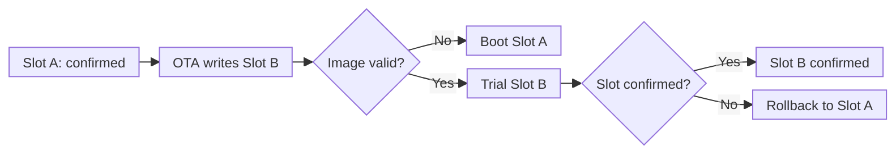

# WF88 Bootloader User Guide

This guide is intended for device users and field service personnel. It explains how to use **Amp'ed RF Firmware Tool** to install firmware, update an individual APP image, and verify that the device starts from the correct application Slot.

> [!CAUTION]
> Keep the power supply and USB/serial connection stable throughout an update. After a transfer starts, do not close the tool, disconnect the device, or remove power.

## 1. Entering the Bootloader Menu

Entering the menu only interrupts the current automatic boot. It does not modify firmware, configuration, or customer files.

1. Connect the device to the computer and start Amp'ed RF Firmware Tool.
2. Select the `Port` and `Baudrate` for the device. The baud rate is normally `115200`. If your supplier provides a Profile, load that Profile first and do not change its settings.
3. Reset or power-cycle the device.
4. As soon as the following startup prompt appears, press `Enter` or `Del`:

   ```text
   Stage 1 started
   Press Enter or Del within 100 ms to enter Stage 1 Menu...
   ```

The `100 ms` window is very short. Have the tool and keyboard ready before resetting the device.

After automatic boot is successfully interrupted, the serial console displays:

```text
Boot interrupted; entering Stage 1 Menu.

Stage 1 Menu
 1. Start application
 2. Update firmware package
 3. Device status
 4. Advanced maintenance
 5. Factory
 6. Provision Dual-slot layout
 0. Enter Stage 0 Recovery
#
```

> [!TIP]
> If the APP starts automatically, the key was not received during the entry window. Reset the device again and immediately press `Enter` repeatedly.

## 2. Restoring Factory Settings and Installing Complete Firmware

`Factory → Install factory firmware package` restores the device to the factory state defined by a complete firmware package. Use it in the following situations:

- Installing complete firmware on a new device for the first time;
- Recovering from damaged APP, supporting firmware, or stored data;
- Removing all existing device configuration and customer files;
- Reinstalling complete firmware as directed by the device supplier or technical support.

This operation does not preserve user data. Existing contents in the following areas are lost:

- `Slot A`: Erases the existing APP and installs the APP from the complete firmware package;
- `Platform`: Erases the existing supporting firmware and installs the supporting firmware from the package;
- `Slot B`: Formats the Slot and leaves it empty;
- `Config A/B`: Clears the existing AT configuration. If the package contains a factory configuration, that configuration is installed instead;
- `Custom`: Clears customer files, including TLS certificates, private keys, and custom configuration files. If the package contains Custom files, those package files are installed instead.

> [!CAUTION]
> Existing configuration, TLS certificates, and private keys are not preserved. Before starting, make sure that the complete firmware package matches the device model and that any customer files that are still required have been backed up.

### Installation Procedure

1. Enter the Bootloader menu as described in Section 1.
2. Enter `5` at the main menu to open `Factory Menu`.
3. Enter `1` to select `Install factory firmware package`.
4. Read the erase warning and enter `Y` to continue.
5. When `C` appears, select the complete firmware package in Amp'ed RF Firmware Tool and click `load`.
6. Keep the device powered and connected until installation finishes.

The serial console interaction is shown below:

```text
#5

Factory Menu
 1. Install factory firmware package
 2. Check all partition status
 0. Back
#1

Factory firmware package install
WARNING: Slot A, Platform, Slot B, Config A/B,
and Custom files will be erased. Continue? [Y/N] Y
Send package with YMODEM now
C
```

After the transfer, the device validates Slot A and Platform, clears Slot B, and processes Config A/B, Custom, and boot information. The detailed summary varies with the contents of the complete firmware package. When every step succeeds, the device displays:

```text
Factory package installed successfully.

Factory Menu
 1. Install factory firmware package
 2. Check all partition status
 0. Back
#
```

Installation is successful only when `Factory package installed successfully.` appears. The device initializes Slot A as the confirmed boot Slot. The next reset, or selecting `Start application`, starts the APP from Slot A.

## 3. Boot Slots: Viewing, Selecting, and Rolling Back

The Dual-slot layout provides two independent APP storage locations: Slot A and Slot B. The device boots from one Slot, while the other can hold a new version or a version available for rollback.

There are two important boot states:

- **Confirmed Slot**: Contains the most recent APP that completed initialization successfully. Automatic rollback returns to this Slot;
- **Pending trial Slot**: Contains the new APP to be tried on the next boot. It becomes confirmed only after successful initialization.

The following diagram assumes that the device currently boots from Slot A:



If the device currently boots from Slot B, OTA writes the new APP to Slot A instead. After a successful OTA transfer, the newly written Slot automatically becomes the next trial target, so no manual Slot selection is required after a normal OTA update.

Automatic rollback applies only to an unconfirmed trial APP. After the new APP completes initialization and confirms its Slot, that Slot becomes the confirmed Slot.

### Viewing the Selected Boot Slot

1. Enter `4` at the main menu to open `Advanced Maintenance`.
2. Enter `1` to open `Boot control`.
3. Enter `2` to open `Select Boot Slot`.
4. The Slot marked `(current)` is the currently selected target for the next boot. Enter `0` after checking it. Returning from this menu does not change the selection.

The following example shows Slot A as the current selection. APP filenames depend on the firmware installed on the device.

```text
#4

Advanced Maintenance
 1. Boot control
 2. File and platform update
 3. Storage management
 4. Update Stage 0
 0. Back
#1

Boot Menu
 1. Boot active package
 2. Select Boot Slot
 3. Check Slot A
 4. Check Slot B
 0. Back
#2

Select Boot Slot
 1. Slot A, Image: WifiApp.bin (current)
 2. Slot B, Image: NewApp.bin
 0. Back
#
```

### Manually Selecting a Boot Slot

Manual Slot selection is needed only after an individual APP update, or when directed by the device supplier or technical support. In `Select Boot Slot`, enter `1` for Slot A or `2` for Slot B.

The following operation selects Slot B as the next trial target:

```text
#2
Slot B selected for the next boot (pending trial)

Select Boot Slot
 1. Slot A, Image: WifiApp.bin
 2. Slot B, Image: NewApp.bin (current)
 0. Back
#
```

Selecting a Slot does not immediately start the APP. Start the selected Slot using either method below, or reset the device and let the Bootloader start it automatically.

### Starting the Selected Slot

Stage 1 provides two equivalent ways to start the Slot marked `(current)` in `Select Boot Slot`:

- Select `1. Boot active package` from `Boot Menu`;
- Select `1. Start application` from the Stage 1 main menu.

If the Slot was just selected manually or was just updated by OTA, this boot is a pending trial.

From `Select Boot Slot`, enter `0` once to return to `Boot Menu`, then enter `1`:

```text
Boot Menu
 1. Boot active package
 2. Select Boot Slot
 3. Check Slot A
 4. Check Slot B
 0. Back
#1
Starting NewApp.bin from Slot B
```

Alternatively, enter `0` three times from `Select Boot Slot` to return to the Stage 1 main menu, then enter `1`:

```text
Stage 1 Menu
 1. Start application
 2. Update firmware package
 3. Device status
 4. Advanced maintenance
 5. Factory
 6. Provision Dual-slot layout
 0. Enter Stage 0 Recovery
#1
Starting NewApp.bin from Slot B
```

Both methods have the same effect. `NewApp.bin` is replaced by the actual APP filename in that Slot. `Starting <APP file> from Slot <A/B>` means that the Bootloader completed its pre-boot checks and started the APP.

If validation of the pending trial image fails, the Bootloader starts the previously confirmed Slot instead. After the new APP completes initialization, it confirms the trial and becomes the new confirmed Slot.

### Cancelling a Pending Trial Slot

If Slot B is selected as the pending trial target but the device should continue using the previously confirmed Slot A, select Slot A again from `Select Boot Slot`:

```text
Select Boot Slot
 1. Slot A, Image: WifiApp.bin
 2. Slot B, Image: NewApp.bin (current)
 0. Back
#1
Pending boot Slot cancelled; next boot: A

Select Boot Slot
 1. Slot A, Image: WifiApp.bin (current)
 2. Slot B, Image: NewApp.bin
 0. Back
#
```

If validation of the pending trial image fails, the Bootloader immediately uses the previously confirmed Slot. If the APP starts but the device resets before confirmation completes, the Bootloader cancels the pending trial on the next boot and returns to the confirmed Slot. Neither case requires a manual rollback.

## 4. Updating an Individual APP Image

For developers using the SDK, uploading only the compiled APP image is more efficient than reinstalling a complete firmware package when only the APP has changed. This method is suitable for routine development and testing.

An individual APP update formats and updates only the selected Slot. It does not update `Platform` or modify the other Slot, Config A/B, or Custom files.

> [!IMPORTANT]
> The APP must be compatible with the supporting Platform firmware already installed on the device. If the new version also changes Platform, or if the device does not yet contain the complete matching firmware, use the complete firmware installation procedure in Section 2. An individual APP update is not a replacement for complete firmware installation.

### Selecting the Target Slot

Before uploading, follow Section 3 to check the currently selected boot Slot. Using the other Slot as the upload target is recommended, although uploading to the current Slot is also supported:

- If Slot A is currently in use, upload the new APP to Slot B;
- If Slot B is currently in use, upload the new APP to Slot A.

The entire target Slot is erased before the upload starts. If the transfer fails, that Slot will not contain a usable APP. Selecting the other Slot preserves the currently confirmed APP for rollback if testing fails.

The following procedure assumes that Slot A is currently in use and that the new APP will be uploaded to Slot B.

### Uploading the APP Image

1. Enter `4` at the main menu to open `Advanced Maintenance`.
2. Enter `2` to open `File and platform update`.
3. Enter `1` to select `Upload individual files`.
4. Enter `2` to select Slot B. To upload to Slot A, enter `1` instead.
5. Enter `1` to select `Application image`.
6. Enter `Y` to confirm erasing the target Slot.
7. When `C` appears, select the compiled APP image in Amp'ed RF Firmware Tool and click `load`.
8. Keep the device powered and connected until writing and validation finish.

The serial console interaction is shown below:

```text
#4

Advanced Maintenance
 1. Boot control
 2. File and platform update
 3. Storage management
 4. Update Stage 0
 0. Back
#2

File and Platform Update
Use this menu only for service or development.
 1. Upload individual files
 2. Platform firmware
 3. Upload Custom file
 4. Finalize Slot A and initialize Metadata
 0. Back
#1

Select Upload Slot
 1. Slot A
 2. Slot B
 0. Back
#2

Upload Individual Files to Slot B
 1. Application image
 0. Back
#1
WARNING: erase all of Slot B before uploading the application image. A failed transfer will leave no usable application. Continue? [Y/N] Y
Send a file with YMODEM now
C
File committed

Upload Individual Files to Slot B
 1. Application image
 0. Back
#
```

`File committed` means that the file was written and passed transfer validation. If the following message appears afterward, the APP did not pass boot validation. Do not select that Slot for booting.

```text
Application image validation failed
```

### Selecting and Starting the New APP

After a successful upload, follow “Manually Selecting a Boot Slot” in Section 3 to set the updated Slot B as the next trial target:

```text
Slot B selected for the next boot (pending trial)
```

Then use either startup method described in Section 3, or reset the device. The device starts the new APP from Slot B as a trial:

```text
Starting NewApp.bin from Slot B
```

`NewApp.bin` is replaced by the actual uploaded APP filename. After the new APP initializes successfully, Slot B becomes the confirmed Slot. If startup fails before confirmation, the device rolls back to Slot A as described in Section 3.

## 5. Uploading TLS Certificate Files

TLS certificates and private keys are stored in the `Custom` partition. By default, the WF88 MQTT TLS function uses the following files:

| Default filename | Contents | Usage |
| --- | --- | --- |
| `ca.crt` | X.509 CA certificate or certificate chain in PEM format | One-way and mutual TLS; used to verify the server certificate |
| `client.crt` | X.509 client certificate in PEM format | Mutual TLS; used to identify the device to the server |
| `client.key` | Unencrypted PEM private key matching the client certificate | Mutual TLS; used for client authentication |

One-way TLS requires only `ca.crt`. Mutual TLS requires `ca.crt`, `client.crt`, and `client.key`.

### Filename Rules

- Use the default filenames `ca.crt`, `client.crt`, and `client.key` whenever possible;
- Filenames are case-sensitive. The uploaded filename must exactly match the filename configured in the APP;
- A filename can contain no more than 53 characters and cannot be empty or contain spaces;
- A filename cannot contain `/`, `\`, or two consecutive periods (`..`);
- To use different filenames, also update the corresponding values in `MQTTCaCrt`, `MQTTClinetCrt`, or `MQTTClinetKey`.

`Clinet` in `MQTTClinetCrt` and `MQTTClinetKey` is part of the existing firmware configuration name. Use it exactly as shown.

The Bootloader stores the file using the filename sent by Amp'ed RF Firmware Tool. Before clicking `load`, make sure the file on the computer already has the correct filename.

### Replacing a File with the Same Name

If the `Custom` partition already contains a file with the same name, the new file replaces it. The existing file does not need to be deleted first. Files with different names can coexist in the `Custom` partition, but MQTT does not automatically use them unless the APP configuration refers to those filenames.

> [!CAUTION]
> The Bootloader verifies only that the complete file was written. It does not validate certificate contents or expiration, or verify that a client certificate matches its private key. `File committed` does not guarantee that the TLS configuration is valid.

> [!WARNING]
> `client.key` contains the device private key. Back it up securely before uploading, and do not expose it through logs, email, or other insecure channels.

### Upload Procedure

Only one file can be uploaded at a time. To upload all three files, repeat this procedure for each file.

1. Enter `4` at the main menu to open `Advanced Maintenance`.
2. Enter `2` to open `File and platform update`.
3. Enter `3` to select `Upload Custom file`.
4. After confirming that the filename is correct and that replacing a file with the same name is acceptable, enter `Y`.
5. When `C` appears, select the certificate or private-key file in Amp'ed RF Firmware Tool and click `load`.
6. Wait for the device to display `File committed`.

If the following prompt appears before upload, the `Custom` partition cannot be read normally:

```text
Custom partition contains old or invalid data.
Format Custom partition before upload? [Y/N]
```

Entering `Y` formats the entire `Custom` partition and deletes all existing certificates, private keys, and other customer files. If any files must be preserved, enter `N` to cancel and contact technical support first.

The serial console interaction is shown below:

```text
#4

Advanced Maintenance
 1. Boot control
 2. File and platform update
 3. Storage management
 4. Update Stage 0
 0. Back
#2

File and Platform Update
Use this menu only for service or development.
 1. Upload individual files
 2. Platform firmware
 3. Upload Custom file
 4. Finalize Slot A and initialize Metadata
 0. Back
#3
File name comes from the YMODEM header and may overwrite an existing file. Continue? [Y/N] YSend a file with YMODEM now
C
File committed

File and Platform Update
Use this menu only for service or development.
 1. Upload individual files
 2. Platform firmware
 3. Upload Custom file
 4. Finalize Slot A and initialize Metadata
 0. Back
#
```

### Verifying the Uploaded Files

After uploading, use `4 → 3 → 5 → 1` to view the files in the `Custom` partition:

```text
#4

Advanced Maintenance
 1. Boot control
 2. File and platform update
 3. Storage management
 4. Update Stage 0
 0. Back
#3

Storage Menu
 1. Slot A status
 2. Slot B status
 3. Platform status
 4. Config A/B status
 5. Custom files
 6. Format storage
 7. Metadata status
 8. Check all partition status
 0. Back
#5

Custom Files
 1. List files
 2. Delete file
 0. Back
#1
Custom directory:
 0: ca.crt sector=<sector> size=<bytes>
 1: client.crt sector=<sector> size=<bytes>
 2: client.key sector=<sector> size=<bytes>

Custom Files
 1. List files
 2. Delete file
 0. Back
#
```

The `sector` and `size` values depend on the actual files. Verify that all required filenames are listed and that each `size` matches the uploaded file.

Restart the APP after uploading files or changing certificate filename settings, then test the TLS connection. No certificate filename setting changes are needed when the default filenames are used.

### Effect of Firmware Updates on TLS Files

- A normal OTA update does not format the `Custom` partition, so existing TLS certificates and private keys are preserved;
- The complete factory installation in Section 2 clears the existing TLS certificates and private keys. If the complete firmware package contains TLS files, the files from the package are used after installation instead of the device's previous files.

## 6. Dual-slot Partition Layout

The Dual-slot layout provides two independent APP partitions: Slot A and Slot B. The device can run the APP from one Slot while writing a new APP to the other. If the new APP trial fails, the Bootloader can return to the previously confirmed Slot.

The Slot selection, OTA trial, and automatic rollback functions described in Section 3 depend on the Dual-slot layout.

### Partition Overview

The WF88 2 MiB Flash is allocated as shown below when using the Dual-slot layout. The capacities are allocated partition sizes. File-based partitions use a small amount of space for directory information, so their usable file capacity is slightly smaller than the listed size.

| Partition | Allocated capacity | Purpose |
| --- | ---: | --- |
| Stage 0 | 8 KiB | Minimal recovery program used to start or recover Stage 1 |
| Stage 1 | 96 KiB | Provides the Bootloader menus, firmware installation, file upload, and boot management |
| Partition Table | 4 KiB | Records the active Flash partition layout |
| Metadata A/B | 8 KiB | Stores confirmed Slot, pending trial Slot, and other boot state in two redundant copies |
| Config A/B | 8 KiB | Stores device configuration in two redundant copies |
| Platform | 160 KiB | Stores supporting firmware shared by Slot A and Slot B |
| Slot A | 752 KiB | Stores one APP image for update and rollback |
| Slot B | 752 KiB | Stores another APP image for update and rollback |
| Custom | 260 KiB | Stores TLS certificates, private keys, and other customer files |

Slot A and Slot B contain only APP images. They share the same Platform, so an individually uploaded APP must be compatible with the existing Platform. `A/B` in Metadata A/B and Config A/B means redundant storage copies; it does not mean that the copies belong separately to Slot A and Slot B.

### When to Use This Function

`6. Provision Dual-slot layout` in the main menu creates or rebuilds the Dual-slot partition table. Use it in the following situations:

- Initializing a device with the Dual-slot layout for the first time;
- A new device does not have a valid partition table;
- The partition table is damaged and the device supplier or technical support directs you to rebuild it.

Do not use this function for routine OTA updates, individual APP updates, or boot Slot selection.

> [!CAUTION]
> This is a destructive operation. Selecting `6` requests a partition-table rewrite even when the device already uses the Dual-slot layout. Do not repeat this operation on a working Dual-slot device. If `Current layout: Dual-slot` appears, enter `N` to cancel unless the device supplier or technical support explicitly directs you to rebuild the layout.

Initializing or rebuilding the layout can repartition the Custom area. Existing TLS certificates, private keys, and other customer files might not be preserved. Before proceeding, back up any files that are still required and obtain a complete firmware package that matches the device model.

### Initializing the Dual-slot Layout

1. Enter the Bootloader menu as described in Section 1.
2. Enter `6` at the main menu.
3. Verify that the target is `Target layout: Dual-slot`.
4. Read the warning and, after confirming that all required files are backed up, enter `Y`.
5. Wait for the device to confirm that the new partition table is active.

The complete serial console interaction is shown below:

```text
#6
Current layout: Single-slot
Target layout: Dual-slot
WARNING: this is a destructive partition-layout switch.
Custom is split into Slot B and a smaller Custom partition; its old contents cannot be retained.
Config, Platform, and Slot A retain their locations.
Continue? [Y/N] Y
Partition Table verified at sector 26.
New layout is active now.
Config, Platform, and Slot A retain their locations.
Format Slot B and the reduced Custom partition before using them.

Stage 1 Menu
 1. Start application
 2. Update firmware package
 3. Device status
 4. Advanced maintenance
 5. Factory
 6. Provision Dual-slot layout
 0. Enter Stage 0 Recovery
#
```

`New layout is active now.` means that the Dual-slot partition table was written and verified. This step creates only the partition layout; it does not automatically format partitions or install firmware.

### When the Current Layout Is Already Dual-slot

If the device displays `Current layout: Dual-slot`, enter `N` under normal circumstances:

```text
#6
Current layout: Dual-slot
Target layout: Dual-slot
WARNING: this is a destructive partition-layout switch.
The Partition Table will be rewritten; runtime partition boundaries may change.
Continue? [Y/N] N
Cancelled

Stage 1 Menu
 1. Start application
 2. Update firmware package
 3. Device status
 4. Advanced maintenance
 5. Factory
 6. Provision Dual-slot layout
 0. Enter Stage 0 Recovery
#
```

Enter `Y` only when the device supplier or technical support explicitly directs you to rebuild the layout. The device displays:

```text
Continue? [Y/N] Y
Partition Table verified at sector 26.
New layout is active now.
Format and redeploy Slot A, Slot B, and Custom before using the reprovisioned layout.
```

### Steps After Creating the Layout

Do not select `Start application` immediately after initializing or rebuilding the Dual-slot layout. Restore the device in this order:

1. Follow Section 2 and select `Factory → Install factory firmware package` to install complete firmware and initialize Slot A;
2. Follow Section 5 to upload the required TLS certificates, private keys, and other Custom files again;
3. Reapply any device configuration cleared during installation;
4. Reset the device, or follow Section 3 to start the currently selected Slot A.

After complete firmware installation, Slot A is the confirmed boot Slot and Slot B remains empty for a later OTA or individual APP update.

## 7. Stage 0 Fault Recovery

Stage 0 is a minimal recovery program independent of Stage 1 and the APP. If Stage 1 is damaged, fails validation, or cannot start, the device stops at `Stage 0 Recovery` so that Stage 1 can be reinstalled.

Stage 0 cannot directly install a complete firmware package or start an APP. After recovering Stage 1, follow Section 2 to install complete firmware if Slot, Platform, or another runtime partition still has a problem.

### Entering Stage 0 Recovery

There are two ways to enter Stage 0 Recovery.

#### From the Stage 1 Main Menu

If Stage 1 can still display its main menu, enter `0`:

```text
#0
Entering Stage 0 Recovery

Flashloader 2.0.0 - 2026.09.03 (A)

Stage 0 Recovery
 1. Boot Stage 1
 2. Update Stage 1
 3. Update Stage 0
 4. Status
 5. Erase Stage 1
#
```

The version, date, and build identifier after `Flashloader` can vary by release.

#### Automatic Entry When Stage 1 Is Damaged

At power-on or reset, Stage 0 validates Stage 1 before starting it. If the Stage 1 descriptor, image integrity, or startup information is invalid, the device displays the corresponding error and enters the recovery menu automatically. No keypress is required.

The complete output for an invalid Stage 1 descriptor is shown below:

```text
Flashloader 2.0.0 - 2026.09.03 (A)
Stage 1 descriptor invalid

Stage 0 Recovery
 1. Boot Stage 1
 2. Update Stage 1
 3. Update Stage 0
 4. Status
 5. Erase Stage 1
#
```

Depending on the fault, the error can instead be:

```text
Stage 1 image CRC invalid
```

or:

```text
Stage 1 vector invalid
```

For all three errors, follow “Updating and Starting Stage 1” below.

### Checking Stage 1 Status

Enter `4` in `Stage 0 Recovery` to safely check whether Stage 1 is valid. This operation does not modify firmware or data.

When Stage 1 is valid, the device displays:

```text
#4
Flash 2048K
Stage 1: valid, <bytes> bytes

Stage 0 Recovery
 1. Boot Stage 1
 2. Update Stage 1
 3. Update Stage 0
 4. Status
 5. Erase Stage 1
#
```

`<bytes>` is the actual size of the current Stage 1 image.

When Stage 1 is missing or fails validation, the device displays:

```text
#4
Flash 2048K
Stage 1: unavailable or invalid

Stage 0 Recovery
 1. Boot Stage 1
 2. Update Stage 1
 3. Update Stage 0
 4. Status
 5. Erase Stage 1
#
```

### Updating and Starting Stage 1

Before starting, obtain a raw Stage 1 `.bin` file from the device supplier that belongs to the same Bootloader release as the current Stage 0. Do not use an APP image, a complete firmware package, or a Stage 1 file from an unknown source.

1. Enter `2` in `Stage 0 Recovery`.
2. When `Update Stage 1? (Y)` appears, enter uppercase `Y`. Lowercase `y` does not start the update.
3. When `C` appears, select the supplied Stage 1 `.bin` file in Amp'ed RF Firmware Tool and click `load`.
4. Keep the device powered and connected until `Stage 1 updated` appears.
5. After the menu returns, enter `1` to validate and start the updated Stage 1.

The complete interaction for updating Stage 1 is shown below. `<bytes>` is the actual file size written:

```text
#2
Update Stage 1? (Y) Y
CStage 1 updated: <bytes> bytes

Stage 0 Recovery
 1. Boot Stage 1
 2. Update Stage 1
 3. Update Stage 0
 4. Status
 5. Erase Stage 1
#
```

The update is successful only when `Stage 1 updated: <bytes> bytes` appears. After a successful update, enter `1`:

```text
#1

Stage 1 started

Stage 1 Menu
 1. Start application
 2. Update firmware package
 3. Device status
 4. Advanced maintenance
 5. Factory
 6. Provision Dual-slot layout
 0. Enter Stage 0 Recovery
#
```

After `Boot Stage 1` is selected in Stage 0, Stage 1 stops directly at its main menu. There is no need to press `Enter` again within 100 ms.

If storage has a problem, a `Startup storage audit warning` can appear between `Stage 1 started` and the main menu. This does not mean that Stage 1 recovery failed. Save the complete message, then restore the complete firmware as described in Section 2 or contact technical support.

Updating Stage 1 replaces only the Stage 1 portion of the Bootloader. It does not erase Slot A, Slot B, Platform, Config A/B, or Custom. If Stage 1 has been recovered but the APP still cannot start, install complete firmware as described in Section 2.

### Other Stage 0 Menu Items

#### `1. Boot Stage 1`

Validates and starts the existing Stage 1. If Stage 1 is invalid, the corresponding error appears and the device returns to `Stage 0 Recovery`. This function does not repair a damaged Stage 1.

#### `3. Update Stage 0`

Replaces the lowest-level device recovery program. Stage 0 and Stage 1 must come from the same Bootloader release.

> [!CAUTION]
> Do not update Stage 0 as a routine recovery step. An incorrect file, failed transfer, or loss of power during the update can prevent the device from entering the serial recovery menu again. Perform this operation only when the device supplier or technical support provides a matching Stage 0 file and explicitly directs you to update it.

When technical support explicitly requires this update, the device interaction is:

```text
#3
Update Stage 0? (Y) Y
CStage 0 updated: <bytes> bytes

Stage 0 Recovery
 1. Boot Stage 1
 2. Update Stage 1
 3. Update Stage 0
 4. Status
 5. Erase Stage 1
#
```

The update is successful only when `Stage 0 updated: <bytes> bytes` appears. Then follow “Updating and Starting Stage 1” using a Stage 1 file from the same release.

#### `5. Erase Stage 1`

This operation completely erases Stage 1, leaving the device in `Stage 0 Recovery`. Stage 1 does not need to be erased before it is updated.

> [!WARNING]
> Do not use this function unless the device supplier or technical support explicitly directs you to do so.

The complete interaction for confirming the erase is:

```text
#5
WARNING: erase Stage 1 image and descriptor? (Y) Y
Stage 1 erased; the device will remain in Stage 0 Recovery

Stage 0 Recovery
 1. Boot Stage 1
 2. Update Stage 1
 3. Update Stage 0
 4. Status
 5. Erase Stage 1
#
```

After erasing, reinstall Stage 1 using `2. Update Stage 1`.

### Recovery Failure

If `Stage 1 update failed`, `Stage 1 write verification failed`, or `Stage 1 descriptor write failed` appears during the update, keep the device connected, select `2. Update Stage 1` again, and upload the correct file.

If there is no serial output, `Stage 0 Recovery` cannot be displayed, or a failed Stage 0 update prevents the menu from opening again, serial recovery is no longer available. Stop and contact the device supplier or technical support for low-level programming recovery.

## 8. Status and Troubleshooting

### Viewing Device Status

Enter `3` (`Device status`) at the main menu. If an update, startup, or transfer fails, save the complete output from this page and from the tool log.

### Unable to Enter the Bootloader Menu

Verify that Amp'ed RF Firmware Tool is using the correct `Port` and `Baudrate`. Reset the device and immediately press `Enter` repeatedly. If the menu still does not appear, check the cable and power supply, and make sure that another application is not using the serial port.

### Transfer Failure or Timeout

Keep the tool and device connected, reset the device, and repeat the applicable update procedure. If the failure occurs repeatedly, record the tool version, firmware filename, device status, and complete log, then contact technical support.

### Device Does Not Start After an Update

First enter `3` at the main menu to view device status. After a normal OTA update, verify that the device attempted to start from the new Slot. After an individual APP update, verify that the updated Slot was selected manually. If the problem remains, recover the device using a complete firmware package supplied for the device, or contact technical support.

### Unexpected Layout, Storage, or Low-Level Recovery Prompt

Do not continue with any formatting, partition-layout reconstruction, or low-level recovery prompt that is not described in Sections 6 and 7. Contact the device supplier or technical support and provide the complete tool log.
