# Web Configurator User Guide

## 1. Quick Start

### 1.1 Connect the Device

Connect the device with a USB data cable, then use the controls marked below.

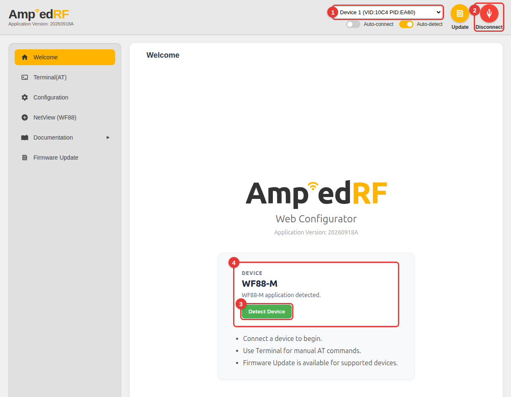

1. Open the serial port list and select **Add new device...**.
2. Select the device's USB serial port, then click **Connect**.

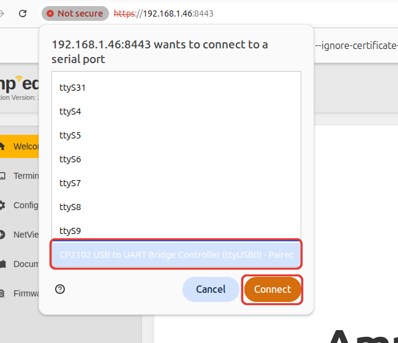

After connecting, the selected port is shown at the top and the button changes to **Disconnect**.

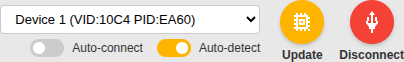

### 1.2 Detect the Device

Click **Detect Device** after the device finishes starting. A successful detection displays the device model.

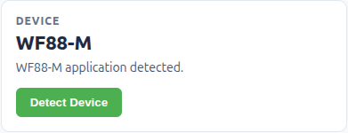

### 1.3 Automatic Connection

- **Auto-connect** reconnects a previously authorized serial device.
- **Auto-detect** detects the device model after the serial connection opens.

## 2. Terminal

Open **Terminal (AT)** after connecting the device. The page has five working areas.

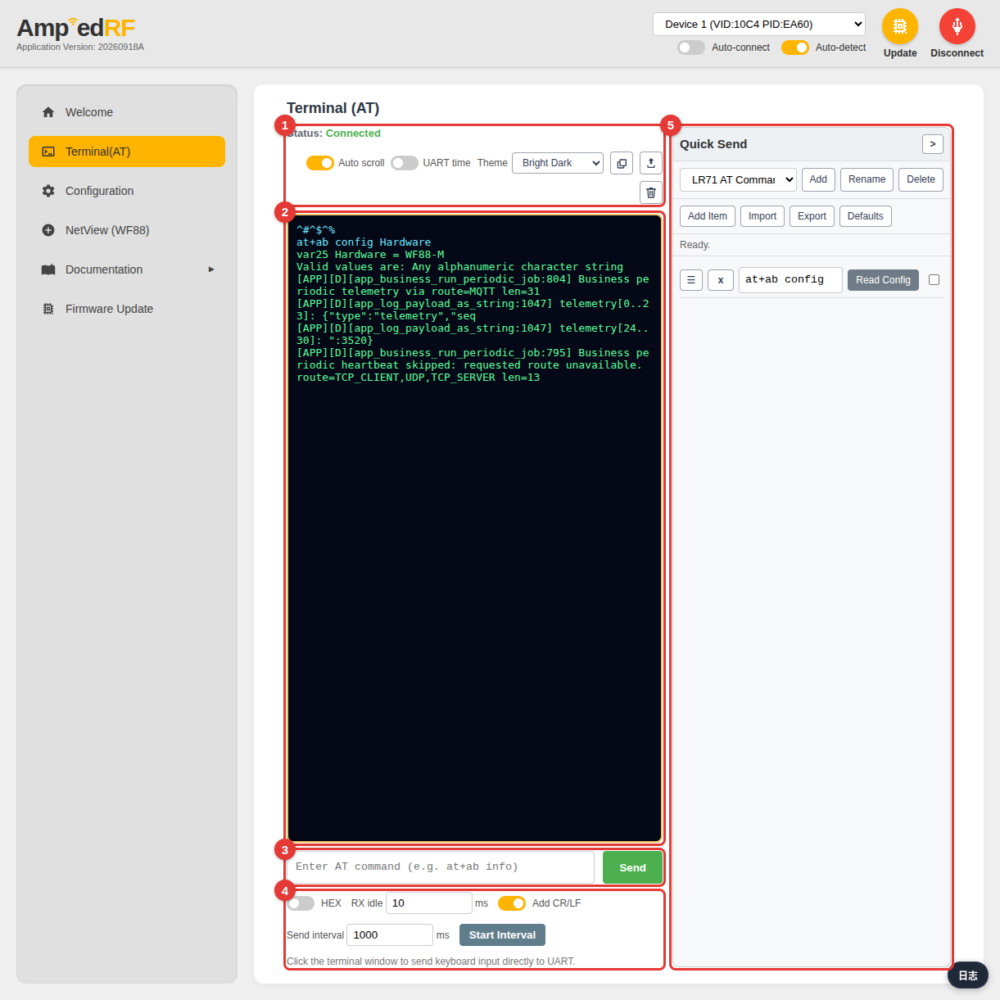

1. Connection status and display tools.
2. UART output.
3. Command input and **Send**.
4. Send options.
5. **Quick Send** commands.

### 2.1 Send a Command

Enter a command and click **Send**, or press **Enter**. Keep **Add CR/LF** on when the device expects a line ending.

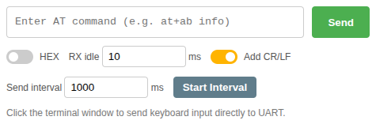

The command and device response appear in the terminal.

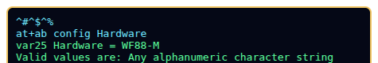

Use **Up** and **Down** in the command input to browse previously sent commands.

### 2.2 Send Keyboard Input Directly

Click the terminal output, then type. Each key is sent directly to UART; **Enter** sends the selected line ending.

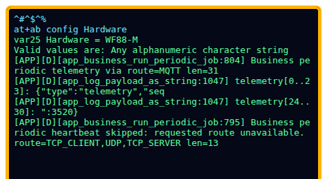

### 2.3 Send HEX Bytes

Turn on **HEX**, enter space-separated byte values, then click **Send**.

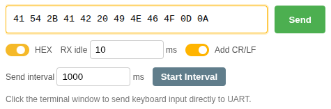

### 2.4 Send at an Interval

Enter the data, set an interval of at least 10 ms, then click **Start Interval**. Click **Stop Interval** to stop.

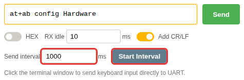

### 2.5 Display and Save Output

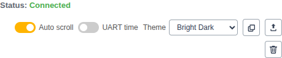

- **Auto scroll** follows the latest output; **UART time** adds timestamps.
- **Theme** changes terminal colors.
- The three icon buttons copy, export, or clear the output.

## 3. Quick Send

Quick Send keeps frequently used commands in groups in this browser.

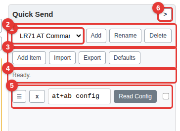

1. Current command group.
2. Group controls.
3. Item and file controls.
4. Operation status.
5. Saved commands.
6. Collapse button.

### 3.1 Send and Edit a Command

Select a group, then click an item's command button. Text commands follow the Terminal **Add CR/LF** setting.

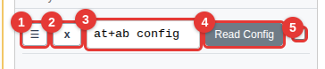

1. Drag to reorder the item.
2. Delete the item.
3. Edit the content; changes are saved automatically.
4. Click to send. Press and hold to rename the button.
5. Send the content as HEX bytes.

### 3.2 Add an Item

Click **Add Item**, then enter the command in the highlighted field. Press and hold its **Send** button to give it a clear name.

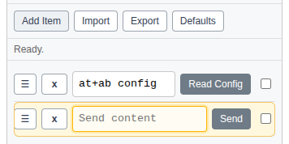

### 3.3 Manage Groups and Files

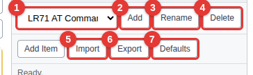

- Select a group, or use **Add**, **Rename**, and **Delete** to organize groups.
- **Import** appends commands from a JSON file to the current group.
- **Export** downloads the current group as JSON.
- **Defaults** restores all built-in groups after confirmation.

### 3.4 Resize or Collapse the Panel

Drag the panel's left edge to change its width, or focus the edge and use the arrow keys. Click **>** to collapse the panel.

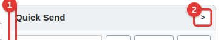

The collapsed panel leaves more space for the terminal. Click **<** to restore it.

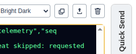

## 4. Configuration

Configuration reads persistent settings from the detected device and arranges them by function. The available groups depend on the device model.

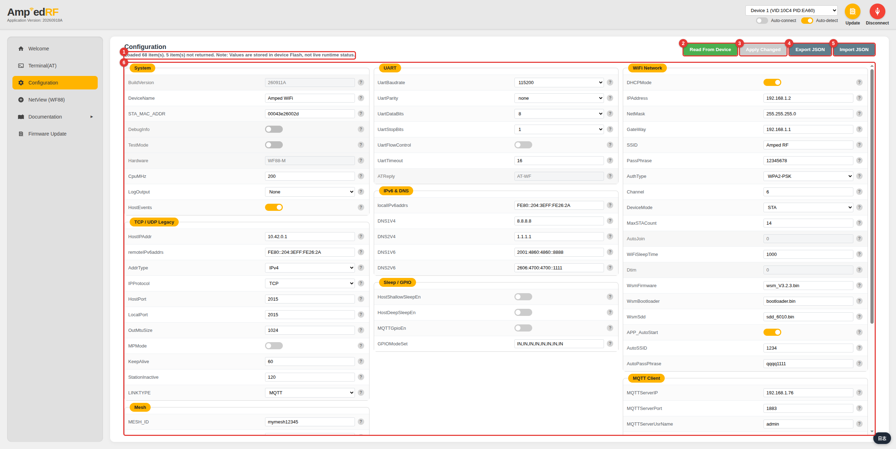

1. Read status and result summary.
2. Read the latest values from the device.
3. Apply changed values.
4. Export a JSON snapshot.
5. Import a JSON snapshot.
6. Configuration groups and fields.

### 4.1 Read From the Device

After connecting, opening Configuration reads the device once automatically. Click **Read From Device** to refresh it later.

The status shows how many items were loaded or not returned. These values are stored in device Flash and may differ from live runtime status.

### 4.2 Review and Edit Values

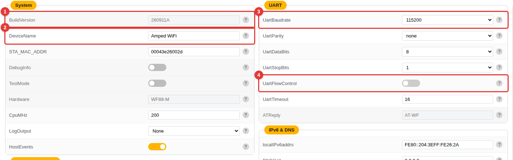

1. Read-only value.
2. Text or number field.
3. Selection list.
4. On/off switch.

Changed rows are highlighted and show the device value on the left and the pending value on the right.

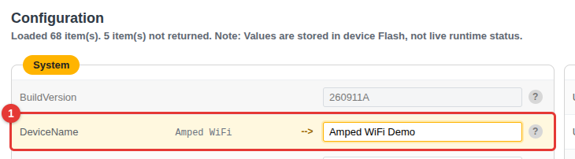

The **Apply Changed** button becomes available when a writable value changes. Click it after reviewing the highlighted rows. Only changed writable items are sent, then the page reads the device again.

### 4.3 View Field Help

Point to or focus **?** to see the variable number, description, allowed range, status, and equivalent AT command.

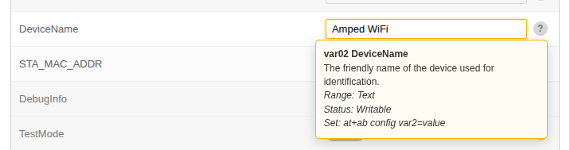

### 4.4 Export or Import JSON

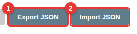

- **Export JSON** saves the current device snapshot.
- **Import JSON** first reads the current device, then highlights writable differences from a matching configuration file.
- Review the differences and click **Apply Changed** to write imported values.

## 5. Firmware Update

Firmware Update sends a `.bin` image to the device with YMODEM-CRC.

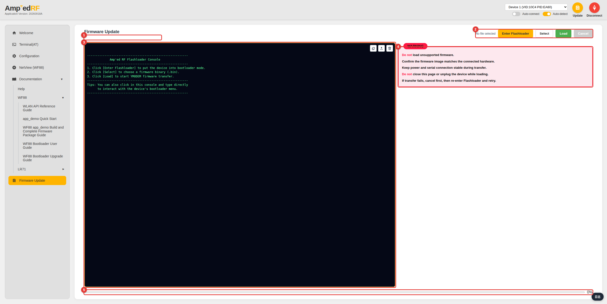

1. Update status.
2. Flashloader and file actions.
3. Flashloader UART console.
4. Update safety notes.
5. Transfer progress.

### 5.1 Prepare the Update

Connect the device and confirm that the firmware image matches its hardware. Keep the USB connection and device power stable until the transfer finishes.

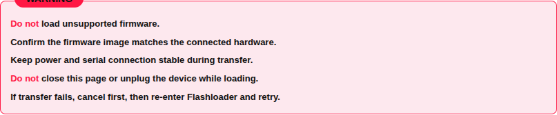

### 5.2 Enter Flashloader

Click **Enter Flashloader**. Use the UART console to follow the Flashloader output and select its Application/Executable upload option when requested.

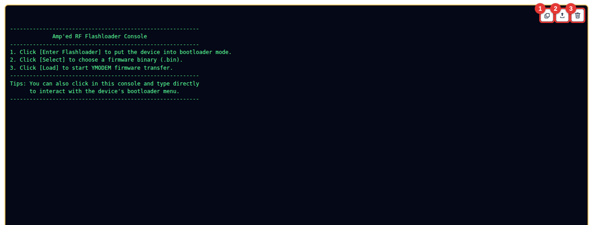

The three console buttons copy, export, or clear the log. Click the console and type if the Flashloader menu needs keyboard input.

### 5.3 Select and Load Firmware

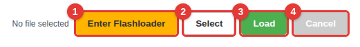

1. Enter Flashloader mode.
2. Select a `.bin` image.
3. Start the YMODEM-CRC transfer.
4. Cancel an active transfer.

After selection, verify the displayed file name and size before clicking **Load**.

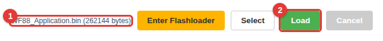

### 5.4 Monitor or Cancel the Transfer

The status, console, and progress bar show the current transfer phase. Keep the page open and the device connected. **Cancel** is available while a transfer is running.
